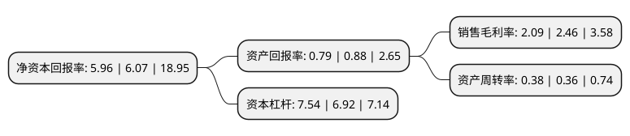

> 本页面由自动化程序生成于 2022年5月20日 01:28
> 内容可能存在错误，如有bug请提交issue至：https://github.com/Eroleice/doc-pi/issues
{.is-warning}

# 上市公司基本情况

## 基本资料

长春欧亚集团股份有限公司（以下简称“欧亚集团”）成立于1992年08月20日，长春市。于1993年12月06日在上交所主板上市。

欧亚集团注册资本15,908.808万元，主要业务:商业，租赁服务。以下是详细信息：

- 公司名称: 长春欧亚集团股份有限公司
- 股票代码: 600697.SH
- 所在地: 吉林 - 长春市
- 成立日期: 1992年08月20日
- 注册资本: 15,908.808万元
- 法定代表人: 曹和平
- 主营业务: 商业，租赁服务
- 公司官网: www.eurasiagroup.com.cn
- 公司介绍: 公司是吉林省的商业龙头企业。从过去单一门市的商业小店，形成了以现代时尚百货、现代摩尔生活馆、综超连锁为三大主力业态的经营格局。公司秉承“唯旗是夺，诚实守信，勤俭善持，团结互助”的企业精神，遵循“调整经营机制，理顺产权体制，提升管理手段，扩充企业规模”的发展思路，坚持“合法经营、合格质量、合理价格、合情服务、合适管理”的经营准则，践行“员工富裕，企业兴旺，社会发展”的目标责任，在市场竞争中实现了企业的持续健康发展，奠定了行业主导地位。公司先后获“中国商业名牌企业”、“全国商业信誉企业”、“全国五一劳动奖状”、“全国内贸系统先进集体”、“中国商业服务业改革开放30周年卓越企业”、“中国上市公司法律风险管理优秀企业”、“中国上市公司十佳法律风险管理奖”等百余项殊荣。

## 股东及高管情况

上市公司第一大股东为长春市汽车城商业有限公司，持股39,013,891股，占比24.52%，**疑似为**上市公司实际控制人。

截至2022年03月31日，上市公司的前十大股东中，共有7名自然人股东，3名机构股东，其中5%以上大股东共有1名。上市公司前十大股东明细如下：

> 未能通过持股比例判定出上市公司实际控制人（持股30%以上）
> 可能存在通过间接持股、联合持股、协议控制等方式拥有实际控制权的主体，具体请参考上市公司定期公告！
{.is-warning}

> 截至2022年03月31日，上市公司前十大股东信息如下：

| 股东名称 | 持股数量（股） | 持股比例 |
| --- | --- | --- |
| 长春市汽车城商业有限公司 | 39,013,891 | 24.52% |
| 曹和平 | 7,720,146 | 4.85% |
| 长春市朝阳区双欧机械制造有限公司 | 3,305,500 | 2.08% |
| 刘文科 | 2,976,100 | 1.87% |
| 长春市兴业百货贸易公司 | 2,113,558 | 1.33% |
| 温泉 | 2,085,000 | 1.31% |
| 王银祥 | 1,592,286 | 1% |
| 黄佩玲 | 1,274,700 | 0.8% |
| 卢丽 | 1,024,800 | 0.64% |
| 吉卫荣 | 1,024,407 | 0.64% |

## 利润表分析

上市公司2021年总收入为83.51亿元，净利润为1.74亿元，实现盈利。

## 杜邦分析

> 数据列示周期：2021年 | 2020年 | 2019年
{.is-info}

上市公司的净资产收益率在近一年有所下降，下降幅度为-1.81%，其变化情况分解如下：
- 上市公司的销售毛利率在近一年下降了-15.04%，可能是生产效率的下降、商品原材料价格上涨或商品价格的下跌所致。
- 上市公司的资产周转率在近一年上升了5.56%，可能是源自于更快的销售回款或库存管理效果提升。
- 上市公司的财务杠杆比率在近一年上升了8.96%，可能是增加负债扩大生产规模。

