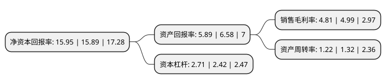

> 本页面由自动化程序生成于 2022年5月20日 01:28
> 内容可能存在错误，如有bug请提交issue至：https://github.com/Eroleice/doc-pi/issues
{.is-warning}

# 上市公司基本情况

## 基本资料

重庆百货大楼股份有限公司（以下简称“重庆百货”）成立于1992年08月11日，重庆市。于1996年07月02日在上交所主板上市。

重庆百货注册资本40,652.847万元，商品零售，商品批发。以下是详细信息：

- 公司名称: 重庆百货大楼股份有限公司
- 股票代码: 600729.SH
- 所在地: 重庆 - 重庆市
- 成立日期: 1992年08月11日
- 注册资本: 40,652.847万元
- 法定代表人: 何谦
- 主营业务: 商品零售，商品批发
- 公司官网: www.e-cbest.com
- 公司介绍: 公司是重庆市最早的国有商业企业和第一家商业上市公司。公司已形成了百货、超市、电器、汽车贸易等多业态发展的经营格局，培育了电子商务、消费金融、供应链金融及质量检测等新兴产业，旗下拥有“重百”、“新世纪百货”曾获中国驰名商标保护；重庆百货、新世纪百货、商社电器和商社汽贸等品牌享誉巴渝，广受消费者信赖与喜爱。经过多年的努力，公司多次跻身“全国零售100强”、“中国连锁30强”前列，并先后荣获“全国五一劳动奖状”、“全国百城万店无假货示范店先进单位”和“重庆市著名商标”等殊荣。

## 股东及高管情况

上市公司第一大股东为重庆商社(集团)有限公司，持股208,997,007股，占比51.4102%，为上市公司实际控制人。

截至2022年03月31日，上市公司的前十大股东中，共有4名机构股东，5个产品账户，1个海外主体，其中5%以上大股东共有2名。上市公司前十大股东明细如下：

> 截至2022年03月31日，上市公司前十大股东信息如下：

| 股东名称 | 持股数量（股） | 持股比例 |
| --- | --- | --- |
| 重庆商社(集团)有限公司 | 208,997,007 | 51.4102% |
| 重庆商社(集团)有限公司 | 208,997,007 | 51.4102% |
| 香港中央结算有限公司(陆股通) | 13,642,578 | 3.36% |
| 招商银行股份有限公司-上证红利交易型开放式指数证券投资基金 | 13,230,602 | 3.25% |
| 重庆百货大楼股份有限公司回购专用证券账户 | 10,360,094 | 2.55% |
| 重庆华贸国有资产经营有限公司 | 4,521,743 | 1.11% |
| 国泰高分红策略股票型养老金产品-招商银行股份有限公司 | 4,455,000 | 1.1% |
| 国泰基金-农业银行-国泰蓝筹价值1号集合资产管理计划 | 4,400,000 | 1.08% |
| 中央汇金资产管理有限责任公司 | 4,369,525 | 1.07% |
| 国泰基金-上海银行-国泰优选配置集合资产管理计划 | 4,110,900 | 1.01% |

## 利润表分析

上市公司2021年总收入为211.23亿元，净利润为10.15亿元，实现盈利。

## 杜邦分析

> 数据列示周期：2021年 | 2020年 | 2019年
{.is-info}

上市公司的净资产收益率在近一年有所上升，上升幅度为0.38%，其变化情况分解如下：
- 上市公司的销售毛利率在近一年下降了-3.61%，可能是生产效率的下降、商品原材料价格上涨或商品价格的下跌所致。
- 上市公司的资产周转率在近一年下降了-7.58%，可能是源自于更慢的销售回款或库存管理效果下降。
- 上市公司的财务杠杆比率在近一年上升了11.98%，可能是增加负债扩大生产规模。

