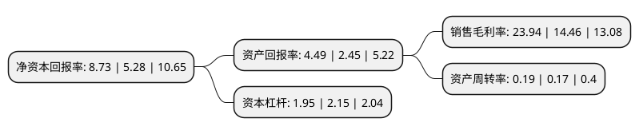

> 本页面由自动化程序生成于 2022年5月20日 01:28
> 内容可能存在错误，如有bug请提交issue至：https://github.com/Eroleice/doc-pi/issues
{.is-warning}

# 上市公司基本情况

## 基本资料

兰州丽尚国潮实业集团股份有限公司（以下简称“丽尚国潮”）成立于1996年12月02日，兰州市。于1996年08月02日在上交所主板上市。

丽尚国潮注册资本77,346.448万元，主营业务:商品零售，餐饮娱乐。以下是详细信息：

- 公司名称: 兰州丽尚国潮实业集团股份有限公司
- 股票代码: 600738.SH
- 所在地: 甘肃 - 兰州市
- 成立日期: 1996年12月02日
- 注册资本: 77,346.448万元
- 法定代表人: 叶茂
- 主营业务: 主营业务:商品零售，餐饮娱乐
- 公司官网: www.lzminbai.com.cn
- 公司介绍: 公司是经营百货零售业为主的大型商贸企业集团。公司已形成现代百货零售、高级酒店、餐饮娱乐、商业地产等多项产业。公司经营业务以兰州核心商圈的百货零售、餐饮酒店和南京地区的专业市场管理为主。公司旗下亚欧商厦地处城市核心商圈，地理位置竞争优势明显，商品销售以自营和联营模式为主。公司餐饮以婚宴包席、商务用餐为主，酒店业务包括商务宾馆和便捷商务酒店。公司以住宿餐饮并重，为客户提供大众化餐饮及商务旅行接待服务。公司秉承“信誉民百，品牌亚欧”的经营宗旨，通过多年的积极进取、不断努力，树立的品牌形象，为公司保有稳定的客户群体，是区域内有影响力的商贸企业之一。公司是全国大型百货零售企业贸易联合会成员单位，也是国务院确定的百户建立现代企业制度试点单位之一。

## 股东及高管情况

上市公司第一大股东为红楼集团有限公司，持股241,944,808股，占比31.28%，为上市公司实际控制人。

截至2022年03月31日，上市公司的前十大股东中，共有5名自然人股东，3名机构股东，2个产品账户，其中5%以上大股东共有8名。上市公司前十大股东明细如下：

> 截至2022年03月31日，上市公司前十大股东信息如下：

| 股东名称 | 持股数量（股） | 持股比例 |
| --- | --- | --- |
| 红楼集团有限公司 | 241,944,808 | 31.28% |
| 红楼集团有限公司 | 201,944,808 | 26.11% |
| 浙江元明控股有限公司 | 154,692,895 | 20% |
| 洪一丹 | 41,512,375 | 5.37% |
| 洪一丹 | 41,512,375 | 5.37% |
| 左玲 | 40,000,000 | 5.17% |
| 铸锋资产管理(北京)有限公司-铸锋鱼肠9号私募证券投资基金 | 38,750,000 | 5.01% |
| 铸锋资产管理(北京)有限公司-铸锋鱼肠9号私募证券投资基金 | 38,750,000 | 5.01% |
| 王平 | 9,373,600 | 1.21% |
| 罗美华 | 7,965,980 | 1.03% |

## 利润表分析

上市公司2021年总收入为6.42亿元，净利润为1.53亿元，实现盈利。

## 杜邦分析

> 数据列示周期：2021年 | 2020年 | 2019年
{.is-info}

上市公司的净资产收益率在近一年有所上升，上升幅度为65.34%，其变化情况分解如下：
- 上市公司的销售毛利率在近一年上升了65.56%，可能是生产效率的提升、商品原材料价格下跌或商品价格的上涨所致。
- 上市公司的资产周转率在近一年上升了11.76%，可能是源自于更快的销售回款或库存管理效果提升。
- 上市公司的财务杠杆比率在近一年下降了-9.3%，可能是减少负债降低财务费用。

