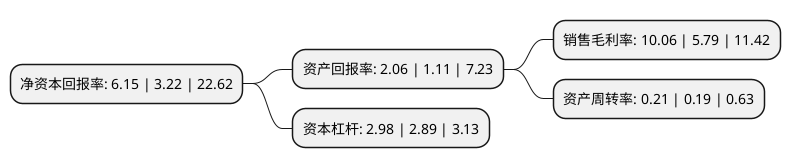

> 本页面由自动化程序生成于 2022年5月20日 01:29
> 内容可能存在错误，如有bug请提交issue至：https://github.com/Eroleice/doc-pi/issues
{.is-warning}

# 上市公司基本情况

## 基本资料

茂业商业股份有限公司（以下简称“茂业商业”）成立于1993年12月31日，成都市。于1994年02月24日在上交所主板上市。

茂业商业注册资本173,198.255万元，主要业务:商品零售。以下是详细信息：

- 公司名称: 茂业商业股份有限公司
- 股票代码: 600828.SH
- 所在地: 四川 - 成都市
- 成立日期: 1993年12月31日
- 注册资本: 173,198.255万元
- 法定代表人: 高宏彪
- 主营业务: 商品零售
- 公司官网: www.cpds.cn
- 公司介绍: 公司是四川省首家公开发行上市的商业股份制公司。目前公司零售板块以“茂业天地”“茂业百货”“仁和春天”“人民商场”多品牌模式运营，立足成都、辐射四川、布局西南、华南、山东、内蒙古等城市核心区域，业务涉及百货零售、商业地产、物业经营、酒店(JW万豪酒店)等领域。公司旗下“茂业天地”、“茂业百货”、“人民商场”及新收购的“仁和春天”、“维多利”品牌积累了一大批忠实的顾客群体，从而在主营业务区域具有广泛的品牌认知度、美誉度和影响力，品牌优势显著，消费者认可度高。目前公司在呼和浩特零售市场已拥有行业龙头地位，在成都、深圳、包头等核心城市的市场份额也名列前茅，这将为公司在这些区域市场上的后续竞争和发展提供良好的基础。

## 股东及高管情况

上市公司第一大股东为深圳茂业商厦有限公司，持股1,401,135,188股，占比80.9%，为上市公司实际控制人。

截至2022年03月31日，上市公司的前十大股东中，共有6名自然人股东，4名机构股东，其中5%以上大股东共有1名。上市公司前十大股东明细如下：

> 截至2022年03月31日，上市公司前十大股东信息如下：

| 股东名称 | 持股数量（股） | 持股比例 |
| --- | --- | --- |
| 深圳茂业商厦有限公司 | 1,401,135,188 | 80.9% |
| 深圳德茂投资企业(有限合伙) | 45,232,397 | 2.61% |
| 包头市茂业东正房地产开发有限公司 | 32,925,460 | 1.9% |
| 深圳合正茂投资企业(有限合伙) | 18,087,452 | 1.04% |
| 赵睿 | 8,552,562 | 0.49% |
| 徐意 | 7,268,275 | 0.42% |
| 张德娟 | 6,482,700 | 0.37% |
| 张音 | 3,669,724 | 0.21% |
| 杨龙活 | 2,973,304 | 0.17% |
| 姜小香 | 2,827,323 | 0.16% |

## 利润表分析

上市公司2021年总收入为41.67亿元，净利润为4.19亿元，实现盈利。

## 杜邦分析

> 数据列示周期：2021年 | 2020年 | 2019年
{.is-info}

上市公司的净资产收益率在近一年有所上升，上升幅度为90.99%，其变化情况分解如下：
- 上市公司的销售毛利率在近一年上升了73.75%，可能是生产效率的提升、商品原材料价格下跌或商品价格的上涨所致。
- 上市公司的资产周转率在近一年上升了10.53%，可能是源自于更快的销售回款或库存管理效果提升。
- 上市公司的财务杠杆比率在近一年上升了3.11%，可能是增加负债扩大生产规模。

