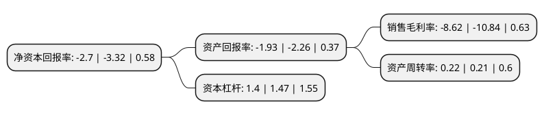

> 本页面由自动化程序生成于 2022年5月20日 01:29
> 内容可能存在错误，如有bug请提交issue至：https://github.com/Eroleice/doc-pi/issues
{.is-warning}

# 上市公司基本情况

## 基本资料

北京城乡商业(集团)股份有限公司（以下简称“北京城乡”）成立于1992年11月03日，北京市。于1994年05月20日在上交所主板上市。

北京城乡注册资本31,680.495万元，商品零售。以下是详细信息：

- 公司名称: 北京城乡商业(集团)股份有限公司
- 股票代码: 600861.SH
- 所在地: 北京 - 北京市
- 成立日期: 1992年11月03日
- 注册资本: 31,680.495万元
- 法定代表人: 王禄征
- 主营业务: 商品零售
- 公司官网: www.bjcx.cn
- 公司介绍: 公司是以商业零售业为主体的大型股份制企业，以商业零售业为主体。公司前身是北京市城乡贸易中心商场，于1992年1月18日开业。同年9月，公司成功地实现了股份制改造，1994年5月又实现了由定向募集公司向上市公司的转变，完成了企业经营管理机制的重大改革。在主业上，公司在成功运作城乡贸易中心本店的基础上，相继创办了北京城乡华懋商厦和北京城乡仓储大超市,从而完善了公司的主业经营格局。华懋商厦与城乡错位经营、优势互补；城乡仓储超市则以低价位、快节奏、高质量的服务模式取胜，赢得了广泛而稳定的消费群，创造了优良的经济效益。公司已发展成为具有雄厚经济实力，良好商誉和发展潜质的大型上市公司。公司将坚持以市场为导向，以资产为纽带，以效益为中心，不断加大改革力度，加速与国际市场接轨的步伐，在竞争中求生存、求发展，最终实现将企业建成集团化、国际化股份公司的宏伟目标。

## 股东及高管情况

上市公司第一大股东为北京国有资本运营管理有限公司，持股108,452,397股，占比34.23%，为上市公司实际控制人。

截至2022年03月31日，上市公司的前十大股东中，共有6名自然人股东，2名机构股东，2个产品账户，其中5%以上大股东共有1名。上市公司前十大股东明细如下：

> 截至2022年03月31日，上市公司前十大股东信息如下：

| 股东名称 | 持股数量（股） | 持股比例 |
| --- | --- | --- |
| 北京国有资本运营管理有限公司 | 108,452,397 | 34.23% |
| 吴建星 | 3,940,001 | 1.24% |
| 代奇 | 3,789,200 | 1.2% |
| 中国工商银行股份有限公司-东方主题精选混合型证券投资基金 | 3,665,046 | 1.16% |
| 刘元涛 | 2,946,400 | 0.93% |
| 招商证券国际有限公司-客户资金 | 2,801,735 | 0.88% |
| 上海合锦投资管理有限公司-合锦稳健私募基金 | 2,800,000 | 0.88% |
| 吴亚军 | 2,491,280 | 0.79% |
| 王文星 | 2,357,300 | 0.74% |
| 李莉 | 2,299,700 | 0.73% |

## 利润表分析

上市公司2021年总收入为6.97亿元，净利润为-0.61亿元，**未实现盈利**。

## 杜邦分析

> 数据列示周期：2021年 | 2020年 | 2019年
{.is-info}

上市公司的净资产收益率在近一年有所下降，下降幅度为-18.67%，其变化情况分解如下：
- 上市公司的销售毛利率在近一年下降了-20.48%，可能是生产效率的下降、商品原材料价格上涨或商品价格的下跌所致。
- 上市公司的资产周转率在近一年上升了4.76%，可能是源自于更快的销售回款或库存管理效果提升。
- 上市公司的财务杠杆比率在近一年下降了-4.76%，可能是减少负债降低财务费用。

