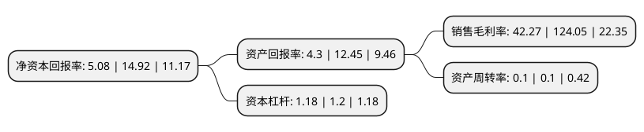

> 本页面由自动化程序生成于 2022年5月20日 01:29
> 内容可能存在错误，如有bug请提交issue至：https://github.com/Eroleice/doc-pi/issues
{.is-warning}

# 上市公司基本情况

## 基本资料

百大集团股份有限公司（以下简称“百大集团”）成立于1992年09月30日，杭州市。于1994年08月09日在上交所主板上市。

百大集团注册资本37,624.032万元，百货，旅游服务以下是详细信息：

- 公司名称: 百大集团股份有限公司
- 股票代码: 600865.SH
- 所在地: 浙江 - 杭州市
- 成立日期: 1992年09月30日
- 注册资本: 37,624.032万元
- 法定代表人: 陈夏鑫
- 主营业务: 百货，旅游服务
- 公司官网: www.baidagroup.com
- 公司介绍: 公司是一家集百货业、酒店业、旅游业等为一体的综合性集团公司，中国商业服务名牌企业。目前，公司旗下拥有浙江百大置业有限公司、杭州百大置业有限公司、杭州百货大楼、杭州大酒店、商居大厦物业管理分公司等多家分子公司。营收主要来源于商品销售、旅游收入、租赁业务和场租费收入。公司拥有杭百大楼、杭州大酒店及其相应的土地使用权，这部分资产位于杭州市黄金商业区，长期增值潜力较大。公司先后被授予中国商业名牌企业，中国商业服务名牌企业，浙江省百强服务业、浙江省著名商标、浙江省知名商号、杭州市百强企业等荣誉称号。

## 股东及高管情况

上市公司第一大股东为西子国际控股有限公司，持股120,396,920股，占比32%，为上市公司实际控制人。

截至2022年05月12日，上市公司的前十大股东中，共有6名自然人股东，4名机构股东，其中5%以上大股东共有4名。上市公司前十大股东明细如下：

> 截至2022年05月12日，上市公司前十大股东信息如下：

| 股东名称 | 持股数量（股） | 持股比例 |
| --- | --- | --- |
| 西子国际控股有限公司 | 120,396,920 | 32% |
| 西子国际控股有限公司 | 120,396,920 | 32% |
| 西子联合控股有限公司 | 54,478,767 | 14.4798% |
| 西子联合控股有限公司 | 47,813,498 | 12.71% |
| 方东晖 | 17,242,400 | 4.58% |
| 陈桂花 | 12,249,742 | 3.26% |
| 李百春 | 8,365,033 | 2.22% |
| 何松兰 | 6,954,383 | 1.85% |
| 孙中奇 | 3,582,000 | 0.95% |
| 何志燕 | 3,234,770 | 0.86% |

## 利润表分析

上市公司2021年总收入为2.66亿元，净利润为1.12亿元，实现盈利。

## 杜邦分析

> 数据列示周期：2021年 | 2020年 | 2019年
{.is-info}

上市公司的净资产收益率在近一年有所下降，下降幅度为-65.95%，其变化情况分解如下：
- 上市公司的销售毛利率在近一年下降了-65.93%，可能是生产效率的下降、商品原材料价格上涨或商品价格的下跌所致。
- 上市公司的资产周转率在近一年下降了0%，可能是源自于更慢的销售回款或库存管理效果下降。
- 上市公司的财务杠杆比率在近一年下降了-1.67%，可能是减少负债降低财务费用。

