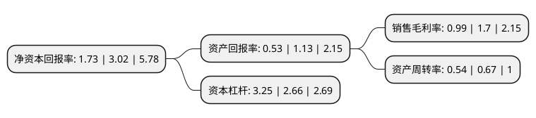

> 本页面由自动化程序生成于 2022年5月20日 01:31
> 内容可能存在错误，如有bug请提交issue至：https://github.com/Eroleice/doc-pi/issues
{.is-warning}

# 上市公司基本情况

## 基本资料

利群商业集团股份有限公司（以下简称“利群股份”）成立于1998年01月22日，青岛市。于2017年04月12日在上交所主板上市。

利群股份注册资本86,052.708万元，公司主营业务为以百货，超市和电器为核心主业的零售连锁业务，和以城市物流中心为辅的品牌代理和商业物流业务。以下是详细信息：

- 公司名称: 利群商业集团股份有限公司
- 股票代码: 601366.SH
- 所在地: 山东 - 青岛市
- 成立日期: 1998年01月22日
- 注册资本: 86,052.708万元
- 法定代表人: 徐恭藻
- 主营业务: 公司主营业务为以百货，超市和电器为核心主业的零售连锁业务，和以城市物流中心为辅的品牌代理和商业物流业务
- 公司官网: www.liquncommercialgroup.com
- 公司介绍: 公司是集百货零售连锁、商业物流配送、品牌代理与运作、电子商务等多业态于一体的大型商业集团。公司主要从事以百货、超市及电器为核心主业的零售连锁，和以城市物流中心为支撑的品牌代理及商业物流配送业务，并形成“供应链+自营”为核心竞争力的“供应链整合型”利群独特商业经营模式。公司在近几年的不断进取中，取得了跨越式的发展。在不断扩大企业经营规模的同时，公司积极强化企业人力资源管理，优化信息技术系统，打造智慧供应链信息管理平台，完善采购中心、物流中心、资金结算中心和信息中心“四大中心”建设，夯实企业核心竞争力。展望未来，利群股份将依托品牌、批发、物流、人才等突出优势，把握时代脉搏、挖掘发展潜能，践行“利泽群惠”的经营理念，实现企业的快速、稳健和可持续发展。

## 股东及高管情况

上市公司第一大股东为利群集团股份有限公司，持股171,129,589股，占比19.8866%，**疑似为**上市公司实际控制人。

截至2022年04月20日，上市公司的前十大股东中，共有2名自然人股东，7名机构股东，1个产品账户，其中5%以上大股东共有5名。上市公司前十大股东明细如下：

> 未能通过持股比例判定出上市公司实际控制人（持股30%以上）
> 可能存在通过间接持股、联合持股、协议控制等方式拥有实际控制权的主体，具体请参考上市公司定期公告！
{.is-warning}

> 截至2022年04月20日，上市公司前十大股东信息如下：

| 股东名称 | 持股数量（股） | 持股比例 |
| --- | --- | --- |
| 利群集团股份有限公司 | 171,129,589 | 19.8866% |
| 利群集团股份有限公司 | 171,129,589 | 19.89% |
| 青岛钧泰基金投资有限公司 | 122,170,664 | 14.1972% |
| 青岛利群投资有限公司 | 57,737,580 | 6.7095% |
| 青岛利群投资有限公司 | 57,707,580 | 6.71% |
| 青岛恒荣泰资产管理股份有限公司 | 42,942,287 | 4.99% |
| 连云港市嘉瑞宝商业发展有限公司 | 42,759,692 | 4.97% |
| 青岛上瑞商业有限公司 | 42,277,106 | 4.91% |
| 李林 | 21,096,369 | 2.45% |
| 王维平 | 16,276,469 | 1.89% |

## 利润表分析

上市公司2021年总收入为80.83亿元，净利润为0.79亿元，实现盈利。

## 杜邦分析

> 数据列示周期：2021年 | 2020年 | 2019年
{.is-info}

上市公司的净资产收益率在近一年有所下降，下降幅度为-42.72%，其变化情况分解如下：
- 上市公司的销售毛利率在近一年下降了-41.76%，可能是生产效率的下降、商品原材料价格上涨或商品价格的下跌所致。
- 上市公司的资产周转率在近一年下降了-19.4%，可能是源自于更慢的销售回款或库存管理效果下降。
- 上市公司的财务杠杆比率在近一年上升了22.18%，可能是增加负债扩大生产规模。

