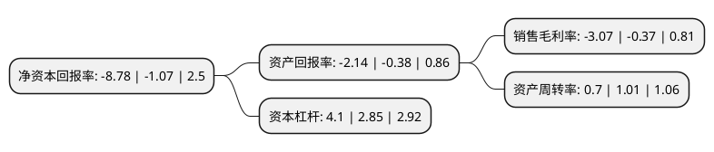

> 本页面由自动化程序生成于 2022年5月20日 01:32
> 内容可能存在错误，如有bug请提交issue至：https://github.com/Eroleice/doc-pi/issues
{.is-warning}

# 上市公司基本情况

## 基本资料

安徽安德利百货股份有限公司（以下简称“安德利”）成立于1999年05月07日，合肥市。于2016年08月22日在上交所主板上市。

安德利注册资本11,200万元，主营业务:以自营百货零售为主;主要产品:购物中心，超市，家电专业店等。以下是详细信息：

- 公司名称: 安徽安德利百货股份有限公司
- 股票代码: 603031.SH
- 所在地: 安徽 - 合肥市
- 成立日期: 1999年05月07日
- 注册资本: 11,200万元
- 法定代表人: 夏柱兵
- 主营业务: 主营业务:以自营百货零售为主;主要产品:购物中心，超市，家电专业店等
- 公司官网: www.sinoadl.com
- 公司介绍: 公司是省政府重点建设的流通服务企业，万村千乡市场建设工程承办企业。公司主营业务是主要业务是国内三、四线城市及农村市场的百货零售，零售主营业态有购物中心、超市和专业店。公司立足安徽中部皖江流域，面向县城、乡镇及广大农村市场的各类需求，以县城大型购物中心为“中心”，以县城、乡镇超市为“网点”，积极向庐江、巢湖、含山、和县、无为、当涂等皖中长江流域辐射，目前已发展成为安徽中部下属的县乡地区中最大的百货零售连锁企业、安徽省重点扶持的“十大商贸流通企业”、中国百货商业协会百强企业。公司是安徽省著名商业企业，先后被授予全国诚信单位、省改革先进单位、安徽省购物放心店、省文明单位、省重合同守信用企业、省诚信建设及职工职业道德教育双佳单位等多项殊荣。

## 股东及高管情况

上市公司第一大股东为宁波亚丰电器有限公司，持股16,800,000股，占比15%，**疑似为**上市公司实际控制人。

截至2022年04月29日，上市公司的前十大股东中，共有6名自然人股东，3名机构股东，1个产品账户，其中5%以上大股东共有8名。上市公司前十大股东明细如下：

> 未能通过持股比例判定出上市公司实际控制人（持股30%以上）
> 可能存在通过间接持股、联合持股、协议控制等方式拥有实际控制权的主体，具体请参考上市公司定期公告！
{.is-warning}

> 截至2022年04月29日，上市公司前十大股东信息如下：

| 股东名称 | 持股数量（股） | 持股比例 |
| --- | --- | --- |
| 宁波亚丰电器有限公司 | 16,800,000 | 15% |
| 合肥荣新股权投资基金合伙企业(有限合伙) | 14,380,800 | 12.84% |
| 秦大乾 | 10,785,600 | 9.63% |
| 张敬红 | 8,400,000 | 7.5% |
| 张敬红 | 8,400,000 | 7.5% |
| 储圆圆 | 8,116,356 | 7.25% |
| 深圳市前海荣耀资本管理有限公司 | 7,457,240 | 6.66% |
| 深圳市前海荣耀资本管理有限公司 | 7,457,240 | 6.66% |
| 杨越 | 1,150,700 | 1.03% |
| 蒋一翔 | 980,040 | 0.88% |

## 利润表分析

上市公司2021年总收入为16.77亿元，净利润为-0.52亿元，**未实现盈利**。

## 杜邦分析

> 数据列示周期：2021年 | 2020年 | 2019年
{.is-info}

上市公司的净资产收益率在近一年有所上升，上升幅度为720.56%，其变化情况分解如下：
- 上市公司的销售毛利率在近一年上升了729.73%，可能是生产效率的提升、商品原材料价格下跌或商品价格的上涨所致。
- 上市公司的资产周转率在近一年下降了-30.69%，可能是源自于更慢的销售回款或库存管理效果下降。
- 上市公司的财务杠杆比率在近一年上升了43.86%，可能是增加负债扩大生产规模。

