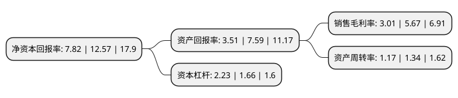

> 本页面由自动化程序生成于 2022年5月20日 01:33
> 内容可能存在错误，如有bug请提交issue至：https://github.com/Eroleice/doc-pi/issues
{.is-warning}

# 上市公司基本情况

## 基本资料

上海爱婴室商务服务股份有限公司（以下简称“爱婴室”）成立于2005年08月22日，上海市。于2018年03月30日在上交所主板上市。

爱婴室注册资本14,150.59万元，主营业务:主要从事母婴商品的销售及相关服务业务。经营产品涵盖了婴幼儿乳制品，纸制品，喂哺用品，玩具，洗护用品，棉纺品，车床等品类，产品品种逾万种。以下是详细信息：

- 公司名称: 上海爱婴室商务服务股份有限公司
- 股票代码: 603214.SH
- 所在地: 上海 - 上海市
- 成立日期: 2005年08月22日
- 注册资本: 14,150.59万元
- 法定代表人: 施琼
- 主营业务: 主营业务:主要从事母婴商品的销售及相关服务业务经营产品涵盖了婴幼儿乳制品，纸制品，喂哺用品，玩具，洗护用品，棉纺品，车床等品类，产品品种逾万种
- 公司官网: www.aiyingshi.com
- 公司介绍: 公司主要从事母婴商品的销售及相关服务业务，是一家结合直营门店、电子商务等多种渠道，为孕前至6岁婴幼儿家庭提供优质母婴商品和相关服务的专业连锁零售商，经营产品涵盖了婴幼儿乳制品、纸制品、喂哺用品、玩具、洗护用品、棉纺品、车床等品类，产品品种逾万种。公司总部位于上海，并在上海、无锡、南通、杭州、绍兴、嘉兴、宁波、厦门、福州等经济发达城市设立子公司和分公司，运营162家中大型母婴品质生活馆，专业销售中高端母婴用品并提供婴儿抚触等专业服务，公司直营门店由公司及子公司直接经营，为客户搭建了一站式母婴用品采购及孕婴童健康服务平台。

## 股东及高管情况

上市公司第一大股东为施琼，持股32,280,855股，占比22.81%，**疑似为**上市公司实际控制人。

截至2022年03月31日，上市公司的前十大股东中，共有5名自然人股东，1名机构股东，3个产品账户，1个海外主体，其中5%以上大股东共有3名。上市公司前十大股东明细如下：

> 未能通过持股比例判定出上市公司实际控制人（持股30%以上）
> 可能存在通过间接持股、联合持股、协议控制等方式拥有实际控制权的主体，具体请参考上市公司定期公告！
{.is-warning}

> 截至2022年03月31日，上市公司前十大股东信息如下：

| 股东名称 | 持股数量（股） | 持股比例 |
| --- | --- | --- |
| 施琼 | 32,280,855 | 22.81% |
| Partners Group Harmonious Baby Limited | 24,012,404 | 16.97% |
| 莫锐强 | 16,800,000 | 11.87% |
| 董勤存 | 4,137,000 | 2.92% |
| 杨清芬 | 3,450,000 | 2.44% |
| 上海茂强投资管理合伙企业(有限合伙) | 3,123,000 | 2.21% |
| 广发基金管理有限公司-社保基金四二零组合 | 2,768,805 | 1.96% |
| 戚继伟 | 2,339,576 | 1.65% |
| 基本养老保险基金一六零四一组合 | 1,873,420 | 1.32% |
| 中国工商银行股份有限公司-华安媒体互联网混合型证券投资基金 | 1,187,060 | 0.84% |

## 利润表分析

上市公司2021年总收入为26.52亿元，净利润为0.79亿元，实现盈利。

## 杜邦分析

> 数据列示周期：2021年 | 2020年 | 2019年
{.is-info}

上市公司的净资产收益率在近一年有所下降，下降幅度为-37.79%，其变化情况分解如下：
- 上市公司的销售毛利率在近一年下降了-46.91%，可能是生产效率的下降、商品原材料价格上涨或商品价格的下跌所致。
- 上市公司的资产周转率在近一年下降了-12.69%，可能是源自于更慢的销售回款或库存管理效果下降。
- 上市公司的财务杠杆比率在近一年上升了34.34%，可能是增加负债扩大生产规模。

