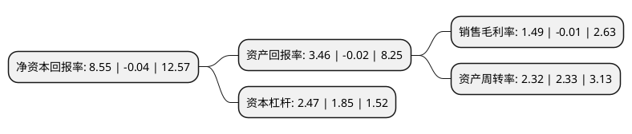

> 本页面由自动化程序生成于 2022年5月20日 01:02
> 内容可能存在错误，如有bug请提交issue至：https://github.com/Eroleice/doc-pi/issues
{.is-warning}

# 上市公司基本情况

## 基本资料

茂名石化实华股份有限公司（以下简称“茂化实华”）成立于1988年10月04日，茂名市。于1996年11月14日在深交所主板上市。

茂化实华注册资本51,987.536万元，主要产品:聚丙烯，液化气，盐产品。以下是详细信息：

- 公司名称: 茂名石化实华股份有限公司
- 股票代码: 000637.SZ
- 所在地: 广东 - 茂名市
- 成立日期: 1988年10月04日
- 注册资本: 51,987.536万元
- 法定代表人: 范洪岩
- 主营业务: 主要产品:聚丙烯，液化气，盐产品
- 公司官网: www.mhsh0637.com.cn
- 公司介绍: 公司是以国家特大型国有企业—中国石化茂名石油化工公司为发起人，于1988年10月创立的股份制企业。公司以建设全国知名化工企业集团为目标，发挥资源和技术优势，实业、投资、贸易一体化发展，企业规模和产业水平不断发展壮大。公司属于石油化工行业；主要产品是液化气、聚丙烯、醋酸仲丁酯、MTBE、溶剂油、乙醇胺、聚合级异丁烷、丙烷等；主要经营范围是石油化工产品的生产及销售。公司拥有一个广东省级精细化工工程技术研发中心，4项发明专利和12项实用新型专利，多次获得广东省、茂名市科技进步一、二、三等奖。“实华”牌商标为广东省著名商标，“实华”牌聚丙烯树脂被评为国家监督检测质量十佳放心品牌。公司被评为广东省文明单位，多次获得广东省先进集体、茂名市先进集体、茂名市文明单位和“双文明”竞赛优胜单位等荣誉称号。

## 股东及高管情况

上市公司第一大股东为北京泰跃房地产开发有限责任公司，持股151,538,145股，占比29.15%，**疑似为**上市公司实际控制人。

截至2022年03月31日，上市公司的前十大股东中，共有7名自然人股东，3名机构股东，其中5%以上大股东共有2名。上市公司前十大股东明细如下：

> 未能通过持股比例判定出上市公司实际控制人（持股30%以上）
> 可能存在通过间接持股、联合持股、协议控制等方式拥有实际控制权的主体，具体请参考上市公司定期公告！
{.is-warning}

> 截至2022年03月31日，上市公司前十大股东信息如下：

| 股东名称 | 持股数量（股） | 持股比例 |
| --- | --- | --- |
| 北京泰跃房地产开发有限责任公司 | 151,538,145 | 29.15% |
| 中国石化集团茂名石油化工有限公司 | 76,658,001 | 14.75% |
| 蒋健 | 5,003,200 | 0.96% |
| 广东众和化塑股份公司 | 4,489,930 | 0.86% |
| 刘鹏安 | 4,077,500 | 0.78% |
| 曹敬群 | 1,780,000 | 0.34% |
| 张玉兰 | 1,705,300 | 0.33% |
| 姚慧群 | 1,360,900 | 0.26% |
| 薛晓耕 | 1,358,200 | 0.26% |
| 李加恒 | 1,281,500 | 0.25% |

## 利润表分析

上市公司2021年总收入为55.72亿元，净利润为0.83亿元，实现盈利。

## 杜邦分析

> 数据列示周期：2021年 | 2020年 | 2019年
{.is-info}

上市公司的净资产收益率在近一年有所下降，下降幅度为-21475%，其变化情况分解如下：
- 上市公司的销售毛利率在近一年下降了-15000%，可能是生产效率的下降、商品原材料价格上涨或商品价格的下跌所致。
- 上市公司的资产周转率在近一年下降了-0.43%，可能是源自于更慢的销售回款或库存管理效果下降。
- 上市公司的财务杠杆比率在近一年上升了33.51%，可能是增加负债扩大生产规模。

