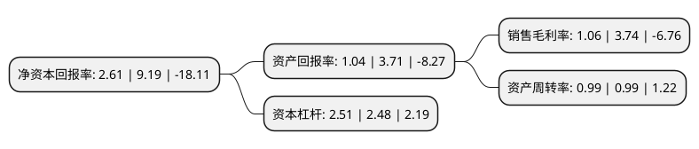

> 本页面由自动化程序生成于 2022年5月20日 01:03
> 内容可能存在错误，如有bug请提交issue至：https://github.com/Eroleice/doc-pi/issues
{.is-warning}

# 上市公司基本情况

## 基本资料

沈阳化工股份有限公司（以下简称“沈阳化工”）成立于1996年05月20日，沈阳市。于1997年02月20日在深交所主板上市。

沈阳化工注册资本81,951.44万元，主要产品:烧碱，糊树脂，93#汽油，轻柴油，丙烯。以下是详细信息：

- 公司名称: 沈阳化工股份有限公司
- 股票代码: 000698.SZ
- 所在地: 辽宁 - 沈阳市
- 成立日期: 1996年05月20日
- 注册资本: 81,951.44万元
- 法定代表人: 孙泽胜
- 主营业务: 主要产品:烧碱，糊树脂，93#汽油，轻柴油，丙烯
- 公司官网: www.sychem.com
- 公司介绍: 公司是以氯碱化工、石油深加工和化工新材料为主业的国有控股上市公司。公司主要生产装置有20万吨/年PVC糊树脂、20万吨/年烧碱；50万吨/年催化热裂解制乙烯(CPP)、13万吨/年丙烯酸及酯、30万吨/年聚醚多元醇等装置，主导产品的产量、质量及生产工艺技术都居国内同行业前列，有的已达到国际先进水平。作为“国家级高新技术企业”，公司拥有国家级博士后科研工作站、省级企业技术中心和省级工程技术研究中心，拥有多项自主知识产权和发明专利，成功研发了氯醋共聚专用糊树脂及特种PVC糊树脂等高端新牌号，发挥规模、质量、成本、品牌优势，走高端化市场竞争路线，产品营销范围不断扩大，市场占有率稳步提高。近年来，公司获得了“全国和谐劳动关系优秀企业”、“全国质量管理先进企业”、“国家守合同重信誉企业”、“全国环境保护先进单位”、“全国模范职工之家”、“辽宁省纳税百强企业”“辽宁省安全生产先进单位”等荣誉称号。

## 股东及高管情况

上市公司第一大股东为沈阳化工集团有限公司，持股218,663,539股，占比26.68%，**疑似为**上市公司实际控制人。

截至2022年03月31日，上市公司的前十大股东中，共有7名自然人股东，3名机构股东，其中5%以上大股东共有2名。上市公司前十大股东明细如下：

> 未能通过持股比例判定出上市公司实际控制人（持股30%以上）
> 可能存在通过间接持股、联合持股、协议控制等方式拥有实际控制权的主体，具体请参考上市公司定期公告！
{.is-warning}

> 截至2022年03月31日，上市公司前十大股东信息如下：

| 股东名称 | 持股数量（股） | 持股比例 |
| --- | --- | --- |
| 沈阳化工集团有限公司 | 218,663,539 | 26.68% |
| 中国蓝星(集团)股份有限公司 | 158,585,867 | 19.35% |
| 顾诵华 | 18,233,600 | 2.22% |
| 中国化工集团公司 | 9,865,417 | 1.2% |
| 李钻流 | 2,710,700 | 0.33% |
| 王键 | 2,309,000 | 0.28% |
| 俞建杨 | 2,000,000 | 0.24% |
| 曾天生 | 1,966,000 | 0.24% |
| 叶杰秋 | 1,777,200 | 0.22% |
| 肖云 | 1,336,715 | 0.16% |

## 利润表分析

上市公司2021年总收入为101.31亿元，净利润为1.06亿元，实现盈利。

## 杜邦分析

> 数据列示周期：2021年 | 2020年 | 2019年
{.is-info}

上市公司的净资产收益率在近一年有所下降，下降幅度为-71.6%，其变化情况分解如下：
- 上市公司的销售毛利率在近一年下降了-71.66%，可能是生产效率的下降、商品原材料价格上涨或商品价格的下跌所致。
- 上市公司的资产周转率在近一年下降了0%，可能是源自于更慢的销售回款或库存管理效果下降。
- 上市公司的财务杠杆比率在近一年上升了1.21%，可能是增加负债扩大生产规模。

