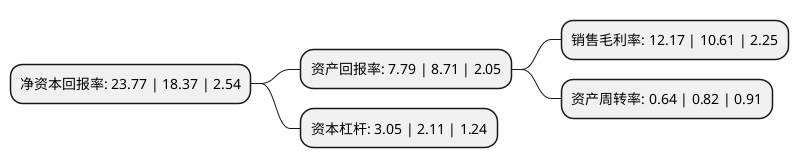

> 本页面由自动化程序生成于 2022年5月20日 01:12
> 内容可能存在错误，如有bug请提交issue至：https://github.com/Eroleice/doc-pi/issues
{.is-warning}

# 上市公司基本情况

## 基本资料

江苏中晟高科环境股份有限公司（以下简称“中晟高科”）成立于1992年04月11日，无锡市。于2016年01月06日在深交所中小板上市。

中晟高科注册资本12,475.33万元，主营业务:从事各类工业润滑油与车用润滑油产品的研发，生产和销售;主要产品:变压器油，液压油，内燃机油，齿轮油，金属加工油，特种溶剂等13个类别，200余种规格型号，广泛应用于电力电器设备，工程机械，工业机械设备，冶金和交通运输等领域。以下是详细信息：

- 公司名称: 江苏中晟高科环境股份有限公司
- 股票代码: 002778.SZ
- 所在地: 江苏 - 无锡市
- 成立日期: 1992年04月11日
- 注册资本: 12,475.33万元
- 法定代表人: 程国鹏
- 主营业务: 主营业务:从事各类工业润滑油与车用润滑油产品的研发，生产和销售;主要产品:变压器油，液压油，内燃机油，齿轮油，金属加工油，特种溶剂等13个类别，200余种规格型号，广泛应用于电力电器设备，工程机械，工业机械设备，冶金和交通运输等领域
- 公司官网: www.jsgaoke.com
- 公司介绍: 公司生产工业润滑油，车用润滑油、特种油、脂等润滑油剂产品13个系列200个品种，是研发、生产、销售的专业专注润滑油、脂企业，公司实现了产品系列化、生产规模化、经营品牌化，是行业内有影响力的企业之一，也是国内民营润滑油行业A股上市公司。公司拥有国内先进的酯化，精馏、全自动脉冲调合等多套生产装置，年生产、销售达10万多吨。公司荣获了中国润滑油行业十强、年度影响力的民族品牌、江苏省著名商标、高新技术企业、江苏省高新技术企业、江苏省AAA级信用企业、质量达标企业、省、市企业等荣誉，承担了火炬项目，省重大科技成果转化和技术支撑项目。长期以来公司注重科技投入和科技创新，公司先后和常州大学、天津大学、上海大学、华中科技大学、中科院成都有机研究所、南京工业大学等大专院校进行了产学研合作，并聘用了多名行业中拥有资深经验的专家教授，拥有国家千人计划专家工作站，江苏省博士后创新实践基地、江苏省废弃油脂快速脂化和综合利用工程技术研究中心、江苏省企业技术中心、国家火炬项目非金属材料产业基地。

## 股东及高管情况

上市公司第一大股东为苏州吴中融玥投资管理有限公司-苏州吴中区天凯汇达股权投资合伙企业(有限合伙)，持股27,883,590股，占比22.35%，**疑似为**上市公司实际控制人。

截至2022年03月31日，上市公司的前十大股东中，共有5名自然人股东，3名机构股东，2个产品账户，其中5%以上大股东共有3名。上市公司前十大股东明细如下：

> 未能通过持股比例判定出上市公司实际控制人（持股30%以上）
> 可能存在通过间接持股、联合持股、协议控制等方式拥有实际控制权的主体，具体请参考上市公司定期公告！
{.is-warning}

> 截至2022年03月31日，上市公司前十大股东信息如下：

| 股东名称 | 持股数量（股） | 持股比例 |
| --- | --- | --- |
| 苏州吴中融玥投资管理有限公司-苏州吴中区天凯汇达股权投资合伙企业(有限合伙) | 27,883,590 | 22.35% |
| 许汉祥 | 10,304,560 | 8.26% |
| 苏州市吴中金融控股集团有限公司 | 8,812,650 | 7.06% |
| 苏州市长桥集团有限公司 | 4,740,000 | 3.8% |
| 上海阿杏投资管理有限公司-阿杏葵花籽6号私募证券投资基金 | 3,123,540 | 2.5% |
| 上海烜鼎资产管理有限公司-烜鼎星辰8号私募证券投资基金 | 3,016,856 | 2.42% |
| 许春栋 | 1,700,180 | 1.36% |
| 许志坚 | 1,486,560 | 1.19% |
| 陈国荣 | 1,413,537 | 1.13% |
| 靖涛 | 1,027,500 | 0.82% |

## 利润表分析

上市公司2021年总收入为10.31亿元，净利润为1.25亿元，实现盈利。

## 杜邦分析

> 数据列示周期：2021年 | 2020年 | 2019年
{.is-info}

上市公司的净资产收益率在近一年有所上升，上升幅度为29.4%，其变化情况分解如下：
- 上市公司的销售毛利率在近一年上升了14.7%，可能是生产效率的提升、商品原材料价格下跌或商品价格的上涨所致。
- 上市公司的资产周转率在近一年下降了-21.95%，可能是源自于更慢的销售回款或库存管理效果下降。
- 上市公司的财务杠杆比率在近一年上升了44.55%，可能是增加负债扩大生产规模。

