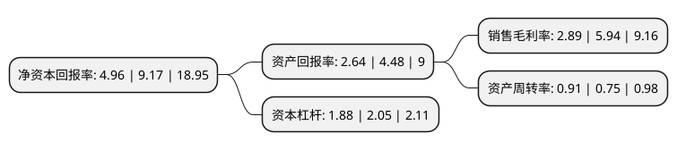

> 本页面由自动化程序生成于 2022年5月20日 01:20
> 内容可能存在错误，如有bug请提交issue至：https://github.com/Eroleice/doc-pi/issues
{.is-warning}

# 上市公司基本情况

## 基本资料

宁波博汇化工科技股份有限公司（以下简称“博汇股份”）成立于2005年10月12日，宁波市。于2020年06月30日在深交所创业板上市。

博汇股份注册资本13,520万元，主营业务:主要从事对催化裂化后的燃料油进行深加工，生产和销售沥青助剂，橡胶助剂，润滑油助剂，轻质燃料油等产品。公司主要产品包括沥青助剂，橡胶助剂，润滑油助剂等重芳烃类产品以及轻质燃料油。以下是详细信息：

- 公司名称: 宁波博汇化工科技股份有限公司
- 股票代码: 300839.SZ
- 所在地: 浙江 - 宁波市
- 成立日期: 2005年10月12日
- 注册资本: 13,520万元
- 法定代表人: 王律
- 主营业务: 主营业务:主要从事对催化裂化后的燃料油进行深加工，生产和销售沥青助剂，橡胶助剂，润滑油助剂，轻质燃料油等产品公司主要产品包括沥青助剂，橡胶助剂，润滑油助剂等重芳烃类产品以及轻质燃料油
- 公司官网: www.bhpcc.com
- 公司介绍: 公司是被纳入国家火炬计划产业化示范项目的高新技术企业，公司主营业务是采用自行研发的间歇式加工生产工艺,连续式生产工艺以及分子蒸馏和沉降等技术,对催化裂化后的燃料油即催化油浆进行深加工,研发,生产和销售作为化工原料的沥青助剂,橡胶助剂,润滑油助剂等重芳烃产品和更为纯净.公司主要产品包括沥青助剂,橡胶助剂,润滑油助剂等重芳烃类产品以及轻质燃料油.公司自主研发的工艺，装置操作温度远低于原料结焦温度，原料在装置内停留时间短，大大减少了原料结焦的可能，因此产品含焦量低、产品色度大为提高，并有效提高了重芳烃产品的收率，实现了催化油浆接近百分之百的综合利用率，提升了经济附加值，符合国家循环经济产业政策，具有循环经济和环保产业的双重特征，为节能减排做出积极贡献。

## 股东及高管情况

上市公司第一大股东为宁波市文魁控股集团有限公司，持股70,484,700股，占比52.13%，为上市公司实际控制人。

截至2022年03月31日，上市公司的前十大股东中，共有8名自然人股东，2名机构股东，其中5%以上大股东共有1名。上市公司前十大股东明细如下：

> 截至2022年03月31日，上市公司前十大股东信息如下：

| 股东名称 | 持股数量（股） | 持股比例 |
| --- | --- | --- |
| 宁波市文魁控股集团有限公司 | 70,484,700 | 52.13% |
| 洪淼松 | 3,000,920 | 2.22% |
| 陈云 | 2,888,806 | 2.14% |
| 陆新花 | 2,704,078 | 2% |
| 徐双全 | 2,560,000 | 1.89% |
| 陈杏花 | 2,000,000 | 1.48% |
| 尤丹红 | 1,810,320 | 1.34% |
| 王律 | 1,637,220 | 1.21% |
| 上海岩明投资中心(有限合伙) | 1,419,900 | 1.05% |
| 周利方 | 974,570 | 0.72% |

## 利润表分析

上市公司2021年总收入为14.58亿元，净利润为0.42亿元，实现盈利。

## 杜邦分析

> 数据列示周期：2021年 | 2020年 | 2019年
{.is-info}

上市公司的净资产收益率在近一年有所下降，下降幅度为-45.91%，其变化情况分解如下：
- 上市公司的销售毛利率在近一年下降了-51.35%，可能是生产效率的下降、商品原材料价格上涨或商品价格的下跌所致。
- 上市公司的资产周转率在近一年上升了21.33%，可能是源自于更快的销售回款或库存管理效果提升。
- 上市公司的财务杠杆比率在近一年下降了-8.29%，可能是减少负债降低财务费用。

