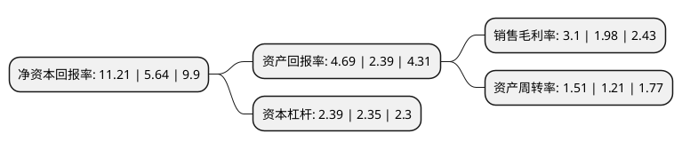

> 本页面由自动化程序生成于 2022年5月20日 01:23
> 内容可能存在错误，如有bug请提交issue至：https://github.com/Eroleice/doc-pi/issues
{.is-warning}

# 上市公司基本情况

## 基本资料

中国石油化工股份有限公司（以下简称“中国石化”）成立于2000年02月25日，北京市。于2001年08月08日在上交所主板上市。

中国石化注册资本12,107,120.965万元，主要产品:原油，天然气，汽油，柴油，煤油，合纤单体及聚合物，合成树脂，合成纤维，合成橡胶，化肥。主营业务:主要从事石油与天然气勘探开采，管道运输，销售;石油炼制，石油化工，化纤，化肥及其它化工生产与产品销售，储运;石油，天然气，石油产品，石油化工及其它化工产品和其它商品，技术的进出口，代理进出口业务;技术，信息的研究，开发，应用。以下是详细信息：

- 公司名称: 中国石油化工股份有限公司
- 股票代码: 600028.SH
- 所在地: 北京 - 北京市
- 成立日期: 2000年02月25日
- 注册资本: 12,107,120.965万元
- 法定代表人: 马永生
- 主营业务: 主要产品:原油，天然气，汽油，柴油，煤油，合纤单体及聚合物，合成树脂，合成纤维，合成橡胶，化肥主营业务:主要从事石油与天然气勘探开采，管道运输，销售;石油炼制，石油化工，化纤，化肥及其它化工生产与产品销售，储运;石油，天然气，石油产品，石油化工及其它化工产品和其它商品，技术的进出口，代理进出口业务;技术，信息的研究，开发，应用
- 公司官网: www.sinopec.com
- 公司介绍: 公司是一家上中下游一体化、石油石化主业突出、拥有比较完备销售网络、境内外上市的股份制企业。公司是中国最大的一体化能源化工公司之一，主要从事石油与天然气勘探开发、管道运输、销售；石油炼制、石油化工、煤化工、化纤及其它化工生产与产品销售、储运；石油、天然气、石油产品、石油化工及其它化工产品和其它商品、技术的进出口、代理进出口业务；技术、信息的研究、开发、应用。中国石化是中国大型油气生产商；炼油能力排名中国第一位；在中国拥有完善的成品油销售网络，是中国最大的成品油供应商；乙烯生产能力排名中国第一位，构建了比较完善的化工产品营销网络。

## 股东及高管情况

上市公司第一大股东为中国石油化工集团有限公司，持股82,709,227,393股，占比68.31%，为上市公司实际控制人。

截至2022年03月31日，上市公司的前十大股东中，共有5名机构股东，4个产品账户，1个海外主体，其中5%以上大股东共有2名。上市公司前十大股东明细如下：

> 截至2022年03月31日，上市公司前十大股东信息如下：

| 股东名称 | 持股数量（股） | 持股比例 |
| --- | --- | --- |
| 中国石油化工集团有限公司 | 82,709,227,393 | 68.31% |
| 香港(中央结算)代理人有限公司 | 25,386,047,959 | 20.97% |
| 中国证券金融股份有限公司 | 2,325,374,407 | 1.92% |
| 中国人寿保险股份有限公司-传统-普通保险产品-005L-CT001沪 | 665,551,331 | 0.55% |
| 中央汇金资产管理有限责任公司 | 315,223,600 | 0.26% |
| 国信证券股份有限公司 | 235,474,124 | 0.19% |
| 中国工商银行-上证50交易型开放式指数 | 94,682,676 | 0.08% |
| 中国工商银行-上证50交易型开放式指数证券投资基金 | 94,682,676 | 0.08% |
| 全国社保基金一一八组合 | 83,162,900 | 0.07% |
| 招商银行股份有限公司-上证红利交易型开放式指数证券投资基金 | 83,006,016 | 0.07% |

## 利润表分析

上市公司2021年总收入为27,408.84亿元，净利润为850.3亿元，实现盈利。

## 杜邦分析

> 数据列示周期：2021年 | 2020年 | 2019年
{.is-info}

上市公司的净资产收益率在近一年有所上升，上升幅度为98.76%，其变化情况分解如下：
- 上市公司的销售毛利率在近一年上升了56.57%，可能是生产效率的提升、商品原材料价格下跌或商品价格的上涨所致。
- 上市公司的资产周转率在近一年上升了24.79%，可能是源自于更快的销售回款或库存管理效果提升。
- 上市公司的财务杠杆比率在近一年上升了1.7%，可能是增加负债扩大生产规模。

