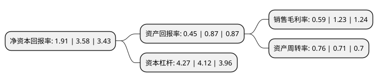

> 本页面由自动化程序生成于 2022年5月20日 01:26
> 内容可能存在错误，如有bug请提交issue至：https://github.com/Eroleice/doc-pi/issues
{.is-warning}

# 上市公司基本情况

## 基本资料

中国石油集团工程股份有限公司（以下简称“中油工程”）成立于1999年04月28日，克拉玛依市。于2000年12月25日在上交所主板上市。

中油工程注册资本558,314.747万元，主要产品:塑料类，沥青类，甲乙酮类，添加剂类，润滑油类，垫片类，化工产品类，润滑油类。以下是详细信息：

- 公司名称: 中国石油集团工程股份有限公司
- 股票代码: 600339.SH
- 所在地: 新疆 - 克拉玛依市
- 成立日期: 1999年04月28日
- 注册资本: 558,314.747万元
- 法定代表人: 白玉光
- 主营业务: 主要产品:塑料类，沥青类，甲乙酮类，添加剂类，润滑油类，垫片类，化工产品类，润滑油类
- 公司官网: www.cpec.com.cn
- 公司介绍: 公司作为中石油集团旗下工程建设业务核心平台，主营业务为以油气田地面工程服务、储运工程服务、炼化工程服务、环境工程服务、项目管理服务为核心的石油工程设计、施工及总承包等相关工程建设业务。公司在多年的发展中突破了一批新技术，创新了一批新工艺新工法，研制了一批新材料新装备，有力提升了工程建设的能力和水平。陆上油气田地面工程设计施工水平和能力处于国内领先地位；陆上长输管道建设处于国内领先地位，施工技术达到国际先进水平；炼油化工加快了赶超步伐，在大型乙烯、大型炼厂、大型氮肥等成套技术开发上取得重大进展，聚酯技术、PTA技术、丙烯酸及酯技术达到了国内领先、国际一流的水平。

## 股东及高管情况

上市公司第一大股东为中国石油天然气集团有限公司，持股3,030,966,809股，占比54.29%，为上市公司实际控制人。

截至2022年03月31日，上市公司的前十大股东中，共有2名自然人股东，5名机构股东，3个产品账户，其中5%以上大股东共有2名。上市公司前十大股东明细如下：

> 截至2022年03月31日，上市公司前十大股东信息如下：

| 股东名称 | 持股数量（股） | 持股比例 |
| --- | --- | --- |
| 中国石油天然气集团有限公司 | 3,030,966,809 | 54.29% |
| 中国石油集团工程服务有限公司 | 1,000,000,000 | 17.91% |
| 新疆天利石化控股集团有限公司 | 197,706,637 | 3.54% |
| 武汉长石鑫工贸有限公司 | 37,740,000 | 0.68% |
| 九泰基金-广发银行-中兵投资管理有限责任公司 | 27,667,595 | 0.5% |
| 北信瑞丰基金-工商银行-北京恒宇天泽投资管理有限公司-恒宇天泽盈-赢二号私募投资基金 | 16,967,729 | 0.3% |
| 广州市玄元投资管理有限公司-玄元元定9号私募证券投资基金 | 15,509,299 | 0.28% |
| 中国人民人寿保险股份有限公司-分红-个险分红 | 12,977,444 | 0.23% |
| 黄玲素 | 12,035,300 | 0.22% |
| 唐友锤 | 9,865,800 | 0.18% |

## 利润表分析

上市公司2021年总收入为798.31亿元，净利润为4.71亿元，实现盈利。

## 杜邦分析

> 数据列示周期：2021年 | 2020年 | 2019年
{.is-info}

上市公司的净资产收益率在近一年有所下降，下降幅度为-46.65%，其变化情况分解如下：
- 上市公司的销售毛利率在近一年下降了-52.03%，可能是生产效率的下降、商品原材料价格上涨或商品价格的下跌所致。
- 上市公司的资产周转率在近一年上升了7.04%，可能是源自于更快的销售回款或库存管理效果提升。
- 上市公司的财务杠杆比率在近一年上升了3.64%，可能是增加负债扩大生产规模。

