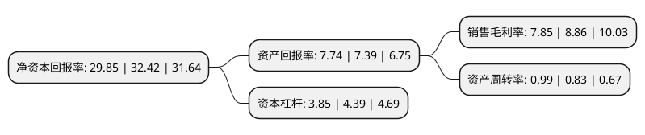

> 本页面由自动化程序生成于 2022年5月20日 01:26
> 内容可能存在错误，如有bug请提交issue至：https://github.com/Eroleice/doc-pi/issues
{.is-warning}

# 上市公司基本情况

## 基本资料

恒力石化股份有限公司（以下简称“恒力石化”）成立于1999年03月09日，大连市。于2001年08月20日在上交所主板上市。

恒力石化注册资本703,909.979万元，主要从事PTA，聚酯切片，民用涤纶长丝，工业涤纶长丝，聚酯薄膜，工程塑料的生产，研发和销售，同时对外提供电力，蒸汽等产品以下是详细信息：

- 公司名称: 恒力石化股份有限公司
- 股票代码: 600346.SH
- 所在地: 辽宁 - 大连市
- 成立日期: 1999年03月09日
- 注册资本: 703,909.979万元
- 法定代表人: 范红卫
- 主营业务: 主要从事PTA，聚酯切片，民用涤纶长丝，工业涤纶长丝，聚酯薄膜，工程塑料的生产，研发和销售，同时对外提供电力，蒸汽等产品
- 公司官网: hengliinc.com
- 公司介绍: 公司起源于苏州吴江，现有苏州、南通、宿迁、大连、康辉、惠州等六大生产基地，恒力石化立足主业，坚持全产业链发展，致力于打造“原油—芳烃、烯烃—PTA、乙二醇—PET—民用丝、工业丝、聚酯薄膜、工程塑料等新材料”的世界级全产业链发展，拥有2000万吨石油炼化项目，是全球单体装置最大和产能规模最大的PTA制造商，现有产能1160万吨，在建500万吨，同时也是我国聚酯化纤领域规模化、高端化、差异化的领军企业。

## 股东及高管情况

上市公司第一大股东为恒能投资(大连)有限公司，持股1,498,478,926股，占比21.29%，**疑似为**上市公司实际控制人。

截至2022年05月11日，上市公司的前十大股东中，共有1名自然人股东，6名机构股东，2个产品账户，1个海外主体，其中5%以上大股东共有7名。上市公司前十大股东明细如下：

> 未能通过持股比例判定出上市公司实际控制人（持股30%以上）
> 可能存在通过间接持股、联合持股、协议控制等方式拥有实际控制权的主体，具体请参考上市公司定期公告！
{.is-warning}

> 截至2022年05月11日，上市公司前十大股东信息如下：

| 股东名称 | 持股数量（股） | 持股比例 |
| --- | --- | --- |
| 恒能投资(大连)有限公司 | 1,498,478,926 | 21.29% |
| 恒能投资(大连)有限公司 | 1,498,478,926 | 21.29% |
| 恒力集团有限公司 | 1,398,172,342 | 19.86% |
| 范红卫 | 791,494,169 | 11.24% |
| 德诚利国际集团有限公司 | 732,711,668 | 10.41% |
| 德诚利国际集团有限公司 | 732,711,668 | 10.41% |
| 恒力集团-西南证券-21恒力E1担保及信托财产专户 | 702,440,000 | 9.98% |
| 恒力石化股份有限公司回购专用证券账户 | 88,048,210 | 1.25% |
| 国泰君安证券股份有限公司约定购回式证券交易专用证券账户 | 57,050,000 | 0.81% |
| 海来得国际投资有限公司 | 52,246,838 | 0.74% |

## 利润表分析

上市公司2021年总收入为1,979.96亿元，净利润为155.38亿元，实现盈利。

## 杜邦分析

> 数据列示周期：2021年 | 2020年 | 2019年
{.is-info}

上市公司的净资产收益率在近一年有所下降，下降幅度为-7.93%，其变化情况分解如下：
- 上市公司的销售毛利率在近一年下降了-11.4%，可能是生产效率的下降、商品原材料价格上涨或商品价格的下跌所致。
- 上市公司的资产周转率在近一年上升了19.28%，可能是源自于更快的销售回款或库存管理效果提升。
- 上市公司的财务杠杆比率在近一年下降了-12.3%，可能是减少负债降低财务费用。

