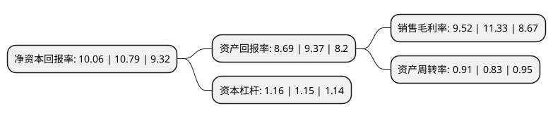

> 本页面由自动化程序生成于 2022年5月20日 01:35
> 内容可能存在错误，如有bug请提交issue至：https://github.com/Eroleice/doc-pi/issues
{.is-warning}

# 上市公司基本情况

## 基本资料

青岛康普顿科技股份有限公司（以下简称“康普顿”）成立于2003年12月19日，青岛市。于2016年04月06日在上交所主板上市。

康普顿注册资本20,000万元，公司主营业务系为车辆，工业设备提供润滑和养护的系列产品，主要包括车用润滑油，工业润滑油，汽车化学品及汽车养护品的研发，生产与销售。公司产品分四大类:第一类是车用润滑油产品;第二类是工业润滑油产品;第三类是汽车化学品;第四类是汽车养护品。以下是详细信息：

- 公司名称: 青岛康普顿科技股份有限公司
- 股票代码: 603798.SH
- 所在地: 山东 - 青岛市
- 成立日期: 2003年12月19日
- 注册资本: 20,000万元
- 法定代表人: 朱振华
- 主营业务: 公司主营业务系为车辆，工业设备提供润滑和养护的系列产品，主要包括车用润滑油，工业润滑油，汽车化学品及汽车养护品的研发，生产与销售公司产品分四大类:第一类是车用润滑油产品;第二类是工业润滑油产品;第三类是汽车化学品;第四类是汽车养护品
- 公司官网: www.copton.com.cn
- 公司介绍: 公司是专业的润滑油和汽车养护用品生产商和服务商。公司始终致力于产品研发和创新，在中国润滑油、车用养护品和汽车化学品市场上一直稳步发展。康普顿品牌润滑油产品涵盖汽车润滑油、工业润滑油、摩托车润滑油、润滑脂、防冻液、制动液等数百个品种，可以为车辆和设备提供全面高效的润滑养护方案，并可以根据客户要求定向开发特种油品。在纳米陶瓷机油、纳米抗磨剂和合成工业油等技术领域具有明显优势。康普顿参与起草、制定了GB29743-2013《机动车发动机冷却液》、《发动机内部清洗剂》、《发动机外部保护剂》、《水箱清洗剂》四项国家标准，主持制定了《节气门清洗剂CAS161-2008》、《发动机润滑系清洗剂CAS162-2008》、《汽油发动机电喷系统清洗剂CAS163-2008》三项汽车养护用品行业标准。

## 股东及高管情况

上市公司第一大股东为恒嘉世科国际(香港)有限公司，持股55,230,000股，占比27.62%，**疑似为**上市公司实际控制人。

截至2022年03月31日，上市公司的前十大股东中，共有6名自然人股东，4名机构股东，其中5%以上大股东共有2名。上市公司前十大股东明细如下：

> 未能通过持股比例判定出上市公司实际控制人（持股30%以上）
> 可能存在通过间接持股、联合持股、协议控制等方式拥有实际控制权的主体，具体请参考上市公司定期公告！
{.is-warning}

> 截至2022年03月31日，上市公司前十大股东信息如下：

| 股东名称 | 持股数量（股） | 持股比例 |
| --- | --- | --- |
| 恒嘉世科国际(香港)有限公司 | 55,230,000 | 27.62% |
| 青岛路邦石油化工有限公司 | 52,970,000 | 26.49% |
| 青岛华侨实业股有限公司 | 3,487,300 | 1.74% |
| 青岛华侨实业股份有限公司 | 3,487,300 | 1.74% |
| 黄启平 | 2,252,700 | 1.13% |
| 李冬梅 | 1,704,400 | 0.85% |
| 纪东 | 1,630,000 | 0.82% |
| 张玉成 | 1,185,700 | 0.59% |
| 马林 | 816,800 | 0.41% |
| 刘健 | 800,000 | 0.4% |

## 利润表分析

上市公司2021年总收入为11.08亿元，净利润为1.05亿元，实现盈利。

## 杜邦分析

> 数据列示周期：2021年 | 2020年 | 2019年
{.is-info}

上市公司的净资产收益率在近一年有所下降，下降幅度为-6.77%，其变化情况分解如下：
- 上市公司的销售毛利率在近一年下降了-15.98%，可能是生产效率的下降、商品原材料价格上涨或商品价格的下跌所致。
- 上市公司的资产周转率在近一年上升了9.64%，可能是源自于更快的销售回款或库存管理效果提升。
- 上市公司的财务杠杆比率在近一年上升了0.87%，可能是增加负债扩大生产规模。

