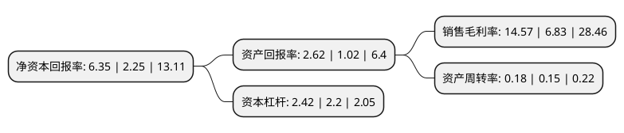

> 本页面由自动化程序生成于 2022年5月20日 01:04
> 内容可能存在错误，如有bug请提交issue至：https://github.com/Eroleice/doc-pi/issues
{.is-warning}

# 上市公司基本情况

## 基本资料

山西蓝焰控股股份有限公司（以下简称“蓝焰控股”）成立于1998年12月22日，太原市。于2000年06月22日在深交所主板上市。

蓝焰控股注册资本96,750.266万元，主要业务为煤矿瓦斯治理及煤层气勘查，开发与利用。主要产品为煤层气(煤矿瓦斯)。以下是详细信息：

- 公司名称: 山西蓝焰控股股份有限公司
- 股票代码: 000968.SZ
- 所在地: 山西 - 太原市
- 成立日期: 1998年12月22日
- 注册资本: 96,750.266万元
- 法定代表人: 翟慧兵
- 主营业务: 主要业务为煤矿瓦斯治理及煤层气勘查，开发与利用主要产品为煤层气(煤矿瓦斯)
- 公司官网: www.tymqh.com
- 公司介绍: 公司主营业务为煤矿瓦斯治理及煤层气勘探、开发与利用业务。公司作为行业内的龙头企业，形成了煤层气勘探、抽采、输送、销售等完整产业链，掌握了具有独立自主知识产权且较为完善煤层气地面抽采技术。公司将保持在煤层气勘探、抽采、输送、压缩、液化、化工、发电、汽车燃气、居民用气等一整套的产业链优势，煤层气利用市场的规模优势，煤层气抽采的技术、地域、政策优势，以煤矿瓦斯治理为业务核心，以提高煤炭井下生产安全为宗旨，发展和完善地面瓦斯治理成套技术，拓展煤层气(瓦斯)利用方式和销售渠道，提高煤层气(瓦斯)的利用率，为社会提供清洁能源、推动大气环境治理。

## 股东及高管情况

上市公司第一大股东为晋能控股装备制造集团有限公司，持股387,490,182股，占比40.05%，为上市公司实际控制人。

截至2022年04月19日，上市公司的前十大股东中，共有2名自然人股东，6名机构股东，1个产品账户，1个海外主体，其中5%以上大股东共有5名。上市公司前十大股东明细如下：

> 截至2022年04月19日，上市公司前十大股东信息如下：

| 股东名称 | 持股数量（股） | 持股比例 |
| --- | --- | --- |
| 晋能控股装备制造集团有限公司 | 387,490,182 | 40.05% |
| 晋能控股装备制造集团有限公司 | 387,490,182 | 40.05% |
| 太原煤炭气化(集团)有限责任公司 | 129,417,726 | 13.38% |
| 太原煤炭气化(集团)有限责任公司 | 129,417,726 | 13.38% |
| 中国信达资产管理股份有限公司 | 52,839,075 | 5.46% |
| 陕西畅达油气工程技术服务有限公司 | 35,685,917 | 3.69% |
| 李艳丽 | 21,081,200 | 2.18% |
| 香港中央结算有限公司(陆股通) | 13,020,553 | 1.35% |
| 赵惠新 | 12,270,267 | 1.27% |
| 中国农业银行股份有限公司-中邮核心优势灵活配置混合型证券投资基金 | 7,710,000 | 0.8% |

## 利润表分析

上市公司2021年总收入为19.77亿元，净利润为2.88亿元，实现盈利。

## 杜邦分析

> 数据列示周期：2021年 | 2020年 | 2019年
{.is-info}

上市公司的净资产收益率在近一年有所上升，上升幅度为182.22%，其变化情况分解如下：
- 上市公司的销售毛利率在近一年上升了113.32%，可能是生产效率的提升、商品原材料价格下跌或商品价格的上涨所致。
- 上市公司的资产周转率在近一年上升了20%，可能是源自于更快的销售回款或库存管理效果提升。
- 上市公司的财务杠杆比率在近一年上升了10%，可能是增加负债扩大生产规模。

