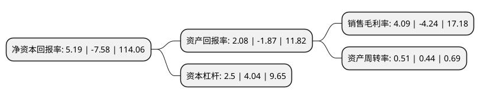

> 本页面由自动化程序生成于 2022年5月20日 01:07
> 内容可能存在错误，如有bug请提交issue至：https://github.com/Eroleice/doc-pi/issues
{.is-warning}

# 上市公司基本情况

## 基本资料

新疆准东石油技术股份有限公司（以下简称“准油股份”）成立于2001年06月29日，克拉玛依市。于2008年01月28日在深交所中小板上市。

准油股份注册资本26,205.538万元，主营业务:石油技术业务，油田管理业务，建筑安装业务，运输服务业务和化工产品销售，包括:油田动态监测(试井，生产测试等)，井下作业(清防蜡，调剖，堵水，酸化，连续油管作业，油田氮气新技术应用等);储油罐机械清洗;油田管理(边探井管理，劳务输出等);建安工程(油田工程建设，输变电工程，道路施工等);运输服务等。以下是详细信息：

- 公司名称: 新疆准东石油技术股份有限公司
- 股票代码: 002207.SZ
- 所在地: 新疆 - 克拉玛依市
- 成立日期: 2001年06月29日
- 注册资本: 26,205.538万元
- 法定代表人: 简伟
- 主营业务: 主营业务:石油技术业务，油田管理业务，建筑安装业务，运输服务业务和化工产品销售，包括:油田动态监测(试井，生产测试等)，井下作业(清防蜡，调剖，堵水，酸化，连续油管作业，油田氮气新技术应用等);储油罐机械清洗;油田管理(边探井管理，劳务输出等);建安工程(油田工程建设，输变电工程，道路施工等);运输服务等
- 公司官网: www.zygf.com.cn
- 公司介绍: 公司是石油开采企业提供油田动态监测和提高采收率技术服务的专业企业，主要业务是油田动态监测(油、气、水井测试及资料解释)、井下作业(调剖、堵水、酸化、压裂、清蜡、连续油管作业、制氮注氮新技术)及大中型储油罐机械清洗等新兴石油技术服务业务。目前，公司是全疆首屈一指的油田稳产、增产技术服务企业，同时也是新疆唯一的大中型储油罐机械清洗等新兴石油技术服务提供商。此外，公司还承揽油田建安工程、送变电工程等油田建设工程和油田管理、油田运输业务。

## 股东及高管情况

上市公司第一大股东为湖州燕润投资管理合伙企业(有限合伙)，持股78,616,278股，占比30%，**疑似为**上市公司实际控制人。

截至2022年03月31日，上市公司的前十大股东中，共有8名自然人股东，1名机构股东，1个海外主体，其中5%以上大股东共有1名。上市公司前十大股东明细如下：

> 截至2022年03月31日，上市公司前十大股东信息如下：

| 股东名称 | 持股数量（股） | 持股比例 |
| --- | --- | --- |
| 湖州燕润投资管理合伙企业(有限合伙) | 78,616,278 | 30% |
| 李付珍 | 2,152,444 | 0.82% |
| UBS AG | 1,806,682 | 0.69% |
| 吴树强 | 1,453,000 | 0.55% |
| 高云雪 | 1,274,000 | 0.49% |
| 吕占民 | 1,182,875 | 0.45% |
| 胡镜波 | 1,150,000 | 0.44% |
| 王洪涛 | 881,200 | 0.34% |
| 徐伟 | 844,474 | 0.32% |
| 单海涛 | 745,500 | 0.28% |

## 利润表分析

上市公司2021年总收入为1.91亿元，净利润为0.07亿元，实现盈利。

## 杜邦分析

> 数据列示周期：2021年 | 2020年 | 2019年
{.is-info}

上市公司的净资产收益率在近一年有所下降，下降幅度为-168.47%，其变化情况分解如下：
- 上市公司的销售毛利率在近一年下降了-196.46%，可能是生产效率的下降、商品原材料价格上涨或商品价格的下跌所致。
- 上市公司的资产周转率在近一年上升了15.91%，可能是源自于更快的销售回款或库存管理效果提升。
- 上市公司的财务杠杆比率在近一年下降了-38.12%，可能是减少负债降低财务费用。

