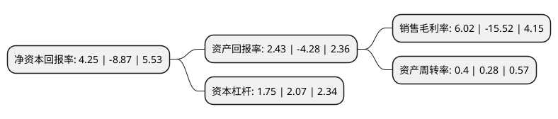

> 本页面由自动化程序生成于 2022年5月20日 01:10
> 内容可能存在错误，如有bug请提交issue至：https://github.com/Eroleice/doc-pi/issues
{.is-warning}

# 上市公司基本情况

## 基本资料

华油惠博普科技股份有限公司（以下简称“惠博普”）成立于1998年10月07日，长沙市。于2011年02月25日在深交所中小板上市。

惠博普注册资本134,685.777万元，主要产品:油气水处理系统装备，移动式高温高压测试装备，三次采油工艺技术装备，含油污泥处理装备，储油罐机械清洗装备，油田自动化系统。主营业务:油气田开发地面系统装备的工艺技术研发，系统设计，成套装备提供及工程技术服务业务。以下是详细信息：

- 公司名称: 华油惠博普科技股份有限公司
- 股票代码: 002554.SZ
- 所在地: 湖南 - 长沙市
- 成立日期: 1998年10月07日
- 注册资本: 134,685.777万元
- 法定代表人: 谢文辉
- 主营业务: 主要产品:油气水处理系统装备，移动式高温高压测试装备，三次采油工艺技术装备，含油污泥处理装备，储油罐机械清洗装备，油田自动化系统主营业务:油气田开发地面系统装备的工艺技术研发，系统设计，成套装备提供及工程技术服务业务
- 公司官网: www.china-hbp.com
- 公司介绍: 公司主要从事油气田开发地面系统装备的工艺技术研发、系统设计、成套装备提供及工程技术服务业务。公司业务已涵盖油气处理系统、油气开采系统、油田环保系统和油田工程技术服务等领域。公司为高新技术企业，专注于油气水高效分离技术的研发，以分离技术为核心，已经拥有18项实用新型专利、4项发明专利申请权、13项软件著作权、11项专有技术构成的核心技术体系，成为油气田地面系统装备领域的知名企业。公司已从单一设备供应商发展成为具有工艺系统一体化综合解决能力的成套系统装备与技术服务商。公司是国内少数能够提供RIDMIS一体化综合服务的油气田装备及技术服务商之一。

## 股东及高管情况

上市公司第一大股东为长沙水业集团有限公司，持股407,059,723股，占比30.22%，为上市公司实际控制人。

截至2022年03月31日，上市公司的前十大股东中，共有9名自然人股东，1名机构股东，其中5%以上大股东共有2名。上市公司前十大股东明细如下：

> 截至2022年03月31日，上市公司前十大股东信息如下：

| 股东名称 | 持股数量（股） | 持股比例 |
| --- | --- | --- |
| 长沙水业集团有限公司 | 407,059,723 | 30.22% |
| 黄松 | 115,661,850 | 8.59% |
| 肖荣 | 61,723,912 | 4.58% |
| 白明垠 | 58,622,800 | 4.35% |
| 吴玉玲 | 8,720,000 | 0.65% |
| 王全 | 7,575,187 | 0.56% |
| 樊温参 | 7,005,000 | 0.52% |
| 史瑞祥 | 5,550,000 | 0.41% |
| 王林 | 5,358,002 | 0.4% |
| 张文灿 | 4,425,500 | 0.33% |

## 利润表分析

上市公司2021年总收入为15.94亿元，净利润为0.96亿元，实现盈利。

## 杜邦分析

> 数据列示周期：2021年 | 2020年 | 2019年
{.is-info}

上市公司的净资产收益率在近一年有所下降，下降幅度为-147.91%，其变化情况分解如下：
- 上市公司的销售毛利率在近一年下降了-138.79%，可能是生产效率的下降、商品原材料价格上涨或商品价格的下跌所致。
- 上市公司的资产周转率在近一年上升了42.86%，可能是源自于更快的销售回款或库存管理效果提升。
- 上市公司的财务杠杆比率在近一年下降了-15.46%，可能是减少负债降低财务费用。

