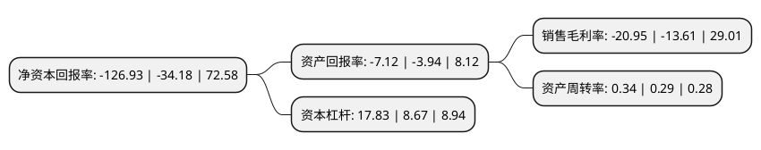

> 本页面由自动化程序生成于 2022年5月20日 01:10
> 内容可能存在错误，如有bug请提交issue至：https://github.com/Eroleice/doc-pi/issues
{.is-warning}

# 上市公司基本情况

## 基本资料

浙江仁智股份有限公司（以下简称“仁智股份”）成立于2006年09月27日，温州市。于2011年11月03日在深交所中小板上市。

仁智股份注册资本41,194.8万元，本公司是一家集油田技术服务的技术研发，方案设计，服务提供及油田化学助剂的研发，生产为一体的高新技术企业。主营业务:油田技术服务以下是详细信息：

- 公司名称: 浙江仁智股份有限公司
- 股票代码: 002629.SZ
- 所在地: 浙江 - 温州市
- 成立日期: 2006年09月27日
- 注册资本: 41,194.8万元
- 法定代表人: 温志平
- 主营业务: 本公司是一家集油田技术服务的技术研发，方案设计，服务提供及油田化学助剂的研发，生产为一体的高新技术企业主营业务:油田技术服务
- 公司官网: www.chinarenzhi.com
- 公司介绍: 公司围绕石油天然气钻井工程领域提供各类专业服务，是一家持续健康发展中的高新技术企业。其业务遍布大江南北，主要从事油服行业，围绕石油天然气钻井工程领域提供各类专业服务。从事各类油田化学品开发、生产、销售及新材料开发、生产、销售等国内进出口贸易。公司是国内服务能力较强，是国内能够提供一体化、一站式钻井液技术服务的优势企业之一，是西南地区市场占有率较高的油田环保技术服务提供商，是西南地区主要的油田特种设备检测维修技术服务及防腐工程技术服务提供商。公司坚持执行国际安全、环保、健康标准，通过了ISO9001质量管理标准、ISO14000环境管理标准和OHSAS18000职业健康安全标准体系认证。

## 股东及高管情况

上市公司第一大股东为西藏瀚澧电子科技合伙企业(有限合伙)，持股81,387,013股，占比19.76%，**疑似为**上市公司实际控制人。

截至2022年03月31日，上市公司的前十大股东中，共有8名自然人股东，2名机构股东，其中5%以上大股东共有1名。上市公司前十大股东明细如下：

> 未能通过持股比例判定出上市公司实际控制人（持股30%以上）
> 可能存在通过间接持股、联合持股、协议控制等方式拥有实际控制权的主体，具体请参考上市公司定期公告！
{.is-warning}

> 截至2022年03月31日，上市公司前十大股东信息如下：

| 股东名称 | 持股数量（股） | 持股比例 |
| --- | --- | --- |
| 西藏瀚澧电子科技合伙企业(有限合伙) | 81,387,013 | 19.76% |
| 金雷 | 6,810,000 | 1.65% |
| 林玉华 | 2,539,600 | 0.62% |
| 吴翠芳 | 2,437,291 | 0.59% |
| 华泰证券股份有限公司 | 2,308,699 | 0.56% |
| 游宝林 | 2,045,250 | 0.5% |
| 黄鹏华 | 1,938,900 | 0.47% |
| 许秉右 | 1,643,300 | 0.4% |
| 谷京华 | 1,636,253 | 0.4% |
| 朱孟明 | 1,595,024 | 0.39% |

## 利润表分析

上市公司2021年总收入为1.25亿元，净利润为-0.27亿元，**未实现盈利**。

## 杜邦分析

> 数据列示周期：2021年 | 2020年 | 2019年
{.is-info}

上市公司的净资产收益率在近一年有所上升，上升幅度为271.36%，其变化情况分解如下：
- 上市公司的销售毛利率在近一年上升了53.93%，可能是生产效率的提升、商品原材料价格下跌或商品价格的上涨所致。
- 上市公司的资产周转率在近一年上升了17.24%，可能是源自于更快的销售回款或库存管理效果提升。
- 上市公司的财务杠杆比率在近一年上升了105.65%，可能是增加负债扩大生产规模。

