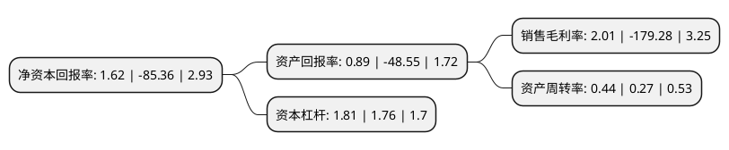

> 本页面由自动化程序生成于 2022年5月20日 01:15
> 内容可能存在错误，如有bug请提交issue至：https://github.com/Eroleice/doc-pi/issues
{.is-warning}

# 上市公司基本情况

## 基本资料

通源石油科技集团股份有限公司（以下简称“通源石油”）成立于1995年06月15日，西安市。于2011年01月13日在深交所创业板上市。

通源石油注册资本54,426.14万元，主营业务:油田增产技术的集研发，产品推广和作业服务为一体的油田服务。主要产品为复合射孔器产品。以下是详细信息：

- 公司名称: 通源石油科技集团股份有限公司
- 股票代码: 300164.SZ
- 所在地: 陕西 - 西安市
- 成立日期: 1995年06月15日
- 注册资本: 54,426.14万元
- 法定代表人: 张国桉
- 主营业务: 主营业务:油田增产技术的集研发，产品推广和作业服务为一体的油田服务主要产品为复合射孔器产品
- 公司官网: www.tongoiltools.com
- 公司介绍: 公司是一家专注于油田增产技术的集研发、产品推广和作业服务为一体的油田增产服务企业。公司依托自主研发的油气增产新兴技术，立足于油田服务领域，向油田客户提供复合射孔器销售、复合射孔作业服务、复合射孔专项技术服务、爆燃压裂作业服务及油田其他服务。作为集各种电缆信息采集技术服务为一体的油田技术服务公司，公司配备了先进的测井服务装备，拥有数套车载测井系统以及多个作业小队，具备在陆上、滩海、海洋、沙漠、山地等各种地理环境下的施工作业能力，能够出色的完成裸眼井测井、套管井测井、射孔作业以及其他工程测井作业。公司以增产一体化为核心进行全产业链和全球化布局，通过并购重组，收购永晨石油，参股一龙恒业、胜源宏、宝鸡通源、延安通源，从单一射孔服务迈向钻井、压裂、电缆测井、射孔到完井等一体化油田技术，从国内市场扩展到北美、南美、北非和中亚市场，增强国内外业务的协同效应。

## 股东及高管情况

上市公司第一大股东为张国桉，持股70,346,636股，占比12.93%，**疑似为**上市公司实际控制人。

截至2022年05月16日，上市公司的前十大股东中，共有6名自然人股东，1名机构股东，2个产品账户，1名其他股东，其中5%以上大股东共有1名。上市公司前十大股东明细如下：

> 未能通过持股比例判定出上市公司实际控制人（持股30%以上）
> 可能存在通过间接持股、联合持股、协议控制等方式拥有实际控制权的主体，具体请参考上市公司定期公告！
{.is-warning}

> 截至2022年05月16日，上市公司前十大股东信息如下：

| 股东名称 | 持股数量（股） | 持股比例 |
| --- | --- | --- |
| 张国桉 | 70,346,636 | 12.93% |
| 陕西省民营经济高质量发展纾困基金合伙企业(有限合伙) | 13,118,434 | 2.41% |
| 孙伟杰 | 10,483,106 | 1.93% |
| 黄建庆 | 8,792,177 | 1.62% |
| 蒋黎 | 7,591,623 | 1.39% |
| 滨海天地(天津)投资管理有限公司-滨海长安一号私募证券投资基金 | 6,544,502 | 1.2% |
| 联储证券有限责任公司 | 5,241,443 | 0.96% |
| 张晓龙 | 5,151,994 | 0.95% |
| 法国兴业银行 | 4,549,100 | 0.84% |
| 张春龙 | 4,482,052 | 0.82% |

## 利润表分析

上市公司2021年总收入为7.47亿元，净利润为0.15亿元，实现盈利。

## 杜邦分析

> 数据列示周期：2021年 | 2020年 | 2019年
{.is-info}

上市公司的净资产收益率在近一年有所下降，下降幅度为-101.9%，其变化情况分解如下：
- 上市公司的销售毛利率在近一年下降了-101.12%，可能是生产效率的下降、商品原材料价格上涨或商品价格的下跌所致。
- 上市公司的资产周转率在近一年上升了62.96%，可能是源自于更快的销售回款或库存管理效果提升。
- 上市公司的财务杠杆比率在近一年上升了2.84%，可能是增加负债扩大生产规模。

