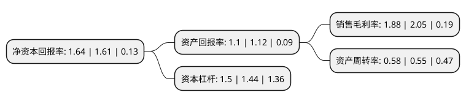

> 本页面由自动化程序生成于 2022年5月20日 01:27
> 内容可能存在错误，如有bug请提交issue至：https://github.com/Eroleice/doc-pi/issues
{.is-warning}

# 上市公司基本情况

## 基本资料

海洋石油工程股份有限公司（以下简称“海油工程”）成立于2000年04月20日，天津市。于2002年02月05日在上交所主板上市。

海油工程注册资本442,135.48万元，主营业务;海洋工程以下是详细信息：

- 公司名称: 海洋石油工程股份有限公司
- 股票代码: 600583.SH
- 所在地: 天津 - 天津市
- 成立日期: 2000年04月20日
- 注册资本: 442,135.48万元
- 法定代表人: 于毅
- 主营业务: 主营业务;海洋工程
- 公司官网: www.cnoocengineering.com
- 公司介绍: 公司是国内惟一一家集海洋石油、天然气开发工程设计、陆地制造和海上安装、调试、维修以及液化天然气工程于一体的大型工程总承包公司，是亚太地区最大的海洋石油工程EPCI(设计、采办、建造、安装)总承包商之一。公司为油气公司开发海上油气资源提供工程服务，具体包括围绕海上采油平台进行的工程设计、物资采办、陆地制造、海上运输和海上安装、海管铺设、调试、交付与维修等工作。经过多年的建设和发展，公司形成了海洋工程设计、海洋工程建造、海洋工程安装、海上油气田维保、水下工程检测与安装、高端橇装产品制造、海洋工程质量检测、海洋工程项目总包管理八大能力，拥有300米以内水深传统海域较强的油气田工程建设综合能力。

## 股东及高管情况

上市公司第一大股东为中国海洋石油集团有限公司，持股2,138,328,954股，占比48.36%，为上市公司实际控制人。

截至2022年03月31日，上市公司的前十大股东中，共有1名机构股东，8个产品账户，1个海外主体，其中5%以上大股东共有1名。上市公司前十大股东明细如下：

> 截至2022年03月31日，上市公司前十大股东信息如下：

| 股东名称 | 持股数量（股） | 持股比例 |
| --- | --- | --- |
| 中国海洋石油集团有限公司 | 2,138,328,954 | 48.36% |
| 香港中央结算有限公司(陆股通) | 180,340,681 | 4.08% |
| 华夏基金-农业银行-华夏中证金融资产管理计划 | 36,704,400 | 0.83% |
| 南方基金-农业银行-南方中证金融资产管理计划 | 36,704,400 | 0.83% |
| 易方达基金-农业银行-易方达中证金融资产管理计划 | 36,704,400 | 0.83% |
| 博时基金-农业银行-博时中证金融资产管理计划 | 36,704,400 | 0.83% |
| 大成基金-农业银行-大成中证金融资产管理计划 | 36,704,400 | 0.83% |
| 广发基金-农业银行-广发中证金融资产管理计划 | 36,704,400 | 0.83% |
| 银华基金-农业银行-银华中证金融资产管理计划 | 36,704,400 | 0.83% |
| 工银瑞信基金-农业银行-工银瑞信中证金融资产管理计划 | 36,704,400 | 0.83% |

## 利润表分析

上市公司2021年总收入为197.95亿元，净利润为3.71亿元，实现盈利。

## 杜邦分析

> 数据列示周期：2021年 | 2020年 | 2019年
{.is-info}

上市公司的净资产收益率在近一年有所上升，上升幅度为1.86%，其变化情况分解如下：
- 上市公司的销售毛利率在近一年下降了-8.29%，可能是生产效率的下降、商品原材料价格上涨或商品价格的下跌所致。
- 上市公司的资产周转率在近一年上升了5.45%，可能是源自于更快的销售回款或库存管理效果提升。
- 上市公司的财务杠杆比率在近一年上升了4.17%，可能是增加负债扩大生产规模。

