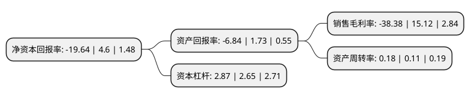

> 本页面由自动化程序生成于 2022年5月20日 01:28
> 内容可能存在错误，如有bug请提交issue至：https://github.com/Eroleice/doc-pi/issues
{.is-warning}

# 上市公司基本情况

## 基本资料

洲际油气股份有限公司（以下简称“ST洲际”）成立于1984年08月20日，海口市。于1996年10月08日在上交所主板上市。

ST洲际注册资本226,350.752万元，石油勘探开发业务，房地产开发，物业租赁以及贸易以下是详细信息：

- 公司名称: 洲际油气股份有限公司
- 股票代码: 600759.SH
- 所在地: 海南 - 海口市
- 成立日期: 1984年08月20日
- 注册资本: 226,350.752万元
- 法定代表人: 陈焕龙
- 主营业务: 石油勘探开发业务，房地产开发，物业租赁以及贸易
- 公司官网: www.geojade.com
- 公司介绍: 公司系由此前的海南正和实业集团有限公司改名为现名。公司的主营业务目前已由房地产、租赁服务和贸易转型为石油天然气勘探与开发。基于中国的石油供需现状和国家鼓励各类企业实施“走出去”战略和鼓励各类资本进入油气勘探开发领域的政策指引，公司业务发展方向将集中在石油勘探与开发、同时积极向油气物流以及下游加工产业投资，以“源自中国的国际化独立油气公司”为发展愿景，弘扬“鼓励团队精神、奖励优异业绩、吸引顶尖人才、控制风险因素”的企业文化和核心价值观，力争为股东、员工和社会持续创造价值。

## 股东及高管情况

上市公司第一大股东为广西正和实业集团有限公司，持股578,281,232股，占比25.55%，**疑似为**上市公司实际控制人。

截至2022年03月31日，上市公司的前十大股东中，共有2名自然人股东，6名机构股东，2个产品账户，其中5%以上大股东共有2名。上市公司前十大股东明细如下：

> 未能通过持股比例判定出上市公司实际控制人（持股30%以上）
> 可能存在通过间接持股、联合持股、协议控制等方式拥有实际控制权的主体，具体请参考上市公司定期公告！
{.is-warning}

> 截至2022年03月31日，上市公司前十大股东信息如下：

| 股东名称 | 持股数量（股） | 持股比例 |
| --- | --- | --- |
| 广西正和实业集团有限公司 | 578,281,232 | 25.55% |
| 深圳市中民昇汇壹号投资企业(有限合伙) | 169,338,677 | 7.48% |
| 湖南省恒畅投资有限公司 | 16,700,000 | 0.74% |
| 芜湖江和投资管理合伙企业(有限合伙) | 15,935,062 | 0.7% |
| 张研 | 12,785,400 | 0.56% |
| 亚太奔德有限公司 | 11,945,490 | 0.53% |
| 蔡双婷 | 11,483,090 | 0.51% |
| 青岛立心资产管理有限责任公司-立心方圆1号私募证券投资基金 | 10,492,220 | 0.46% |
| 青岛立心资产管理有限责任公司-立心方圆2号私募证券投资基金 | 9,864,500 | 0.44% |
| 华泰证券股份有限公司 | 7,796,691 | 0.34% |

## 利润表分析

上市公司2021年总收入为24.53亿元，净利润为-9.42亿元，**未实现盈利**。

## 杜邦分析

> 数据列示周期：2021年 | 2020年 | 2019年
{.is-info}

上市公司的净资产收益率在近一年有所下降，下降幅度为-526.96%，其变化情况分解如下：
- 上市公司的销售毛利率在近一年下降了-353.84%，可能是生产效率的下降、商品原材料价格上涨或商品价格的下跌所致。
- 上市公司的资产周转率在近一年上升了63.64%，可能是源自于更快的销售回款或库存管理效果提升。
- 上市公司的财务杠杆比率在近一年上升了8.3%，可能是增加负债扩大生产规模。

