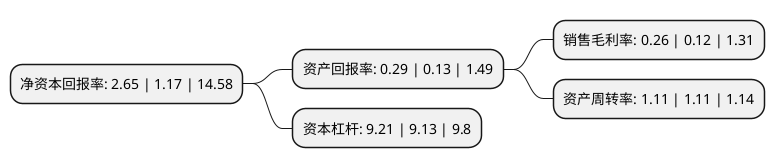

> 本页面由自动化程序生成于 2022年5月20日 01:29
> 内容可能存在错误，如有bug请提交issue至：https://github.com/Eroleice/doc-pi/issues
{.is-warning}

# 上市公司基本情况

## 基本资料

中石化石油工程技术服务股份有限公司（以下简称“石化油服”）成立于1994年11月21日，北京市。于1995年04月11日在上交所主板上市。

石化油服注册资本1,898,434.003万元，油气勘探开发工程施工与技术服务以下是详细信息：

- 公司名称: 中石化石油工程技术服务股份有限公司
- 股票代码: 600871.SH
- 所在地: 北京 - 北京市
- 成立日期: 1994年11月21日
- 注册资本: 1,898,434.003万元
- 法定代表人: 陈锡坤
- 主营业务: 油气勘探开发工程施工与技术服务
- 公司官网: ssc.sinopec.com
- 公司介绍: 公司是由中国石化集团公司控股的中国最大的石油工程和油田技术综合服务提供商之一，也是国内最早的海洋油气勘探工程及技术服务提供商。公司有地球物理、钻井工程、测录井、井下特种作业和工程建设五大业务板块，涵盖了从勘探、钻井、完井、油气生产、油气集输到弃井的全产业链过程。公司拥有丰富的经验、先进的装备和雄厚的研发实力，在页岩气、致密油气田、高含硫气田、超深油气田及老油田综合服务领域积累了丰富的作业经验，公司为北美之外首个页岩气商业开发项目－涪陵页岩气项目，提供了钻井、压裂、测试的全过程工程服务。

## 股东及高管情况

上市公司第一大股东为中国石油化工集团有限公司，持股10,727,896,364股，占比56.51%，为上市公司实际控制人。

截至2022年03月31日，上市公司的前十大股东中，共有2名自然人股东，4名机构股东，2个产品账户，2个海外主体，其中5%以上大股东共有2名。上市公司前十大股东明细如下：

> 截至2022年03月31日，上市公司前十大股东信息如下：

| 股东名称 | 持股数量（股） | 持股比例 |
| --- | --- | --- |
| 中国石油化工集团有限公司 | 10,727,896,364 | 56.51% |
| 香港中央结算(代理人)有限公司 | 5,402,088,694 | 28.46% |
| 中国中信有限公司 | 617,313,200 | 3.25% |
| 香港中央结算有限公司(陆股通) | 113,870,208 | 0.6% |
| 安徽阳光信通电子科技有限公司 | 24,000,000 | 0.13% |
| 上海同能投资控股有限公司 | 13,916,200 | 0.07% |
| 长江养老保险股份有限公司-长江盛世华章集合型团体养老保障管理产品进取增利2号组合 | 11,574,427 | 0.06% |
| 李枫 | 11,406,700 | 0.06% |
| 胡晓 | 9,920,000 | 0.05% |
| 领航投资澳洲有限公司-领航新兴市场股指基金(交易所) | 9,698,700 | 0.05% |

## 利润表分析

上市公司2021年总收入为695.33亿元，净利润为1.79亿元，实现盈利。

## 杜邦分析

> 数据列示周期：2021年 | 2020年 | 2019年
{.is-info}

上市公司的净资产收益率在近一年有所上升，上升幅度为126.5%，其变化情况分解如下：
- 上市公司的销售毛利率在近一年上升了116.67%，可能是生产效率的提升、商品原材料价格下跌或商品价格的上涨所致。
- 上市公司的资产周转率在近一年下降了0%，可能是源自于更慢的销售回款或库存管理效果下降。
- 上市公司的财务杠杆比率在近一年上升了0.88%，可能是增加负债扩大生产规模。

