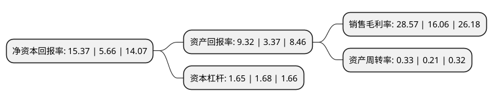

> 本页面由自动化程序生成于 2022年5月20日 01:30
> 内容可能存在错误，如有bug请提交issue至：https://github.com/Eroleice/doc-pi/issues
{.is-warning}

## 股东及高管情况

上市公司第一大股东为中国海洋石油(BVI)公司，持股28,772,727,268股，占比64.44%，为上市公司实际控制人。

截至2022年03月31日，上市公司的前十大股东中，共有4名机构股东，4个海外主体，其中5%以上大股东共有4名。上市公司前十大股东明细如下：

> 截至2022年03月31日，上市公司前十大股东信息如下：

| 股东名称 | 持股数量（股） | 持股比例 |
| --- | --- | --- |
| 中国海洋石油(BVI)公司 | 28,772,727,268 | 64.44% |
| CNOOC(BVI)Limited | 28,772,727,268 | 64.44% |
| 中国海洋石油(BVI)公司 | 28,772,727,268 | 64.44% |
| 香港中央结算(代理人)有限公司 | 15,810,342,735 | 35.41% |
| 中国海洋石油集团有限公司 | 339,780,000 | 0.76% |
| 中国海洋石油集团有限公司 | 339,780,000 | 0.76% |
| CNOOC(BVI)Limited | 5 | 0.0001% |
| CNOOC(BVI)Limited | 5 | 0.0001% |

## 利润表分析

上市公司2021年总收入为2,461.11亿元，净利润为703.06亿元，实现盈利。

## 杜邦分析

> 数据列示周期：2021年 | 2020年 | 2019年
{.is-info}

上市公司的净资产收益率在近一年有所上升，上升幅度为171.55%，其变化情况分解如下：
- 上市公司的销售毛利率在近一年上升了77.9%，可能是生产效率的提升、商品原材料价格下跌或商品价格的上涨所致。
- 上市公司的资产周转率在近一年上升了57.14%，可能是源自于更快的销售回款或库存管理效果提升。
- 上市公司的财务杠杆比率在近一年下降了-1.79%，可能是减少负债降低财务费用。

