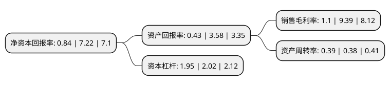

> 本页面由自动化程序生成于 2022年5月20日 01:31
> 内容可能存在错误，如有bug请提交issue至：https://github.com/Eroleice/doc-pi/issues
{.is-warning}

# 上市公司基本情况

## 基本资料

中海油田服务股份有限公司（以下简称“中海油服”）成立于2001年12月25日，天津市。于2007年09月28日在上交所主板上市。

中海油服注册资本477,159.2万元，主营业务:涉及石油及天然气勘探，开发及生产的各个阶段，主要分为钻井服务，油田技术服务，船舶服务，物探勘察服务四大板块。以下是详细信息：

- 公司名称: 中海油田服务股份有限公司
- 股票代码: 601808.SH
- 所在地: 天津 - 天津市
- 成立日期: 2001年12月25日
- 注册资本: 477,159.2万元
- 法定代表人: 赵顺强
- 主营业务: 主营业务:涉及石油及天然气勘探，开发及生产的各个阶段，主要分为钻井服务，油田技术服务，船舶服务，物探勘察服务四大板块
- 公司官网: www.cosl.com.cn
- 公司介绍: 公司隶属油田服务行业，是中国近海最具规模的油田服务供应商，也是亚洲地区功能最全、服务链最完整、最具综合性的海上油田服务公司。公司的业务涉及石油及天然气勘探、开发及生产的各个阶段，主要分为钻井服务、油田技术服务、船舶服务、物探勘察服务四大板块。公司占据了中国近海油田技术服务市场大部分份额，其中固井、泥浆等服务在中国近海拥有绝对市场优势；公司在市场上拥有和操作规模最庞大和功能最广泛的大型装备群，具有较强的竞争能力，可服务于整个中国海域的油田服务市场。

## 股东及高管情况

上市公司第一大股东为中国海洋石油集团有限公司，持股2,410,849,300股，占比50.53%，为上市公司实际控制人。

截至2022年03月31日，上市公司的前十大股东中，共有1名自然人股东，4名机构股东，3个产品账户，2个海外主体，其中5%以上大股东共有2名。上市公司前十大股东明细如下：

> 截至2022年03月31日，上市公司前十大股东信息如下：

| 股东名称 | 持股数量（股） | 持股比例 |
| --- | --- | --- |
| 中国海洋石油集团有限公司 | 2,410,849,300 | 50.53% |
| 香港中央结算(代理人)有限公司 | 1,808,847,958 | 37.91% |
| 中国证券金融股份有限公司 | 137,982,876 | 2.89% |
| 香港中央结算有限公司(陆股通) | 30,792,268 | 0.65% |
| 中国农业银行股份有限公司-银华内需精选混合型证券投资基金(LOF) | 9,390,000 | 0.2% |
| 张瑄 | 8,620,000 | 0.18% |
| 全国社保基金一一四组合 | 8,249,446 | 0.17% |
| 泰康人寿保险有限责任公司-分红-个人分红-019L-FH002沪 | 7,967,492 | 0.17% |
| 中国人民人寿保险股份有限公司-分红-个险分红 | 7,022,100 | 0.15% |
| 中国建设银行股份有限公司-银华同力精选混合型证券投资基金 | 7,000,000 | 0.15% |

## 利润表分析

上市公司2021年总收入为292.03亿元，净利润为3.22亿元，实现盈利。

## 杜邦分析

> 数据列示周期：2021年 | 2020年 | 2019年
{.is-info}

上市公司的净资产收益率在近一年有所下降，下降幅度为-88.37%，其变化情况分解如下：
- 上市公司的销售毛利率在近一年下降了-88.29%，可能是生产效率的下降、商品原材料价格上涨或商品价格的下跌所致。
- 上市公司的资产周转率在近一年上升了2.63%，可能是源自于更快的销售回款或库存管理效果提升。
- 上市公司的财务杠杆比率在近一年下降了-3.47%，可能是减少负债降低财务费用。

