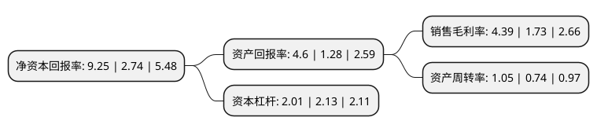

> 本页面由自动化程序生成于 2022年5月20日 01:31
> 内容可能存在错误，如有bug请提交issue至：https://github.com/Eroleice/doc-pi/issues
{.is-warning}

# 上市公司基本情况

## 基本资料

中国石油天然气股份有限公司（以下简称“中国石油”）成立于1999年11月05日，北京市。于2007年11月05日在上交所主板上市。

中国石油注册资本18,302,097.782万元，主营业务:原油和天然气的勘探，开发，生产和销售;原油和石油产品的炼制，运输，储存和销售;基本石油化工产品，衍生化工产品及其他化工产品的生产和销售;天然气，原油和成品油的输送及天然气的销售。以下是详细信息：

- 公司名称: 中国石油天然气股份有限公司
- 股票代码: 601857.SH
- 所在地: 北京 - 北京市
- 成立日期: 1999年11月05日
- 注册资本: 18,302,097.782万元
- 法定代表人: 戴厚良
- 主营业务: 主营业务:原油和天然气的勘探，开发，生产和销售;原油和石油产品的炼制，运输，储存和销售;基本石油化工产品，衍生化工产品及其他化工产品的生产和销售;天然气，原油和成品油的输送及天然气的销售
- 公司官网: www.petrochina.com.cn
- 公司介绍: 公司是中国油气行业占主导地位的最大的油气生产和销售商，是中国销售收入最大的公司之一，也是世界最大的石油公司之一。公司致力于发展成为具有较强竞争力的国际能源公司，成为全球石油石化产品重要的生产和销售商之一。中国石油广泛从事与石油、天然气有关的各项业务，主要包括：原油和天然气的勘探、开发、生产和销售；原油和石油产品的炼制、运输、储存和销售；基本石油化工产品、衍生化工产品及其他化工产品的生产和销售；天然气、原油和成品油的输送及天然气的销售。公司以科学发展观为指导，加快实施资源、市场和国际化三大战略，着力加快转变增长方式，着力提高自主创新能力，着力建立安全环保节能长效机制，着力建设和谐企业，致力于发展成为具有较强竞争力的国际能源公司。

## 股东及高管情况

上市公司第一大股东为中国石油集团，持股146,882,339,136股，占比80.25%，为上市公司实际控制人。

截至2022年03月31日，上市公司的前十大股东中，共有3名机构股东，2个产品账户，4个海外主体，1名其他股东，其中5%以上大股东共有2名。上市公司前十大股东明细如下：

> 截至2022年03月31日，上市公司前十大股东信息如下：

| 股东名称 | 持股数量（股） | 持股比例 |
| --- | --- | --- |
| 中国石油集团 | 146,882,339,136 | 80.25% |
| 香港中央结算(代理人)有限公司 | 20,901,269,406 | 11.42% |
| 中石油集团-中信建投证券-17中油E2担保及信托财产专户 | 3,819,964,314 | 2.09% |
| 中石油集团-中信建投证券-17中油EB担保及信托财产专户 | 2,051,488,228 | 1.12% |
| 中国证券金融股份有限公司 | 1,020,165,128 | 0.56% |
| 香港中央结算有限公司(陆股通) | 994,659,841 | 0.54% |
| 中国冶金科工集团有限公司 | 560,000,000 | 0.31% |
| 中央汇金资产管理有限责任公司 | 201,965,000 | 0.11% |
| 博时基金-鞍钢集团有限公司-博时基金鑫安1号单一资产管理计划 | 177,258,900 | 0.1% |
| 北京银行股份有限公司-景顺长城景颐双利债券型证券投资基金 | 98,639,259 | 0.05% |

## 利润表分析

上市公司2021年总收入为26,143.49亿元，净利润为1,146.87亿元，实现盈利。

## 杜邦分析

> 数据列示周期：2021年 | 2020年 | 2019年
{.is-info}

上市公司的净资产收益率在近一年有所上升，上升幅度为237.59%，其变化情况分解如下：
- 上市公司的销售毛利率在近一年上升了153.76%，可能是生产效率的提升、商品原材料价格下跌或商品价格的上涨所致。
- 上市公司的资产周转率在近一年上升了41.89%，可能是源自于更快的销售回款或库存管理效果提升。
- 上市公司的财务杠杆比率在近一年下降了-5.63%，可能是减少负债降低财务费用。

