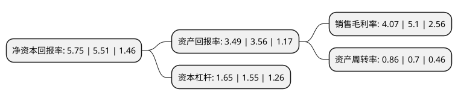

> 本页面由自动化程序生成于 2022年5月20日 01:35
> 内容可能存在错误，如有bug请提交issue至：https://github.com/Eroleice/doc-pi/issues
{.is-warning}

# 上市公司基本情况

## 基本资料

博迈科海洋工程股份有限公司（以下简称“博迈科”）成立于2002年08月15日，天津市。于2016年11月22日在上交所主板上市。

博迈科注册资本28,833.469万元，主营业务:面向国内和国际市场，专注于海洋油气开发，矿业开采，天然气液化等行业的高端客户，为其提供专用模块集成设计与建造服务。主要产品:海洋油气开发模块，矿业开采模块，天然气液化模块。以下是详细信息：

- 公司名称: 博迈科海洋工程股份有限公司
- 股票代码: 603727.SH
- 所在地: 天津 - 天津市
- 成立日期: 2002年08月15日
- 注册资本: 28,833.469万元
- 法定代表人: 彭文成
- 主营业务: 主营业务:面向国内和国际市场，专注于海洋油气开发，矿业开采，天然气液化等行业的高端客户，为其提供专用模块集成设计与建造服务主要产品:海洋油气开发模块，矿业开采模块，天然气液化模块
- 公司官网: www.bomesc.com
- 公司介绍: 公司是一家专注于国际市场的专业模块EPC服务公司，致力于以海洋油气工程、液化天然气LNG和矿业为主的各类模块的设计和集成建造，为国际高端能源和矿业客户提供服务，是国际化的EPC公司。超过90%的公司业务来自国际客户。公司的施工技术与质量控制能够满足国际高端客户各种项目的要求，有能力按照API,ANSI,ASME,AWS等世界石油通用标准进行高质量的建造与施工。公司拥有完善的质量管理体系，由挪威船级社(DNV)权威认证，并颁发了ISO9001质量体系认证的证书。公司根据ISO14001和OHSAS18001建立了完整的健康,安全,环保体系,由挪威船级社(DNV)认证.这些质量和安全管理体系每年均由挪威船级社(DNV)审查通过，并在接受严格的审查之后，为国际知名客户们所广泛接受，赢得客户的广泛赞誉和认同。公司拥有充足的资源，有能力同时执行多个项目。有能力提供电气模块、生活模块、化学注入模块和各种橇块的从详细设计开始的EPC服务；有能力提供其它海洋工程、LNG和矿业所需要的模块产品的从加工设计开始的EPC服务。

## 股东及高管情况

上市公司第一大股东为天津博迈科投资控股有限公司，持股83,096,300股，占比28.8194%，**疑似为**上市公司实际控制人。

截至2022年04月08日，上市公司的前十大股东中，共有8名机构股东，2个产品账户，其中5%以上大股东共有4名。上市公司前十大股东明细如下：

> 未能通过持股比例判定出上市公司实际控制人（持股30%以上）
> 可能存在通过间接持股、联合持股、协议控制等方式拥有实际控制权的主体，具体请参考上市公司定期公告！
{.is-warning}

> 截至2022年04月08日，上市公司前十大股东信息如下：

| 股东名称 | 持股数量（股） | 持股比例 |
| --- | --- | --- |
| 天津博迈科投资控股有限公司 | 83,096,300 | 28.8194% |
| 天津博迈科投资控股有限公司 | 83,096,300 | 28.82% |
| 海洋石油工程(香港)有限公司 | 37,500,000 | 13.0057% |
| 海洋石油工程(香港)有限公司 | 37,500,000 | 13.01% |
| 天津成泰国际工贸有限公司 | 14,250,000 | 4.94% |
| 天津博大投资合伙企业(有限合伙) | 6,929,100 | 2.4% |
| 招商银行股份有限公司-泓德瑞兴三年持有期混合型证券投资基金 | 3,987,202 | 1.38% |
| 北京燕园名博创业投资中心(有限合伙) | 2,500,000 | 0.87% |
| 财通基金-华章天地传媒投资控股集团有限公司-财通基金玉泉1018号单一资产管理计划 | 2,031,043 | 0.7% |
| 泰康人寿保险有限责任公司-分红-团体分红-019L-FH001沪 | 1,990,791 | 0.69% |

## 利润表分析

上市公司2021年总收入为40.81亿元，净利润为1.66亿元，实现盈利。

## 杜邦分析

> 数据列示周期：2021年 | 2020年 | 2019年
{.is-info}

上市公司的净资产收益率在近一年有所上升，上升幅度为4.36%，其变化情况分解如下：
- 上市公司的销售毛利率在近一年下降了-20.2%，可能是生产效率的下降、商品原材料价格上涨或商品价格的下跌所致。
- 上市公司的资产周转率在近一年上升了22.86%，可能是源自于更快的销售回款或库存管理效果提升。
- 上市公司的财务杠杆比率在近一年上升了6.45%，可能是增加负债扩大生产规模。

