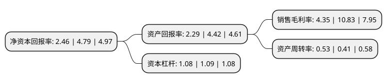

> 本页面由自动化程序生成于 2022年5月20日 01:01
> 内容可能存在错误，如有bug请提交issue至：https://github.com/Eroleice/doc-pi/issues
{.is-warning}

# 上市公司基本情况

## 基本资料

深圳市广聚能源股份有限公司（以下简称“广聚能源”）成立于1999年02月18日，深圳市。于2000年07月24日在深交所主板上市。

广聚能源注册资本52,800万元，主要业务:石油制品，液化石油气销售及电力投资。以下是详细信息：

- 公司名称: 深圳市广聚能源股份有限公司
- 股票代码: 000096.SZ
- 所在地: 广东 - 深圳市
- 成立日期: 1999年02月18日
- 注册资本: 52,800万元
- 法定代表人: 张桂泉
- 主营业务: 石油制品，液化石油气销售及电力投资
- 公司官网: www.gj000096.com
- 公司介绍: 公司是一家集成品油、液体化工储运、危化品储运和贸易、液化石油气经营、电力投资、房地产经营为一体的综合性能源类国有控股上市公司，属于深圳市一类企业。公司以能源投资和经营为主业，扎根深圳，辐射华南，通过投资兴建和收购兼并，获得了石油化工仓库、油库、汽车加油站、液化气储配站等优质资产，以及南山热电、深南燃气、妈湾电力、协孚能源、宝生银行等企业股权。公司目前拥有南山石油、广聚亿升、广聚亿达、广聚实业、广聚房地产、广聚香港6家控股子公司。公司身处石化行业，始终把安全工作看作重中之重，公司系统建立了一整套比较完善的安全管理体系，各个危险化学品经营单位均严格执行有关安全管理规定，实现多年的安全运营。

## 股东及高管情况

上市公司第一大股东为深圳市广聚投资控股(集团)有限公司，持股293,270,377股，占比55.54%，为上市公司实际控制人。

截至2022年03月31日，上市公司的前十大股东中，共有5名自然人股东，4名机构股东，1个海外主体，其中5%以上大股东共有1名。上市公司前十大股东明细如下：

> 截至2022年03月31日，上市公司前十大股东信息如下：

| 股东名称 | 持股数量（股） | 持股比例 |
| --- | --- | --- |
| 深圳市广聚投资控股(集团)有限公司 | 293,270,377 | 55.54% |
| 孙蕾 | 20,813,734 | 3.94% |
| 蔡世潮 | 19,415,793 | 3.68% |
| 深圳市利嘉商业管理有限公司 | 17,878,580 | 3.39% |
| 东莞市泓星创业投资有限公司 | 14,864,371 | 2.82% |
| 深圳市前海康永盛供应链有限公司 | 13,364,256 | 2.53% |
| 香港中央结算有限公司(陆股通) | 12,504,542 | 2.37% |
| 钟俊勇 | 11,100,404 | 2.1% |
| 黄木标 | 9,312,123 | 1.76% |
| 钟君豪 | 4,246,102 | 0.8% |

## 利润表分析

上市公司2021年总收入为16.19亿元，净利润为0.7亿元，实现盈利。

## 杜邦分析

> 数据列示周期：2021年 | 2020年 | 2019年
{.is-info}

上市公司的净资产收益率在近一年有所下降，下降幅度为-48.64%，其变化情况分解如下：
- 上市公司的销售毛利率在近一年下降了-59.83%，可能是生产效率的下降、商品原材料价格上涨或商品价格的下跌所致。
- 上市公司的资产周转率在近一年上升了29.27%，可能是源自于更快的销售回款或库存管理效果提升。
- 上市公司的财务杠杆比率在近一年下降了-0.92%，可能是减少负债降低财务费用。

