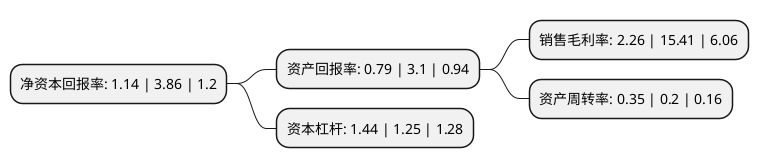

> 本页面由自动化程序生成于 2022年5月20日 01:01
> 内容可能存在错误，如有bug请提交issue至：https://github.com/Eroleice/doc-pi/issues
{.is-warning}

# 上市公司基本情况

## 基本资料

新疆国际实业股份有限公司（以下简称“国际实业”）成立于1999年03月28日，乌鲁木齐市。于2000年09月26日在深交所主板上市。

国际实业注册资本48,068.599万元，主要业务:机电设备，化工产品，轻工产品，建筑材料，金属材料，现代办公用品，畜产品，农副产品，针，棉纺织品的销售，进出口业务，麻黄素及麻黄素类产品的出口;房地产开发，销售，租赁;原煤，焦炭及煤焦化附产品的销售。以下是详细信息：

- 公司名称: 新疆国际实业股份有限公司
- 股票代码: 000159.SZ
- 所在地: 新疆 - 乌鲁木齐市
- 成立日期: 1999年03月28日
- 注册资本: 48,068.599万元
- 法定代表人: 汤小龙
- 主营业务: 机电设备，化工产品，轻工产品，建筑材料，金属材料，现代办公用品，畜产品，农副产品，针，棉纺织品的销售，进出口业务，麻黄素及麻黄素类产品的出口;房地产开发，销售，租赁;原煤，焦炭及煤焦化附产品的销售
- 公司官网: www.xjgjsy.com
- 公司介绍: 公司依托新疆优势资源，实施多元化、实业化、国际化战略，已逐步发展成为跨行业、跨地区的大中型能源企业，公司将依托新疆资源优势和区位优势，以能源产业为支柱，房地产业为补充，国际贸易为纽带，积极开拓中亚、欧洲、国内市场，实现公司可持续发展。公司产业涉足领域为油品的炼化、仓储、运输、批发和零售；燃料油进口、焦炭出口，燃料油、重油销售；煤、焦产业的股权投资；房地产开发、销售、租赁等。公司石油石化产品经营资质较为齐全，具有危化品仓储、批发、零售和铁路运输等经营资质，具有燃料油、重油等进口资质；自有铁路专运线、油罐仓储基地、齐全的运输设施。公司长期从事中亚地区能源贸易业务，在国际能源贸易方面积累了丰富的经验，拥有一定的客户群，在地区同行业中形成了较强的竞争优势。

## 股东及高管情况

上市公司第一大股东为江苏融能投资发展有限公司，持股109,708,888股，占比22.82%，**疑似为**上市公司实际控制人。

截至2022年03月31日，上市公司的前十大股东中，共有9名自然人股东，1名机构股东，其中5%以上大股东共有1名。上市公司前十大股东明细如下：

> 未能通过持股比例判定出上市公司实际控制人（持股30%以上）
> 可能存在通过间接持股、联合持股、协议控制等方式拥有实际控制权的主体，具体请参考上市公司定期公告！
{.is-warning}

> 截至2022年03月31日，上市公司前十大股东信息如下：

| 股东名称 | 持股数量（股） | 持股比例 |
| --- | --- | --- |
| 江苏融能投资发展有限公司 | 109,708,888 | 22.82% |
| 江浩涛 | 2,836,000 | 0.59% |
| 李见中 | 2,808,500 | 0.58% |
| 吴明南 | 2,087,800 | 0.43% |
| 叶亚军 | 1,740,600 | 0.36% |
| 刘莎 | 1,534,686 | 0.32% |
| 吴金魁 | 1,508,700 | 0.31% |
| 赵望生 | 1,497,100 | 0.31% |
| 刘国腾 | 1,372,200 | 0.29% |
| 姜盈顺 | 1,300,000 | 0.27% |

## 利润表分析

上市公司2021年总收入为11.19亿元，净利润为0.25亿元，实现盈利。

## 杜邦分析

> 数据列示周期：2021年 | 2020年 | 2019年
{.is-info}

上市公司的净资产收益率在近一年有所下降，下降幅度为-70.47%，其变化情况分解如下：
- 上市公司的销售毛利率在近一年下降了-85.33%，可能是生产效率的下降、商品原材料价格上涨或商品价格的下跌所致。
- 上市公司的资产周转率在近一年上升了75%，可能是源自于更快的销售回款或库存管理效果提升。
- 上市公司的财务杠杆比率在近一年上升了15.2%，可能是增加负债扩大生产规模。

