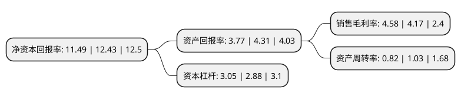

> 本页面由自动化程序生成于 2022年5月20日 01:07
> 内容可能存在错误，如有bug请提交issue至：https://github.com/Eroleice/doc-pi/issues
{.is-warning}

# 上市公司基本情况

## 基本资料

东华能源股份有限公司（以下简称“东华能源”）成立于1996年04月22日，苏州市。于2008年03月06日在深交所中小板上市。

东华能源注册资本164,902.282万元，高纯度液化石油气的加工和销售;生产，销售低温常压液化气并提供相关售后服务。以下是详细信息：

- 公司名称: 东华能源股份有限公司
- 股票代码: 002221.SZ
- 所在地: 江苏 - 苏州市
- 成立日期: 1996年04月22日
- 注册资本: 164,902.282万元
- 法定代表人: 周一峰
- 主营业务: 高纯度液化石油气的加工和销售;生产，销售低温常压液化气并提供相关售后服务
- 公司官网: www.chinadhe.com
- 公司介绍: 公司自成立以来一直专注于烷烃资源的进口、销售和深加工，公司致力于将国际优质烷烃资源与中国经济增长需求相结合，大力发展清洁能源、新材料产业，打造国内最大的烷烃资源综合运营商，现已发展成为全球一流的LPG综合运营商，业务范围涵盖烷烃资源国际国内贸易、化工仓储，终端零售及基础石化等四大板块。公司在新加坡设有国际贸易公司，专门负责国际LPG资源的锁定和采购；在张家港、太仓、宁波拥有三大生产储运基地，从事LPG的接卸、加工、储运以及甲醇，甲苯等化工品的仓储；在江苏，上海、浙江、安徽等省市拥有众多子公司，经营汽车改装、加气站和钢瓶零售等终端业务。

## 股东及高管情况

上市公司第一大股东为东华石油(长江)有限公司，持股325,360,000股，占比19.73%，**疑似为**上市公司实际控制人。

截至2022年03月31日，上市公司的前十大股东中，共有2名自然人股东，4名机构股东，3个产品账户，1个海外主体，其中5%以上大股东共有4名。上市公司前十大股东明细如下：

> 未能通过持股比例判定出上市公司实际控制人（持股30%以上）
> 可能存在通过间接持股、联合持股、协议控制等方式拥有实际控制权的主体，具体请参考上市公司定期公告！
{.is-warning}

> 截至2022年03月31日，上市公司前十大股东信息如下：

| 股东名称 | 持股数量（股） | 持股比例 |
| --- | --- | --- |
| 东华石油(长江)有限公司 | 325,360,000 | 19.73% |
| 周一峰 | 152,610,440 | 9.25% |
| 优尼科长江有限公司 | 131,296,700 | 7.96% |
| 共青城胜帮投资管理有限公司-共青城胜帮凯米投资合伙企业(有限合伙) | 93,506,717 | 5.67% |
| 香港中央结算有限公司(陆股通) | 51,597,248 | 3.13% |
| 天津祎童源资产管理有限公司-祎童源领航成长私募证券投资基金 | 40,537,171 | 2.46% |
| 深圳亿库资本管理有限公司-亿库创赢一号私募投资基金 | 39,683,265 | 2.41% |
| 马森能源(南京)有限公司 | 31,684,854 | 1.92% |
| 陈春满 | 23,265,926 | 1.41% |
| 南京金伯珠资产管理有限公司-金伯珠天枢星私募证券投资基金 | 20,772,905 | 1.26% |

## 利润表分析

上市公司2021年总收入为263.67亿元，净利润为12.08亿元，实现盈利。

## 杜邦分析

> 数据列示周期：2021年 | 2020年 | 2019年
{.is-info}

上市公司的净资产收益率在近一年有所下降，下降幅度为-7.56%，其变化情况分解如下：
- 上市公司的销售毛利率在近一年上升了9.83%，可能是生产效率的提升、商品原材料价格下跌或商品价格的上涨所致。
- 上市公司的资产周转率在近一年下降了-20.39%，可能是源自于更慢的销售回款或库存管理效果下降。
- 上市公司的财务杠杆比率在近一年上升了5.9%，可能是增加负债扩大生产规模。

