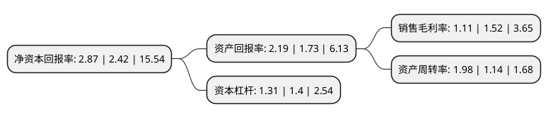

> 本页面由自动化程序生成于 2022年5月20日 01:26
> 内容可能存在错误，如有bug请提交issue至：https://github.com/Eroleice/doc-pi/issues
{.is-warning}

# 上市公司基本情况

## 基本资料

海越能源集团股份有限公司（以下简称“ST海越”）成立于1993年07月26日，绍兴市。于2004年02月18日在上交所主板上市。

ST海越注册资本46,814.446万元，主营业务:油类，气类，公路征费。以下是详细信息：

- 公司名称: 海越能源集团股份有限公司
- 股票代码: 600387.SH
- 所在地: 浙江 - 绍兴市
- 成立日期: 1993年07月26日
- 注册资本: 46,814.446万元
- 法定代表人: 王彬
- 主营业务: 主营业务:油类，气类，公路征费
- 公司官网: www.hy600387.com
- 公司介绍: 公司是以绿色能源投资与生产、石油化工品储运与贸易为主营的大型综合性能源商贸企业，目前，旗下拥有宁波海越新材料、天津北方石油、海越资产管理等公司。旗下宁波海越拥有60万吨/年丙烷脱氢装置、60万吨/年异辛烷装置、4万吨/年甲乙酮装置、及宁波北仑港区5万吨级专业石化码头，是全球单体规模最大和设备最先进的清洁汽油添加剂—异辛烷生产基地和江浙地区单体规模最大的高端石化产品—丙烯产销基地，其中异辛烷产量连续多年稳居市场第一，是行业标准的引领者。旗下北方石油在天津港建有年周转量逾千万吨的5万吨级专业石化码头和85万立方米的原油、成品油及化工产品库区，是中国北方地区商业规模较大、设施先进、配套完善的石油化工储运基地；在诸暨境内拥有5.2万吨成品油库、2200立方液化气库、500吨级的成品油运输码头、10座加油站，以及2条石油专用铁路线，业务辐射国内沿海地区，是浙江省民营油品经营的龙头企业之一。旗下海越资管公司于2017年12月完成私募基金管理人登记，已成为可开展私募证券投资、股权投资、创业投资等私募基金业务的金融机构，累计实现总投资增值3.8倍，直接增值3.6倍，是海越股份实现在能源投资领域做大做强的重要支持力量。

## 股东及高管情况

上市公司第一大股东为铜川汇能鑫能源有限公司，持股89,934,087股，占比19.21%，**疑似为**上市公司实际控制人。

截至2022年03月31日，上市公司的前十大股东中，共有4名自然人股东，5名机构股东，1个产品账户，其中5%以上大股东共有2名。上市公司前十大股东明细如下：

> 未能通过持股比例判定出上市公司实际控制人（持股30%以上）
> 可能存在通过间接持股、联合持股、协议控制等方式拥有实际控制权的主体，具体请参考上市公司定期公告！
{.is-warning}

> 截至2022年03月31日，上市公司前十大股东信息如下：

| 股东名称 | 持股数量（股） | 持股比例 |
| --- | --- | --- |
| 铜川汇能鑫能源有限公司 | 89,934,087 | 19.21% |
| 海航云商投资有限公司 | 63,705,972 | 13.61% |
| 萍乡中天创富企业管理合伙企业(有限合伙) | 15,130,214 | 3.23% |
| 景宁万泰投资管理有限公司 | 8,600,000 | 1.84% |
| 邱力 | 6,000,000 | 1.28% |
| 浙江省经协集团有限公司 | 3,980,000 | 0.85% |
| 瞿小刚 | 3,798,400 | 0.81% |
| 深圳市云古投资有限公司-云古湛卢1号私募证券投资基金 | 2,475,800 | 0.53% |
| 王长安 | 2,364,900 | 0.51% |
| 杨锋 | 1,987,900 | 0.42% |

## 利润表分析

上市公司2021年总收入为82.81亿元，净利润为0.91亿元，实现盈利。

## 杜邦分析

> 数据列示周期：2021年 | 2020年 | 2019年
{.is-info}

上市公司的净资产收益率在近一年有所上升，上升幅度为18.6%，其变化情况分解如下：
- 上市公司的销售毛利率在近一年下降了-26.97%，可能是生产效率的下降、商品原材料价格上涨或商品价格的下跌所致。
- 上市公司的资产周转率在近一年上升了73.68%，可能是源自于更快的销售回款或库存管理效果提升。
- 上市公司的财务杠杆比率在近一年下降了-6.43%，可能是减少负债降低财务费用。

