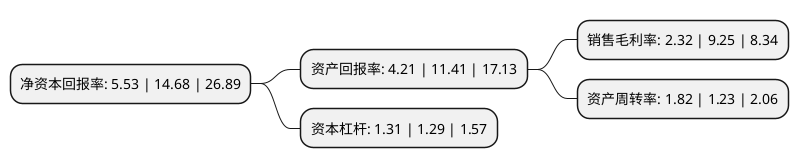

> 本页面由自动化程序生成于 2022年5月20日 01:33
> 内容可能存在错误，如有bug请提交issue至：https://github.com/Eroleice/doc-pi/issues
{.is-warning}

# 上市公司基本情况

## 基本资料

湖南和顺石油股份有限公司（以下简称“和顺石油”）成立于2005年07月18日，长沙市。于2020年04月07日在上交所主板上市。

和顺石油注册资本17,339.4万元，主营业务为成品油批发，零售，业务涵盖成品油采购，仓储，物流，批发，零售环节，在成品油流通领域形成完整产业链。以下是详细信息：

- 公司名称: 湖南和顺石油股份有限公司
- 股票代码: 603353.SH
- 所在地: 湖南 - 长沙市
- 成立日期: 2005年07月18日
- 注册资本: 17,339.4万元
- 法定代表人: 赵忠
- 主营业务: 主营业务为成品油批发，零售，业务涵盖成品油采购，仓储，物流，批发，零售环节，在成品油流通领域形成完整产业链
- 公司官网: www.hnhsjt.com
- 公司介绍: 公司是湖南省第一家获国家商务部批准取得成品油批发资质的民营石油企业,主营业务为成品油批发、零售，业务涵盖成品油采购、仓储、物流、批发、零售环节，在成品油流通领域形成完整产业链,立足于湖南长株潭城市群区域，面向全省及周边发展。公司批发业务覆盖长沙、株洲、湘潭、娄底、邵阳、衡阳等地区；零售业务主要分布在经济发达的长沙市区及周边城市,经过不断努力与发展，迄今为止，公司拥有自营30座加油站，拥有库容为29,500立方米的湘潭油库，拥有1条3.2公里铁路专用线使用权、25辆不同吨位的油罐车，已成为湖南实力最强的地方石油企业。

## 股东及高管情况

上市公司第一大股东为湖南和顺投资发展有限公司，持股72,371,000股，占比41.74%，为上市公司实际控制人。

截至2022年05月05日，上市公司的前十大股东中，共有5名自然人股东，2名机构股东，3个产品账户，其中5%以上大股东共有4名。上市公司前十大股东明细如下：

> 截至2022年05月05日，上市公司前十大股东信息如下：

| 股东名称 | 持股数量（股） | 持股比例 |
| --- | --- | --- |
| 湖南和顺投资发展有限公司 | 72,371,000 | 41.74% |
| 晏喜明 | 24,271,000 | 14% |
| 赵尊铭 | 10,400,000 | 6% |
| 龙小珍 | 8,931,000 | 5.15% |
| 滨州共创盛景信息科技中心(有限合伙) | 6,500,000 | 3.75% |
| 赵雄 | 4,550,000 | 2.62% |
| 华福证券-龙小珍-华福证券-兴企荟1号单一资产管理计划 | 2,977,000 | 1.72% |
| 沐德资产管理(北京)有限公司-沐德沐礼趋势私募证券投资基金 | 600,086 | 0.35% |
| 沐德资产管理(北京)有限公司-沐德沐礼成长私募证券投资基金 | 550,000 | 0.32% |
| 苏丹 | 525,300 | 0.3% |

## 利润表分析

上市公司2021年总收入为39.33亿元，净利润为0.91亿元，实现盈利。

## 杜邦分析

> 数据列示周期：2021年 | 2020年 | 2019年
{.is-info}

上市公司的净资产收益率在近一年有所下降，下降幅度为-62.33%，其变化情况分解如下：
- 上市公司的销售毛利率在近一年下降了-74.92%，可能是生产效率的下降、商品原材料价格上涨或商品价格的下跌所致。
- 上市公司的资产周转率在近一年上升了47.97%，可能是源自于更快的销售回款或库存管理效果提升。
- 上市公司的财务杠杆比率在近一年上升了1.55%，可能是增加负债扩大生产规模。

