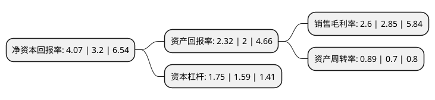

> 本页面由自动化程序生成于 2022年5月20日 01:03
> 内容可能存在错误，如有bug请提交issue至：https://github.com/Eroleice/doc-pi/issues
{.is-warning}

# 上市公司基本情况

## 基本资料

英洛华科技股份有限公司（以下简称“英洛华”）成立于1997年08月04日，金华市。于1997年08月08日在深交所主板上市。

英洛华注册资本113,368.41万元，主要产品:钕铁硼，立体仓库，棕刚玉，金刚石制品，贸易，微特电机的研发，生产与销售。以下是详细信息：

- 公司名称: 英洛华科技股份有限公司
- 股票代码: 000795.SZ
- 所在地: 浙江 - 金华市
- 成立日期: 1997年08月04日
- 注册资本: 113,368.41万元
- 法定代表人: 梅锐
- 主营业务: 主要产品:钕铁硼，立体仓库，棕刚玉，金刚石制品，贸易，微特电机的研发，生产与销售
- 公司官网: www.innuovo.com
- 公司介绍: 公司为山西省出口创汇先进单位和重点企业之一。公司产品涉及磁性新材料、电机电气及高端设备，主营业务为稀土永磁材料与制品、电机系列、物流与消防智能装备。公司收购赣州东磁100%股权及钕铁硼业务相关资产，进一步完善产业链。赣州东磁多年来从事高性能钕铁硼永磁材料的研发、生产和销售，产品广泛应用于风电、电动机、移动通讯、高档音响、仪器仪表、电子元件等领域，在风电发电机、新能源汽车等领域占据了一定的市场份额；横店进出口拥有的钕铁硼业务相关资产主要从事钕铁硼永磁材料出口业务。公司的良好业绩、企业活力及盈利增长潜力受到市场广泛认可。

## 股东及高管情况

上市公司第一大股东为横店集团控股有限公司，持股447,529,376股，占比39.48%，为上市公司实际控制人。

截至2022年05月05日，上市公司的前十大股东中，共有2名自然人股东，5名机构股东，2个产品账户，1个海外主体，其中5%以上大股东共有2名。上市公司前十大股东明细如下：

> 截至2022年05月05日，上市公司前十大股东信息如下：

| 股东名称 | 持股数量（股） | 持股比例 |
| --- | --- | --- |
| 横店集团控股有限公司 | 447,529,376 | 39.48% |
| 横店集团东磁有限公司 | 98,077,839 | 8.65% |
| 浙江横店进出口有限公司 | 12,175,648 | 1.07% |
| 英洛华科技股份有限公司-第一期员工持股计划 | 8,587,297 | 0.76% |
| 香港中央结算有限公司(陆股通) | 5,834,641 | 0.51% |
| 王春飞 | 5,700,000 | 0.5% |
| 中国建设银行股份有限公司-嘉实中证稀土产业交易型开放式指数证券投资基金 | 3,958,400 | 0.35% |
| 钜洲资产管理(上海)有限公司 | 3,660,600 | 0.32% |
| 金华相家投资合伙企业(有限合伙) | 3,133,037 | 0.28% |
| 许晓华 | 3,032,760 | 0.27% |

## 利润表分析

上市公司2021年总收入为37.6亿元，净利润为0.97亿元，实现盈利。

## 杜邦分析

> 数据列示周期：2021年 | 2020年 | 2019年
{.is-info}

上市公司的净资产收益率在近一年有所上升，上升幅度为27.19%，其变化情况分解如下：
- 上市公司的销售毛利率在近一年下降了-8.77%，可能是生产效率的下降、商品原材料价格上涨或商品价格的下跌所致。
- 上市公司的资产周转率在近一年上升了27.14%，可能是源自于更快的销售回款或库存管理效果提升。
- 上市公司的财务杠杆比率在近一年上升了10.06%，可能是增加负债扩大生产规模。

