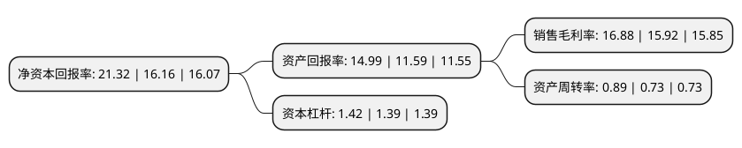

> 本页面由自动化程序生成于 2022年5月20日 01:06
> 内容可能存在错误，如有bug请提交issue至：https://github.com/Eroleice/doc-pi/issues
{.is-warning}

# 上市公司基本情况

## 基本资料

山东鲁阳节能材料股份有限公司（以下简称“鲁阳节能”）成立于1992年10月14日，淄博市。于2006年11月30日在深交所中小板上市。

鲁阳节能注册资本50,633.259万元，主要产品:已经形成了1050，1260，1400，1600等四大系列，包括棉，毯，毡，板，模块，纸，纺织品，浇注料，可塑料，纤维喷涂料等十余种形态的100多种产品。主营业务:陶瓷纤维产品的生产，销售。以下是详细信息：

- 公司名称: 山东鲁阳节能材料股份有限公司
- 股票代码: 002088.SZ
- 所在地: 山东 - 淄博市
- 成立日期: 1992年10月14日
- 注册资本: 50,633.259万元
- 法定代表人: 鹿成滨
- 主营业务: 主要产品:已经形成了1050，1260，1400，1600等四大系列，包括棉，毯，毡，板，模块，纸，纺织品，浇注料，可塑料，纤维喷涂料等十余种形态的100多种产品主营业务:陶瓷纤维产品的生产，销售
- 公司官网: www.luyang.com
- 公司介绍: 公司是一家耐火纤维生产企业，集耐火材料领域的产品研发，生产，销售和应用服务于一体。公司建立国家认可的企业技术中心，国家重点实验室，博士后研究中心，拥有多项专利和科技成果。公司是国家“863”计划的跨部门，产品被列为国家重点新产品。公司耐火纤维产品拥有棉、毯、毡、板等不同形态多品种，年生产能力大；产品畅销全国并远销欧盟、美国、中东等多个国家和地区，在建筑防火隔热，高温隔热等领域有着广泛的应用。公司先后被认定为“中国最大硅酸铝耐火纤维生产基地”、“国家新材料产业化基地骨干企业”，“鲁阳”商标被国家工商总局认定为“中国驰名商标”，其中含锆纤维、陶瓷纤维纸等产品荣获“国家级重点新产品”等荣誉称号。

## 股东及高管情况

上市公司第一大股东为奇耐联合纤维亚太控股有限公司，持股142,493,022股，占比28.14%，**疑似为**上市公司实际控制人。

截至2022年03月31日，上市公司的前十大股东中，共有3名自然人股东，1名机构股东，5个产品账户，1名其他股东，其中5%以上大股东共有2名。上市公司前十大股东明细如下：

> 未能通过持股比例判定出上市公司实际控制人（持股30%以上）
> 可能存在通过间接持股、联合持股、协议控制等方式拥有实际控制权的主体，具体请参考上市公司定期公告！
{.is-warning}

> 截至2022年03月31日，上市公司前十大股东信息如下：

| 股东名称 | 持股数量（股） | 持股比例 |
| --- | --- | --- |
| 奇耐联合纤维亚太控股有限公司 | 142,493,022 | 28.14% |
| 鹿成滨 | 68,595,992 | 13.55% |
| 中国农业银行股份有限公司-大成新锐产业混合型证券投资基金 | 23,643,910 | 4.67% |
| 沂源县南麻街道集体资产经营管理中心 | 19,781,576 | 3.91% |
| 基本养老保险基金一零零一组合 | 14,889,100 | 2.94% |
| 广发证券股份有限公司-大成睿景灵活配置混合型证券投资基金 | 13,551,448 | 2.68% |
| 全国社保基金一一三组合 | 6,335,700 | 1.25% |
| 亓瑛 | 6,235,201 | 1.23% |
| 交通银行股份有限公司-华安策略优选混合型证券投资基金 | 6,048,290 | 1.19% |
| 任德凤 | 5,099,485 | 1.01% |

## 利润表分析

上市公司2021年总收入为31.63亿元，净利润为5.34亿元，实现盈利。

## 杜邦分析

> 数据列示周期：2021年 | 2020年 | 2019年
{.is-info}

上市公司的净资产收益率在近一年有所上升，上升幅度为31.93%，其变化情况分解如下：
- 上市公司的销售毛利率在近一年上升了6.03%，可能是生产效率的提升、商品原材料价格下跌或商品价格的上涨所致。
- 上市公司的资产周转率在近一年上升了21.92%，可能是源自于更快的销售回款或库存管理效果提升。
- 上市公司的财务杠杆比率在近一年上升了2.16%，可能是增加负债扩大生产规模。

