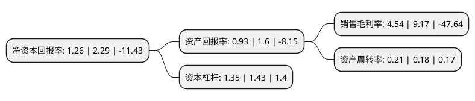

> 本页面由自动化程序生成于 2022年5月20日 01:07
> 内容可能存在错误，如有bug请提交issue至：https://github.com/Eroleice/doc-pi/issues
{.is-warning}

# 上市公司基本情况

## 基本资料

湖南博云新材料股份有限公司（以下简称“博云新材”）成立于1994年08月12日，长沙市。于2009年09月29日在深交所中小板上市。

博云新材注册资本57,310.482万元，主要产品:航空航天产品(军用，民用飞机刹车副<粉末冶金飞机刹车副，炭/炭复合材料飞机刹车副>，航天用炭/炭复合材料产品)，环保型高性能汽车刹车片，高性能模具材料等三大类具有自主知识产权的粉末冶金复合材料产品。以下是详细信息：

- 公司名称: 湖南博云新材料股份有限公司
- 股票代码: 002297.SZ
- 所在地: 湖南 - 长沙市
- 成立日期: 1994年08月12日
- 注册资本: 57,310.482万元
- 法定代表人: 贺柳
- 主营业务: 主要产品:航空航天产品(军用，民用飞机刹车副<粉末冶金飞机刹车副，炭/炭复合材料飞机刹车副>，航天用炭/炭复合材料产品)，环保型高性能汽车刹车片，高性能模具材料等三大类具有自主知识产权的粉末冶金复合材料产品
- 公司官网: www.hnboyun.com.cn
- 公司介绍: 公司是汇聚国内顶尖的粉末冶金复合材料专家团队组建的高新技术企业。公司主要从事军民用飞机粉末冶金和炭/炭复合材料刹车副、航天及民用炭/炭复合材料产品、环保型高性能汽车刹车片、高性能模具材料、军民用飞机机轮及刹车系统、粉末冶金专业设备等产品的研究、开发、生产和销售。公司形成了具有完全自主知识产权的产品系列。公司建立了完整的质量管理体系，通过了ISO9001-2000质量管理体系和GJB9001A-2001质量管理体系认证。公司产品涉及航空、航天、铁路、汽车、冶金、化工等领域。多种机型航空刹车副已广泛应用于军民用飞机上，部分产品还出口东南亚、俄罗斯等独联体国家。自主研发的多种型号炭/炭复合材料喷管，已成功应用于航天飞行器上。

## 股东及高管情况

上市公司第一大股东为中南大学粉末冶金工程研究中心有限公司，持股72,472,129股，占比12.65%，**疑似为**上市公司实际控制人。

截至2022年03月31日，上市公司的前十大股东中，共有2名自然人股东，5名机构股东，3个产品账户，其中5%以上大股东共有3名。上市公司前十大股东明细如下：

> 未能通过持股比例判定出上市公司实际控制人（持股30%以上）
> 可能存在通过间接持股、联合持股、协议控制等方式拥有实际控制权的主体，具体请参考上市公司定期公告！
{.is-warning}

> 截至2022年03月31日，上市公司前十大股东信息如下：

| 股东名称 | 持股数量（股） | 持股比例 |
| --- | --- | --- |
| 中南大学粉末冶金工程研究中心有限公司 | 72,472,129 | 12.65% |
| 湖南湘投高科技创业投资有限公司 | 44,080,202 | 7.69% |
| 国家军民融合产业投资基金有限责任公司 | 37,402,680 | 6.53% |
| 湖南兴湘投资控股集团有限公司 | 24,193,548 | 4.22% |
| 北京誉华基金管理有限公司-航空产业融合发展(青岛)股权投资基金合伙企业(有限合伙) | 8,064,516 | 1.41% |
| 郭伟 | 5,577,672 | 0.97% |
| 共青城华建新希望投资管理合伙企业(有限合伙) | 5,090,000 | 0.89% |
| 应光亮 | 4,470,000 | 0.78% |
| 湖南天惠投资基金管理有限公司-湖南省天惠军民融合投资基金合伙企业(有限合伙) | 3,811,329 | 0.67% |
| 湖州爱道铭泉企业管理合伙企业(有限合伙) | 2,630,000 | 0.46% |

## 利润表分析

上市公司2021年总收入为4.78亿元，净利润为0.21亿元，实现盈利。

## 杜邦分析

> 数据列示周期：2021年 | 2020年 | 2019年
{.is-info}

上市公司的净资产收益率在近一年有所下降，下降幅度为-44.98%，其变化情况分解如下：
- 上市公司的销售毛利率在近一年下降了-50.49%，可能是生产效率的下降、商品原材料价格上涨或商品价格的下跌所致。
- 上市公司的资产周转率在近一年上升了16.67%，可能是源自于更快的销售回款或库存管理效果提升。
- 上市公司的财务杠杆比率在近一年下降了-5.59%，可能是减少负债降低财务费用。

