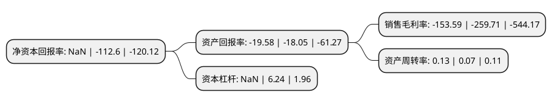

> 本页面由自动化程序生成于 2022年5月20日 01:14
> 内容可能存在错误，如有bug请提交issue至：https://github.com/Eroleice/doc-pi/issues
{.is-warning}

# 上市公司基本情况

## 基本资料

郑州华晶金刚石股份有限公司（以下简称“*ST金刚”）成立于2004年12月24日，郑州市。于2010年03月26日在深交所创业板上市。

*ST金刚注册资本120,547.66万元，本公司主营业务为人造金刚石及其原辅材料的研发，生产和销售，以及人造金刚石合成设备的研发。目前，本公司的主导产品为人造金刚石。以下是详细信息：

- 公司名称: 郑州华晶金刚石股份有限公司
- 股票代码: 300064.SZ
- 所在地: 河南 - 郑州市
- 成立日期: 2004年12月24日
- 注册资本: 120,547.66万元
- 法定代表人: 刘淼
- 主营业务: 本公司主营业务为人造金刚石及其原辅材料的研发，生产和销售，以及人造金刚石合成设备的研发目前，本公司的主导产品为人造金刚石
- 公司官网: www.sinocrystal.com.cn
- 公司介绍: 公司是国内技术和研发能力最完整、综合实力国内领先的人造金刚石生产企业。主导产品为人造金刚石，已成为全国人造金刚石的主要生产企业之一，人造金刚石产销量位居全国第三。生产人造金刚石的全部合成设备都是自主研发、国内独创的，是国内合成缸径最大、对中精度高、稳定性好、生产效率最高的人造金刚石生产设备，处于国内领先地位。公司掌握了大型合成设备、大腔体合成工艺和大腔体合成人造金刚石用原辅材料等核心技术；华晶牌SC系列金刚石产品获得“河南省名牌产品”和“中国著名品牌”称号。

## 股东及高管情况

上市公司第一大股东为兴瀚资管-兴业银行股份有限公司-兴瀚资管-兴开源8号单一客户专项资产管理计划，持股321,839,080股，占比26.7%，**疑似为**上市公司实际控制人。

截至2022年03月31日，上市公司的前十大股东中，共有4名自然人股东，3名机构股东，2个产品账户，1个海外主体，其中5%以上大股东共有4名。上市公司前十大股东明细如下：

> 未能通过持股比例判定出上市公司实际控制人（持股30%以上）
> 可能存在通过间接持股、联合持股、协议控制等方式拥有实际控制权的主体，具体请参考上市公司定期公告！
{.is-warning}

> 截至2022年03月31日，上市公司前十大股东信息如下：

| 股东名称 | 持股数量（股） | 持股比例 |
| --- | --- | --- |
| 兴瀚资管-兴业银行股份有限公司-兴瀚资管-兴开源8号单一客户专项资产管理计划 | 321,839,080 | 26.7% |
| 郭留希 | 185,264,103 | 15.37% |
| 山西证券-郑州银行股份有限公司-山西证券锐创1号定向资产管理计划 | 94,400,000 | 7.83% |
| 河南农投金控股份有限公司 | 89,494,517 | 7.42% |
| 河南华晶超硬材料股份有限公司 | 50,817,483 | 4.22% |
| 郑州冬青企业管理中心(普通合伙) | 21,048,683 | 1.75% |
| BARCLAYS BANK PLC | 5,274,200 | 0.44% |
| 张洁 | 5,000,000 | 0.41% |
| 朱登营 | 4,626,100 | 0.38% |
| 薛建亮 | 4,220,100 | 0.35% |

## 利润表分析

上市公司2021年总收入为7.81亿元，净利润为-12.01亿元，**未实现盈利**。

## 杜邦分析

> 数据列示周期：2021年 | 2020年 | 2019年
{.is-info}

上市公司的净资产收益率在近一年有所下降，下降幅度为NaN%，其变化情况分解如下：
- 上市公司的销售毛利率在近一年下降了-40.86%，可能是生产效率的下降、商品原材料价格上涨或商品价格的下跌所致。
- 上市公司的资产周转率在近一年上升了85.71%，可能是源自于更快的销售回款或库存管理效果提升。
- 上市公司的财务杠杆比率在近一年下降了NaN%，可能是减少负债降低财务费用。

