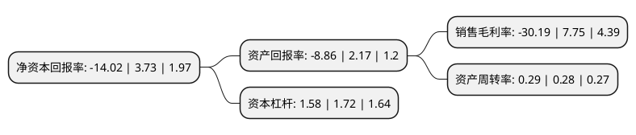

> 本页面由自动化程序生成于 2022年5月20日 01:18
> 内容可能存在错误，如有bug请提交issue至：https://github.com/Eroleice/doc-pi/issues
{.is-warning}

# 上市公司基本情况

## 基本资料

南京三超新材料股份有限公司（以下简称“三超新材”）成立于1999年01月29日，南京市。于2017年04月21日在深交所创业板上市。

三超新材注册资本9,361.337万元，主营业务是金刚石工具的研发，生产和销售，主要产品为电镀金刚线和金刚石砂轮。以下是详细信息：

- 公司名称: 南京三超新材料股份有限公司
- 股票代码: 300554.SZ
- 所在地: 江苏 - 南京市
- 成立日期: 1999年01月29日
- 注册资本: 9,361.337万元
- 法定代表人: 邹余耀
- 主营业务: 主营业务是金刚石工具的研发，生产和销售，主要产品为电镀金刚线和金刚石砂轮
- 公司官网: www.diasc.com.cn
- 公司介绍: 公司是一家专业从事金刚石、立方氮化硼工具的研发、生产与销售的高新技术企业，现拥有金刚石砂轮和金刚石线两大类相互协同的产品系列，应用于硅、蓝宝石、石英、铁氧体、钕铁硼、陶瓷、玻璃、硬质合金等硬脆材料的精密切割、磨削与抛光。公司自成立以来，始终坚持＂以人为本、技术优先＂的发展理念，先后引入多名外籍专家，并在日本成立了超硬材料工具的专业研发机构。经过多年研发，公司成为国内最早通过自主研发掌握金刚线制造的相关技术，成功实现产业化的企业之一，并且打破了国外企业的技术垄断，与新研发成功的硅片背面减薄砂轮、硅片倒角砂轮、PAD修整器等产品，为半导体及太阳能光伏行业提供了优质的金刚石工具，并凭借良好的品质与高性价比，赢得了众多实力用户认可，在国内形成了较高的行业影响力。

## 股东及高管情况

上市公司第一大股东为邹余耀，持股37,206,385股，占比39.74%，为上市公司实际控制人。

截至2022年03月31日，上市公司的前十大股东中，共有9名自然人股东，1名机构股东，其中5%以上大股东共有2名。上市公司前十大股东明细如下：

> 截至2022年03月31日，上市公司前十大股东信息如下：

| 股东名称 | 持股数量（股） | 持股比例 |
| --- | --- | --- |
| 邹余耀 | 37,206,385 | 39.74% |
| 刘建勋 | 12,141,520 | 12.97% |
| 徐建央 | 688,600 | 0.74% |
| 胡佰龙 | 503,900 | 0.54% |
| 刘育辰 | 449,000 | 0.48% |
| 田娜 | 367,900 | 0.39% |
| 钱苏娟 | 324,900 | 0.35% |
| 狄峰 | 324,271 | 0.35% |
| 华泰证券股份有限公司 | 292,560 | 0.31% |
| 蔡敏亚 | 260,000 | 0.28% |

## 利润表分析

上市公司2021年总收入为2.48亿元，净利润为-0.76亿元，**未实现盈利**。

## 杜邦分析

> 数据列示周期：2021年 | 2020年 | 2019年
{.is-info}

上市公司的净资产收益率在近一年有所下降，下降幅度为-475.87%，其变化情况分解如下：
- 上市公司的销售毛利率在近一年下降了-489.55%，可能是生产效率的下降、商品原材料价格上涨或商品价格的下跌所致。
- 上市公司的资产周转率在近一年上升了3.57%，可能是源自于更快的销售回款或库存管理效果提升。
- 上市公司的财务杠杆比率在近一年下降了-8.14%，可能是减少负债降低财务费用。

