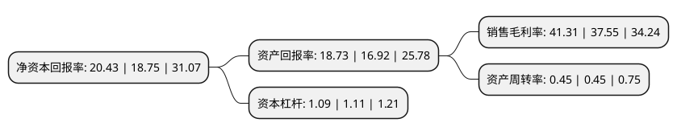

> 本页面由自动化程序生成于 2022年5月20日 01:21
> 内容可能存在错误，如有bug请提交issue至：https://github.com/Eroleice/doc-pi/issues
{.is-warning}

# 上市公司基本情况

## 基本资料

杨凌美畅新材料股份有限公司（以下简称“美畅股份”）成立于2015年07月07日，咸阳市。于2020年08月24日在深交所创业板上市。

美畅股份注册资本40,001万元，金刚石工具及相关产业链中的材料和制品的研发，生产，销售以下是详细信息：

- 公司名称: 杨凌美畅新材料股份有限公司
- 股票代码: 300861.SZ
- 所在地: 陕西 - 咸阳市
- 成立日期: 2015年07月07日
- 注册资本: 40,001万元
- 法定代表人: 吴英
- 主营业务: 金刚石工具及相关产业链中的材料和制品的研发，生产，销售
- 公司官网: www.ylmetron.com
- 公司介绍: 公司是一家从事金刚石工具及相关产业链的材料和制品的研发、生产及销售的新材料企业，目前主要产品为电镀金刚石线，可用于晶体硅、蓝宝石等硬脆材料的切割。公司致力于成为全球领先的金刚石工具制造商，公司以技术研发为核心，在电镀金刚石线生产的核心技术、工艺控制、装备制造等环节均拥有自主知识产权，掌握了包括电镀液配方、添加剂、金刚石预处理、上砂、镀液在线处理等在内的金刚石线生产全套核心技术。基于公司的电镀工艺及技术优势，公司产品在稳定性、切割质量、工艺适用性等方面均有较强的竞争优势；公司自主研发的“单机六线”生产线工艺国际领先，生产效率更高，公司凭借产能优势和产品的质量及性能优势，与光伏行业诸多具有较强行业影响力的下游客户达成了合作关系，包括隆基股份、保利协鑫、晶科能源、阿特斯太阳能等硅片龙头企业以及晶龙集团、中环股份、阳光能源、比亚迪、南玻硅材料、天合光能等知名光伏企业客户群体已基本涵盖国内光伏及硅片生产的主要企业。

## 股东及高管情况

上市公司第一大股东为吴英，持股198,393,294股，占比49.6%，为上市公司实际控制人。

截至2022年03月31日，上市公司的前十大股东中，共有5名自然人股东，5个产品账户，其中5%以上大股东共有3名。上市公司前十大股东明细如下：

> 截至2022年03月31日，上市公司前十大股东信息如下：

| 股东名称 | 持股数量（股） | 持股比例 |
| --- | --- | --- |
| 吴英 | 198,393,294 | 49.6% |
| 张迎九 | 56,263,545 | 14.07% |
| 贾海波 | 31,187,684 | 7.8% |
| 深圳有域投资管理有限公司-如东恒远新材料股权投资基金合伙企业(有限合伙) | 5,355,072 | 1.34% |
| 任军强 | 4,899,358 | 1.22% |
| 三亚兆恒私募基金管理合伙企业(有限合伙)-如东无尽藏金刚新材料股权投资基金合伙企业(有限合伙) | 4,764,756 | 1.19% |
| 三亚兆恒私募基金管理合伙企业(有限合伙)-如东新泉新材料股权投资基金合伙企业(有限合伙) | 4,334,940 | 1.08% |
| 上海浦东发展银行股份有限公司-广发高端制造股票型发起式证券投资基金 | 4,182,601 | 1.05% |
| 苏建国 | 3,488,637 | 0.87% |
| 中国工商银行股份有限公司-广发鑫享灵活配置混合型证券投资基金 | 3,129,711 | 0.78% |

## 利润表分析

上市公司2021年总收入为18.47亿元，净利润为7.63亿元，实现盈利。

## 杜邦分析

> 数据列示周期：2021年 | 2020年 | 2019年
{.is-info}

上市公司的净资产收益率在近一年有所上升，上升幅度为8.96%，其变化情况分解如下：
- 上市公司的销售毛利率在近一年上升了10.01%，可能是生产效率的提升、商品原材料价格下跌或商品价格的上涨所致。
- 上市公司的资产周转率在近一年下降了0%，可能是源自于更慢的销售回款或库存管理效果下降。
- 上市公司的财务杠杆比率在近一年下降了-1.8%，可能是减少负债降低财务费用。

