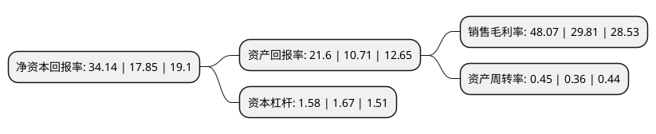

> 本页面由自动化程序生成于 2022年5月20日 01:22
> 内容可能存在错误，如有bug请提交issue至：https://github.com/Eroleice/doc-pi/issues
{.is-warning}

# 上市公司基本情况

## 基本资料

河南省力量钻石股份有限公司（以下简称“力量钻石”）成立于2010年11月09日，商丘市。于2021年09月24日在深交所创业板上市。

力量钻石注册资本6,037.198万元，专业从事人造金刚石产品研发，生产和销售，主要产品包括金刚石单晶，金刚石微粉和培育钻石以下是详细信息：

- 公司名称: 河南省力量钻石股份有限公司
- 股票代码: 301071.SZ
- 所在地: 河南 - 商丘市
- 成立日期: 2010年11月09日
- 注册资本: 6,037.198万元
- 法定代表人: 邵增明
- 主营业务: 专业从事人造金刚石产品研发，生产和销售，主要产品包括金刚石单晶，金刚石微粉和培育钻石
- 公司官网: www.lldia.com
- 公司介绍: 公司是一家专业从事人造金刚石产品研发、生产和销售的高新技术企业，主要产品包括金刚石单晶、金刚石微粉和培育钻石。公司拥有高品级金刚石大单晶合成河南省工程实验室和河南省功能性金刚石及制品工程技术研究中心。通过自主研发，公司已逐步掌握了包括原材料配方技术、新型密封传压介质制造技术、大腔体合成系列技术、高品级培育钻石合成技术、金刚石微粉制备技术等在内的人造金刚石生产五大核心支撑技术，形成了相对完备的核心技术体系。基于公司的核心技术体系，公司具备推动现有产品技术水平优化、新产品新技术研发和实现行业技术创新和产业升级的能力，使得公司始终处于行业技术前沿并保持持续的竞争力。

## 股东及高管情况

上市公司第一大股东为邵增明，持股24,047,916股，占比39.83%，为上市公司实际控制人。

截至2022年03月31日，上市公司的前十大股东中，共有6名自然人股东，3名机构股东，1个产品账户，其中5%以上大股东共有2名。上市公司前十大股东明细如下：

> 截至2022年03月31日，上市公司前十大股东信息如下：

| 股东名称 | 持股数量（股） | 持股比例 |
| --- | --- | --- |
| 邵增明 | 24,047,916 | 39.83% |
| 李爱真 | 10,000,000 | 16.56% |
| 翁伟武 | 2,313,095 | 3.83% |
| 商丘汇力金刚石科技服务中心(有限合伙) | 1,773,333 | 2.94% |
| 林佩霞 | 1,734,821 | 2.87% |
| 河南省国控互联网产业创业投资基金(有限合伙) | 1,245,330 | 2.06% |
| 夏红明 | 1,224,013 | 2.03% |
| 农银二号无锡股权投资中心(有限合伙) | 1,156,548 | 1.92% |
| 王六一 | 1,039,137 | 1.72% |
| 太平人寿保险有限公司-分红-团险分红 | 1,020,054 | 1.69% |

## 利润表分析

上市公司2021年总收入为4.98亿元，净利润为2.39亿元，实现盈利。

## 杜邦分析

> 数据列示周期：2021年 | 2020年 | 2019年
{.is-info}

上市公司的净资产收益率在近一年有所上升，上升幅度为91.26%，其变化情况分解如下：
- 上市公司的销售毛利率在近一年上升了61.25%，可能是生产效率的提升、商品原材料价格下跌或商品价格的上涨所致。
- 上市公司的资产周转率在近一年上升了25%，可能是源自于更快的销售回款或库存管理效果提升。
- 上市公司的财务杠杆比率在近一年下降了-5.39%，可能是减少负债降低财务费用。

