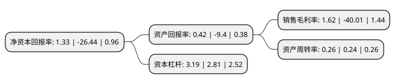

> 本页面由自动化程序生成于 2022年5月20日 01:24
> 内容可能存在错误，如有bug请提交issue至：https://github.com/Eroleice/doc-pi/issues
{.is-warning}

# 上市公司基本情况

## 基本资料

河南黄河旋风股份有限公司（以下简称“黄河旋风”）成立于1998年11月03日，许昌市。于1998年11月26日在上交所主板上市。

黄河旋风注册资本144,218.448万元，主要产品:人造金刚石，建筑机械，金刚石制品。以下是详细信息：

- 公司名称: 河南黄河旋风股份有限公司
- 股票代码: 600172.SH
- 所在地: 河南 - 许昌市
- 成立日期: 1998年11月03日
- 注册资本: 144,218.448万元
- 法定代表人: 庞文龙
- 主营业务: 主要产品:人造金刚石，建筑机械，金刚石制品
- 公司官网: www.hhxf.com
- 公司介绍: 公司是目前国内规模领先、品种最齐全的超硬材料供应商。公司生产的超硬材料单晶是超硬材料产业链的基础性产品，该产品支撑了整个超硬材料行业下游产业的发展。超硬材料应用的终端产品主要包括金刚石研磨工具、金刚石修整工具、金刚石钻进工具、金刚石锯切工具、金刚石超硬材料刀具等类别。工业自动化领域系列产品基于智能制造技术、关键部件、机器人、智能制造软件、智能制造系统、智能制造标准体系的研发等。公司主要经营的产品涵盖碳系材料及制品，超硬材料及聚晶复合材料制品、工业自动化领域系列产品等产业发展。

## 股东及高管情况

上市公司第一大股东为河南黄河实业集团股份有限公司，持股262,218,761股，占比18.18%，**疑似为**上市公司实际控制人。

截至2022年03月31日，上市公司的前十大股东中，共有5名自然人股东，3名机构股东，2个产品账户，其中5%以上大股东共有2名。上市公司前十大股东明细如下：

> 未能通过持股比例判定出上市公司实际控制人（持股30%以上）
> 可能存在通过间接持股、联合持股、协议控制等方式拥有实际控制权的主体，具体请参考上市公司定期公告！
{.is-warning}

> 截至2022年03月31日，上市公司前十大股东信息如下：

| 股东名称 | 持股数量（股） | 持股比例 |
| --- | --- | --- |
| 河南黄河实业集团股份有限公司 | 262,218,761 | 18.18% |
| 许昌市金投开发建设有限公司 | 98,280,298 | 6.81% |
| 日本联合材料公司 | 52,033,466 | 3.61% |
| 胡勃 | 45,686,000 | 3.17% |
| 乔秋生 | 31,440,941 | 2.18% |
| 中国工商银行股份有限公司-信达澳银周期动力混合型证券投资基金 | 28,941,356 | 2.01% |
| 中国建设银行股份有限公司-信达澳银匠心臻选两年持有期混合型证券投资基金 | 21,577,088 | 1.5% |
| 欧阳烛宇 | 19,009,948 | 1.32% |
| 李豫平 | 10,059,258 | 0.7% |
| 肖益群 | 9,942,908 | 0.69% |

## 利润表分析

上市公司2021年总收入为26.52亿元，净利润为0.43亿元，实现盈利。

## 杜邦分析

> 数据列示周期：2021年 | 2020年 | 2019年
{.is-info}

上市公司的净资产收益率在近一年有所下降，下降幅度为-105.03%，其变化情况分解如下：
- 上市公司的销售毛利率在近一年下降了-104.05%，可能是生产效率的下降、商品原材料价格上涨或商品价格的下跌所致。
- 上市公司的资产周转率在近一年上升了8.33%，可能是源自于更快的销售回款或库存管理效果提升。
- 上市公司的财务杠杆比率在近一年上升了13.52%，可能是增加负债扩大生产规模。

