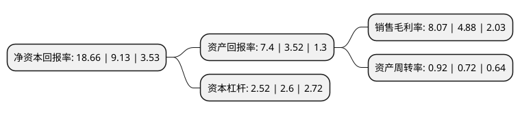

> 本页面由自动化程序生成于 2022年5月20日 01:34
> 内容可能存在错误，如有bug请提交issue至：https://github.com/Eroleice/doc-pi/issues
{.is-warning}

# 上市公司基本情况

## 基本资料

索通发展股份有限公司（以下简称“索通发展”）成立于2003年08月27日，德州市。于2017年07月18日在上交所主板上市。

索通发展注册资本45,993.573万元，主营业务:预焙阳极的研发，生产及销售业务;，主要产品为预焙阳极。以下是详细信息：

- 公司名称: 索通发展股份有限公司
- 股票代码: 603612.SH
- 所在地: 山东 - 德州市
- 成立日期: 2003年08月27日
- 注册资本: 45,993.573万元
- 法定代表人: 郝俊文
- 主营业务: 主营业务:预焙阳极的研发，生产及销售业务;，主要产品为预焙阳极
- 公司官网: www.sun-stone.com
- 公司介绍: 公司是一家专业从事铝用预焙阳极研发、生产和销售的高新技术企业。公司主要生产低消耗、高电流密度的绿色节能预焙阳极，产品出口至欧美、中东、东南亚、大洋洲、非洲共十几个国家。公司连续被授予“山东省优秀出口外贸企业”和“山东省外经贸先进企业”的称号。“索通牌”铝用预焙阳极获得国家有色金属产品实物质量金杯奖，连续两届被山东省名牌战略推进委员会和山东省质量技术监督局评选为“山东名牌”。公司被授予全国首家“全国炭素行业资源综合利用示范企业”及全国首家“铝用炭素生产过程资源综合利用行业技术中心”荣誉称号。

## 股东及高管情况

上市公司第一大股东为郎光辉，持股117,478,389股，占比25.54%，**疑似为**上市公司实际控制人。

截至2022年04月27日，上市公司的前十大股东中，共有3名自然人股东，1名机构股东，6个产品账户，其中5%以上大股东共有2名。上市公司前十大股东明细如下：

> 未能通过持股比例判定出上市公司实际控制人（持股30%以上）
> 可能存在通过间接持股、联合持股、协议控制等方式拥有实际控制权的主体，具体请参考上市公司定期公告！
{.is-warning}

> 截至2022年04月27日，上市公司前十大股东信息如下：

| 股东名称 | 持股数量（股） | 持股比例 |
| --- | --- | --- |
| 郎光辉 | 117,478,389 | 25.54% |
| 王萍 | 56,053,012 | 12.19% |
| 全国社保基金一一八组合 | 11,015,912 | 2.4% |
| 上海科惠股权投资中心(有限合伙) | 5,991,706 | 1.3% |
| 中国建设银行股份有限公司-富国转型机遇混合型证券投资基金 | 5,269,195 | 1.15% |
| 国寿养老策略4号股票型养老金产品-中国工商银行股份有限公司 | 4,939,800 | 1.07% |
| 广州市玄元投资管理有限公司-玄元科新182号私募证券投资基金 | 4,599,357 | 1% |
| 广州市玄元投资管理有限公司-玄元科新181号私募证券投资基金 | 4,599,357 | 1% |
| 黄云 | 4,204,959 | 0.91% |
| 招商银行股份有限公司-富国低碳环保混合型证券投资基金 | 3,759,357 | 0.82% |

## 利润表分析

上市公司2021年总收入为94.57亿元，净利润为7.63亿元，实现盈利。

## 杜邦分析

> 数据列示周期：2021年 | 2020年 | 2019年
{.is-info}

上市公司的净资产收益率在近一年有所上升，上升幅度为104.38%，其变化情况分解如下：
- 上市公司的销售毛利率在近一年上升了65.37%，可能是生产效率的提升、商品原材料价格下跌或商品价格的上涨所致。
- 上市公司的资产周转率在近一年上升了27.78%，可能是源自于更快的销售回款或库存管理效果提升。
- 上市公司的财务杠杆比率在近一年下降了-3.08%，可能是减少负债降低财务费用。

