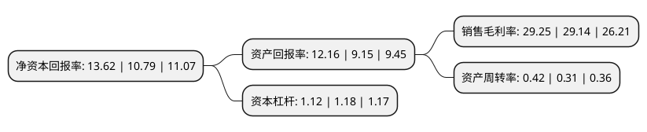

> 本页面由自动化程序生成于 2022年5月20日 01:35
> 内容可能存在错误，如有bug请提交issue至：https://github.com/Eroleice/doc-pi/issues
{.is-warning}

# 上市公司基本情况

## 基本资料

江苏太平洋石英股份有限公司（以下简称“石英股份”）成立于1999年04月23日，连云港市。于2014年10月31日在上交所主板上市。

石英股份注册资本35,314.744万元，主营业务为石英制品的生产，研发及销售;主要产品为中高端石英管，石英棒，高纯石英砂以及包括石英坩埚在内的其他石英制品。以下是详细信息：

- 公司名称: 江苏太平洋石英股份有限公司
- 股票代码: 603688.SH
- 所在地: 江苏 - 连云港市
- 成立日期: 1999年04月23日
- 注册资本: 35,314.744万元
- 法定代表人: 陈士斌
- 主营业务: 主营业务为石英制品的生产，研发及销售;主要产品为中高端石英管，石英棒，高纯石英砂以及包括石英坩埚在内的其他石英制品
- 公司官网: www.quartzpacific.com
- 公司介绍: 公司是一家集科研、生产、销售为一体的硅资源深加工企业，国内石英制品行业的龙头企业。主营业务为石英制品的生产、研发及销售；主要产品为中高端石英管、石英棒，高纯石英砂以及包括石英坩埚在内的其他石英制品，“太平洋”系列石英制品具有很高的品牌知名度和产品竞争力。公司先后被评定为国家火炬计划重点高新技术企业、江苏省高新技术企业、国家硅材料产业基地骨干企业、江苏省星火龙头企业等称号。公司与飞利浦照明、GE照明、欧司朗等国际电光源领先企业都有长期的业务合作关系，并多次获得飞利浦照明等客户授予的优秀供应商贡献奖。

## 股东及高管情况

上市公司第一大股东为陈士斌，持股99,537,682股，占比28.19%，**疑似为**上市公司实际控制人。

截至2022年03月31日，上市公司的前十大股东中，共有3名自然人股东，1名机构股东，6个产品账户，其中5%以上大股东共有2名。上市公司前十大股东明细如下：

> 未能通过持股比例判定出上市公司实际控制人（持股30%以上）
> 可能存在通过间接持股、联合持股、协议控制等方式拥有实际控制权的主体，具体请参考上市公司定期公告！
{.is-warning}

> 截至2022年03月31日，上市公司前十大股东信息如下：

| 股东名称 | 持股数量（股） | 持股比例 |
| --- | --- | --- |
| 陈士斌 | 99,537,682 | 28.19% |
| 富腾发展有限公司 | 81,990,000 | 23.22% |
| 邵静 | 11,248,004 | 3.19% |
| 陈培荣 | 6,739,985 | 1.91% |
| 中国建设银行股份有限公司-易方达环保主题灵活配置混合型证券投资基金 | 5,332,313 | 1.51% |
| 全国社保基金四一四组合 | 3,865,712 | 1.09% |
| 招商银行股份有限公司-睿远成长价值混合型证券投资基金 | 3,702,367 | 1.05% |
| 招商银行股份有限公司-易方达智造优势混合型证券投资基金 | 3,578,866 | 1.01% |
| 招商银行股份有限公司-汇添富中盘积极成长混合型证券投资基金 | 3,572,700 | 1.01% |
| 中国建设银行股份有限公司-华商智能生活灵活配置混合型证券投资基金 | 3,017,926 | 0.85% |

## 利润表分析

上市公司2021年总收入为9.6亿元，净利润为2.8亿元，实现盈利。

## 杜邦分析

> 数据列示周期：2021年 | 2020年 | 2019年
{.is-info}

上市公司的净资产收益率在近一年有所上升，上升幅度为26.23%，其变化情况分解如下：
- 上市公司的销售毛利率在近一年上升了0.38%，可能是生产效率的提升、商品原材料价格下跌或商品价格的上涨所致。
- 上市公司的资产周转率在近一年上升了35.48%，可能是源自于更快的销售回款或库存管理效果提升。
- 上市公司的财务杠杆比率在近一年下降了-5.08%，可能是减少负债降低财务费用。

