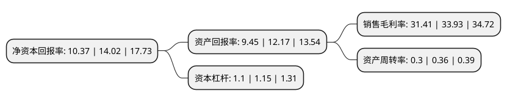

> 本页面由自动化程序生成于 2022年5月20日 01:36
> 内容可能存在错误，如有bug请提交issue至：https://github.com/Eroleice/doc-pi/issues
{.is-warning}

# 上市公司基本情况

## 基本资料

龙岩高岭土股份有限公司（以下简称“龙高股份”）成立于2003年04月25日，龙岩市。于2021年04月16日在上交所主板上市。

龙高股份注册资本12,800万元，从事高岭土的采选，加工和销售，以及相关技术研发业务以下是详细信息：

- 公司名称: 龙岩高岭土股份有限公司
- 股票代码: 605086.SH
- 所在地: 福建 - 龙岩市
- 成立日期: 2003年04月25日
- 注册资本: 12,800万元
- 法定代表人: 温能全
- 主营业务: 从事高岭土的采选，加工和销售，以及相关技术研发业务
- 公司官网: www.longgaogf.com
- 公司介绍: 公司专注于高岭土的采选、加工和销售，以及相关技术研发业务，是国内日用陶瓷高岭土行业中资源储量、资源品位及采选加工规模领先的企业,公司高岭土产品具有自然白度高、杂质含量低、烧成白度和强度高、成瓷性能好等优点，是中、高档日用陶瓷和工艺美术瓷的优质原材料,公司在高岭土采选、配矿、除铁及资源综合利用等领域有深厚的经验积累和技术沉淀，是《高岭土及其实验方法》国家标准(GB/T14563-2008)、《白度的表示方法》(GB/T17749-2008)、《建筑材料与非金属矿产品白度测量方法》(GB/T5950-2008)和《精细高岭土》行业标准(JC/T2370-2016)的主要起草单位，获得福建省优秀新产品、中国非金属矿行业企业技术中心、全国非金属矿行业先进企业等多项荣誉。公司是福建省省级企业技术中心，国家级绿色矿山单位，相继获得国土资源部授予“矿产资源节约与综合利用先进适用技术推广应用示范矿山”、“矿产资源节约与综合利用先进适用技术”等荣誉称号。

## 股东及高管情况

上市公司第一大股东为龙岩投资发展集团有限公司，持股76,848,000股，占比60.04%，为上市公司实际控制人。

截至2022年03月31日，上市公司的前十大股东中，共有6名自然人股东，4名机构股东，其中5%以上大股东共有2名。上市公司前十大股东明细如下：

> 截至2022年03月31日，上市公司前十大股东信息如下：

| 股东名称 | 持股数量（股） | 持股比例 |
| --- | --- | --- |
| 龙岩投资发展集团有限公司 | 76,848,000 | 60.04% |
| 龙岩文旅汇金发展集团有限公司 | 14,400,000 | 11.25% |
| 闽西兴杭国有资产投资经营有限公司 | 4,752,000 | 3.71% |
| 重庆领航兄弟商业管理有限公司 | 647,900 | 0.51% |
| 吕一鸣 | 369,200 | 0.29% |
| 张路 | 300,000 | 0.23% |
| 张玲 | 298,800 | 0.23% |
| 蓝桂红 | 296,900 | 0.23% |
| 韩育 | 280,000 | 0.22% |
| 陶丽霞 | 200,600 | 0.16% |

## 利润表分析

上市公司2021年总收入为2.68亿元，净利润为0.84亿元，实现盈利。

## 杜邦分析

> 数据列示周期：2021年 | 2020年 | 2019年
{.is-info}

上市公司的净资产收益率在近一年有所下降，下降幅度为-26.03%，其变化情况分解如下：
- 上市公司的销售毛利率在近一年下降了-7.43%，可能是生产效率的下降、商品原材料价格上涨或商品价格的下跌所致。
- 上市公司的资产周转率在近一年下降了-16.67%，可能是源自于更慢的销售回款或库存管理效果下降。
- 上市公司的财务杠杆比率在近一年下降了-4.35%，可能是减少负债降低财务费用。

