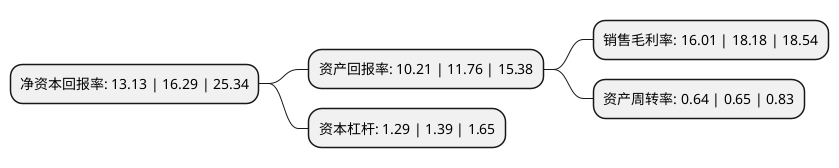

> 本页面由自动化程序生成于 2022年5月20日 01:39
> 内容可能存在错误，如有bug请提交issue至：https://github.com/Eroleice/doc-pi/issues
{.is-warning}

# 上市公司基本情况

## 基本资料

福建赛特新材股份有限公司（以下简称“赛特新材”）成立于2007年10月23日，龙岩市。于2020年02月11日在上交所科创板上市。

赛特新材注册资本8,000万元，公司的主营业务为真空绝热材料的研发，生产和销售。公司的主要产品为真空绝热板，主要由芯材，阻隔膜和吸附剂三部分构成。以下是详细信息：

- 公司名称: 福建赛特新材股份有限公司
- 股票代码: 688398.SH
- 所在地: 福建 - 龙岩市
- 成立日期: 2007年10月23日
- 注册资本: 8,000万元
- 法定代表人: 汪坤明
- 主营业务: 公司的主营业务为真空绝热材料的研发，生产和销售公司的主要产品为真空绝热板，主要由芯材，阻隔膜和吸附剂三部分构成
- 公司官网: www.supertech-vip.com
- 公司介绍: 公司是一家集研发、生产、销售真空绝热板为一体的高新技术企业，公司的主营业务为真空绝热材料的研发、生产和销售。公司的主要产品真空绝热板是一种利用真空绝热原理生产的新型高效节能环保绝热材料，已被作为重点产品列入国家统计局发布的《战略性新兴产业分类(2018)》目录，真空绝热板的生产需要综合运用到真空学、材料科学、传热学、表面科学等多学科知识，其产业化生产需要长期研发技术的沉淀、生产经验的积累以及专业化设备的支持。经过十多年持续的科研投入，公司已在真空绝热板芯材配方与生产工艺、阻隔膜生产与检测、吸附剂生产与检测及真空绝热板性能检测技术等方面形成了自主核心技术。截至本招股说明书签署日，公司已取得56项专利，其中23项为发明专利。公司依托核心技术，通过长期科技转化经验积累，已具备真空绝热板关键生产设备的设计、优化和工艺持续改进能力，使公司产品性能保持持续领先，在业内享有很高的品牌知名度，成为全球真空绝热材料应用领域，尤其是国际冰箱、冷柜等家电领域的新型绝热材料知名供应商。

## 股东及高管情况

上市公司第一大股东为汪坤明，持股31,720,000股，占比39.65%，为上市公司实际控制人。

截至2022年03月31日，上市公司的前十大股东中，共有6名自然人股东，2名机构股东，2个产品账户，其中5%以上大股东共有2名。上市公司前十大股东明细如下：

> 截至2022年03月31日，上市公司前十大股东信息如下：

| 股东名称 | 持股数量（股） | 持股比例 |
| --- | --- | --- |
| 汪坤明 | 31,720,000 | 39.65% |
| 汪美兰 | 8,710,000 | 10.89% |
| 汪洋 | 2,600,000 | 3.25% |
| 上海阿杏投资管理有限公司-阿杏松子6号私募证券投资基金 | 2,377,500 | 2.97% |
| 楚晟旻 | 1,930,500 | 2.41% |
| 深圳通和私募证券投资基金管理有限公司-通和宏观对冲一期私募投资基金 | 1,150,000 | 1.44% |
| 新余市泰斗企业管理中心(有限合伙) | 1,063,800 | 1.33% |
| 应一城 | 1,011,700 | 1.26% |
| 兴证投资管理有限公司 | 1,000,000 | 1.25% |
| 于飞 | 891,400 | 1.11% |

## 利润表分析

上市公司2021年总收入为7.11亿元，净利润为1.13亿元，实现盈利。

## 杜邦分析

> 数据列示周期：2021年 | 2020年 | 2019年
{.is-info}

上市公司的净资产收益率在近一年有所下降，下降幅度为-19.4%，其变化情况分解如下：
- 上市公司的销售毛利率在近一年下降了-11.94%，可能是生产效率的下降、商品原材料价格上涨或商品价格的下跌所致。
- 上市公司的资产周转率在近一年下降了-1.54%，可能是源自于更慢的销售回款或库存管理效果下降。
- 上市公司的财务杠杆比率在近一年下降了-7.19%，可能是减少负债降低财务费用。

