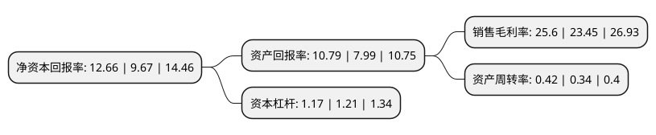

> 本页面由自动化程序生成于 2022年5月20日 01:40
> 内容可能存在错误，如有bug请提交issue至：https://github.com/Eroleice/doc-pi/issues
{.is-warning}

# 上市公司基本情况

## 基本资料

安徽壹石通材料科技股份有限公司（以下简称“壹石通”）成立于2006年01月06日，蚌埠市。于2021年08月17日在上交所科创板上市。

壹石通注册资本18,216.434万元，主营业务为先进无机非金属复合材料的研发，生产和销售，主要产品包括锂电池主动安全材料，电子通信功能材料和低烟无卤阻燃材料等三大类。以下是详细信息：

- 公司名称: 安徽壹石通材料科技股份有限公司
- 股票代码: 688733.SH
- 所在地: 安徽 - 蚌埠市
- 成立日期: 2006年01月06日
- 注册资本: 18,216.434万元
- 法定代表人: 蒋学鑫
- 主营业务: 主营业务为先进无机非金属复合材料的研发，生产和销售，主要产品包括锂电池主动安全材料，电子通信功能材料和低烟无卤阻燃材料等三大类
- 公司官网: www.estonegroup.com
- 公司介绍: 公司主要产品包括新能源锂电池涂覆材料、电子通信功能材料和低烟无卤阻燃材料等三大类，被广泛应用于新能源汽车、消费电子、芯片、覆铜板以及防火安全等领域，与行业内国际、国内龙头企业建立了长期稳定的合作关系。公司目前锂电池涂覆用勃姆石出货量位列全国第一、全球第二，是宁德时代勃姆石产品的核心供应商；电子通信功能材料的主要客户为日本雅都玛、生益科技等，并已通过向生益科技提供产品进入了华为5G产品供应链；公司的阻燃材料已批量供应西门子、杭州高新、金发科技等行业领先企业。公司于2012年成为国家级高新技术企业，先后被评为国家级专精特新“小巨人”企业、中国非金属矿工业协会科技发明类二等奖、安徽省“三重一创”重点企业、安徽省优秀民营企业、安徽省重点领域补短板产品关键技术攻关揭榜企业、安徽省首批次新材料(制造强省)企业、安徽省最具创新潜力企业、安徽省商标品牌示范企业、安徽省科技厅重大专项奖励项目等，并荣获高工锂电“年度创新技术产品奖”、“年度快速成长公司”、“年度中国锂电产业TOP50”等荣誉称号。

## 股东及高管情况

上市公司第一大股东为蒋学鑫，持股40,760,675股，占比22.38%，**疑似为**上市公司实际控制人。

截至2022年03月31日，上市公司的前十大股东中，共有7名自然人股东，3名机构股东，其中5%以上大股东共有2名。上市公司前十大股东明细如下：

> 未能通过持股比例判定出上市公司实际控制人（持股30%以上）
> 可能存在通过间接持股、联合持股、协议控制等方式拥有实际控制权的主体，具体请参考上市公司定期公告！
{.is-warning}

> 截至2022年03月31日，上市公司前十大股东信息如下：

| 股东名称 | 持股数量（股） | 持股比例 |
| --- | --- | --- |
| 蒋学鑫 | 40,760,675 | 22.38% |
| 合肥国科新能股权投资管理合伙企业(有限合伙)-新能源汽车科技创新(合肥)股权投资合伙企业(有限合伙) | 10,250,000 | 5.63% |
| 王亚娟 | 8,517,712 | 4.68% |
| 怀远新创想企业管理咨询合伙企业(有限合伙) | 6,313,255 | 3.47% |
| 王同成 | 6,021,788 | 3.31% |
| 陈炳龙 | 5,874,500 | 3.22% |
| 张家港市招港共赢企业管理合伙企业(有限合伙) | 5,800,000 | 3.18% |
| 张福金 | 5,318,400 | 2.92% |
| 黄小林 | 3,530,700 | 1.94% |
| 刘永开 | 3,177,075 | 1.74% |

## 利润表分析

上市公司2021年总收入为4.22亿元，净利润为1.08亿元，实现盈利。

## 杜邦分析

> 数据列示周期：2021年 | 2020年 | 2019年
{.is-info}

上市公司的净资产收益率在近一年有所上升，上升幅度为30.92%，其变化情况分解如下：
- 上市公司的销售毛利率在近一年上升了9.17%，可能是生产效率的提升、商品原材料价格下跌或商品价格的上涨所致。
- 上市公司的资产周转率在近一年上升了23.53%，可能是源自于更快的销售回款或库存管理效果提升。
- 上市公司的财务杠杆比率在近一年下降了-3.31%，可能是减少负债降低财务费用。

