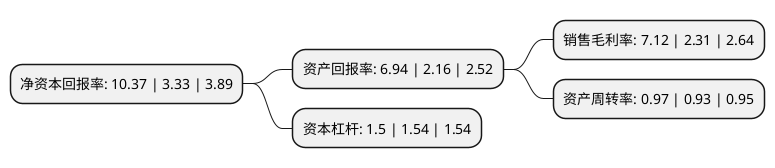

> 本页面由自动化程序生成于 2022年5月20日 01:03
> 内容可能存在错误，如有bug请提交issue至：https://github.com/Eroleice/doc-pi/issues
{.is-warning}

# 上市公司基本情况

## 基本资料

合肥丰乐种业股份有限公司（以下简称“丰乐种业”）成立于1997年04月16日，合肥市。于1997年04月22日在深交所主板上市。

丰乐种业注册资本61,401.498万元，主要产品:水稻类种子，玉米类种子，农化产品，餐饮类服务。以下是详细信息：

- 公司名称: 合肥丰乐种业股份有限公司
- 股票代码: 000713.SZ
- 所在地: 安徽 - 合肥市
- 成立日期: 1997年04月16日
- 注册资本: 61,401.498万元
- 法定代表人: 杨林
- 主营业务: 主要产品:水稻类种子，玉米类种子，农化产品，餐饮类服务
- 公司官网: www.fengle.com.cn
- 公司介绍: 公司是中国种子行业第一家上市公司，被誉为“中国种业第一股”。公司是以种业为主导，农化、香料产业齐头并进，跨地区、跨行业的综合性公司，集农业产业化国家级重点龙头企业、国家高新技术企业、国家级企业技术中心、安徽省西瓜甜瓜工程技术研究中心等多项荣誉于一身，同时，也是行业内唯一一家同时拥有两块中国名牌和驰名商标的企业----丰乐水稻种子和玉米种子是“中国名牌”产品，丰乐商标是“中国驰名商标”，综合实力与规模居中国种子行业前列。公司各项产业蓬勃发展，是中国产销量最大的“两系”杂交水稻种子公司和西甜瓜种子公司；农化产业行业排名50强；香料产业产销量国内第一，被誉为“亚洲之香”。

## 股东及高管情况

上市公司第一大股东为合肥市建设投资控股(集团)有限公司，持股179,542,902股，占比29.24%，**疑似为**上市公司实际控制人。

截至2022年03月31日，上市公司的前十大股东中，共有7名自然人股东，2名机构股东，1个产品账户，其中5%以上大股东共有1名。上市公司前十大股东明细如下：

> 未能通过持股比例判定出上市公司实际控制人（持股30%以上）
> 可能存在通过间接持股、联合持股、协议控制等方式拥有实际控制权的主体，具体请参考上市公司定期公告！
{.is-warning}

> 截至2022年03月31日，上市公司前十大股东信息如下：

| 股东名称 | 持股数量（股） | 持股比例 |
| --- | --- | --- |
| 合肥市建设投资控股(集团)有限公司 | 179,542,902 | 29.24% |
| 朱黎辉 | 5,087,955 | 0.83% |
| 张安春 | 4,097,987 | 0.67% |
| 申建国 | 3,700,483 | 0.6% |
| 任正鹏 | 3,595,755 | 0.59% |
| 李满库 | 3,051,481 | 0.5% |
| 任红梅 | 2,221,370 | 0.36% |
| 季晓萍 | 2,104,720 | 0.34% |
| 合肥兴泰金融控股(集团)有限公司 | 2,082,326 | 0.34% |
| 中国农业银行股份有限公司-银华农业产业股票型发起式证券投资基金 | 1,877,652 | 0.31% |

## 利润表分析

上市公司2021年总收入为26.17亿元，净利润为1.86亿元，实现盈利。

## 杜邦分析

> 数据列示周期：2021年 | 2020年 | 2019年
{.is-info}

上市公司的净资产收益率在近一年有所上升，上升幅度为211.41%，其变化情况分解如下：
- 上市公司的销售毛利率在近一年上升了208.23%，可能是生产效率的提升、商品原材料价格下跌或商品价格的上涨所致。
- 上市公司的资产周转率在近一年上升了4.3%，可能是源自于更快的销售回款或库存管理效果提升。
- 上市公司的财务杠杆比率在近一年下降了-2.6%，可能是减少负债降低财务费用。

