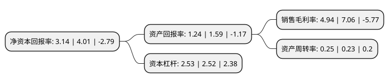

> 本页面由自动化程序生成于 2022年5月20日 01:05
> 内容可能存在错误，如有bug请提交issue至：https://github.com/Eroleice/doc-pi/issues
{.is-warning}

# 上市公司基本情况

## 基本资料

袁隆平农业高科技股份有限公司（以下简称“隆平高科”）成立于1999年06月30日，长沙市。于2000年12月11日在深交所主板上市。

隆平高科注册资本131,697.03万元，主要产品:杂交水稻，蔬菜种子，农化产品，玉米，棉花。以下是详细信息：

- 公司名称: 袁隆平农业高科技股份有限公司
- 股票代码: 000998.SZ
- 所在地: 湖南 - 长沙市
- 成立日期: 1999年06月30日
- 注册资本: 131,697.03万元
- 法定代表人: 毛长青
- 主营业务: 主要产品:杂交水稻，蔬菜种子，农化产品，玉米，棉花
- 公司官网: www.lpht.com.cn
- 公司介绍: 公司是一家以“杂交水稻之父”袁隆平院士的名字命名的国际化种业企业。公司业务涵盖“种业运营”和“农业服务”两大体系，种子业务方面，公司水稻、玉米、蔬菜、食葵、谷子等核心品类全球领先，小麦、棉花、油菜、马铃薯等品类快速发展；农业服务方面，新型职业农民培训、精准种植技术服务、耕地修复与开发、品质粮交易平台、品牌农业、农业金融等齐头并进。公司以“推动种业进步，造福世界人民”为使命，以“世界优秀的种业公司，致力于为客户提供综合农业服务解决方案”为企业愿景，不断推进隆平事业发展，矢志为中国民族种业在世界崛起之梦想而努力。

## 股东及高管情况

上市公司第一大股东为中信农业科技股份有限公司，持股217,815,722股，占比16.54%，**疑似为**上市公司实际控制人。

截至2022年03月31日，上市公司的前十大股东中，共有2名自然人股东，4名机构股东，1个产品账户，1个海外主体，2名其他股东，其中5%以上大股东共有3名。上市公司前十大股东明细如下：

> 未能通过持股比例判定出上市公司实际控制人（持股30%以上）
> 可能存在通过间接持股、联合持股、协议控制等方式拥有实际控制权的主体，具体请参考上市公司定期公告！
{.is-warning}

> 截至2022年03月31日，上市公司前十大股东信息如下：

| 股东名称 | 持股数量（股） | 持股比例 |
| --- | --- | --- |
| 中信农业科技股份有限公司 | 217,815,722 | 16.54% |
| 香港中央结算有限公司(陆股通) | 84,875,171 | 6.44% |
| 湖南杂交水稻研究中心 | 66,857,142 | 5.08% |
| 北大荒中垦(深圳)投资有限公司 | 64,721,500 | 4.91% |
| 王义波 | 25,076,106 | 1.9% |
| 挪威中央银行-自有资金 | 24,742,958 | 1.88% |
| 深圳市信农投资中心(有限合伙) | 21,120,495 | 1.6% |
| 中国建设银行股份有限公司-嘉实农业产业股票型证券投资基金 | 11,091,442 | 0.84% |
| 杨蔚 | 10,824,146 | 0.82% |
| 中信兴业投资集团有限公司 | 10,785,790 | 0.82% |

## 利润表分析

上市公司2021年总收入为35.03亿元，净利润为1.73亿元，实现盈利。

## 杜邦分析

> 数据列示周期：2021年 | 2020年 | 2019年
{.is-info}

上市公司的净资产收益率在近一年有所下降，下降幅度为-21.7%，其变化情况分解如下：
- 上市公司的销售毛利率在近一年下降了-30.03%，可能是生产效率的下降、商品原材料价格上涨或商品价格的下跌所致。
- 上市公司的资产周转率在近一年上升了8.7%，可能是源自于更快的销售回款或库存管理效果提升。
- 上市公司的财务杠杆比率在近一年上升了0.4%，可能是增加负债扩大生产规模。

