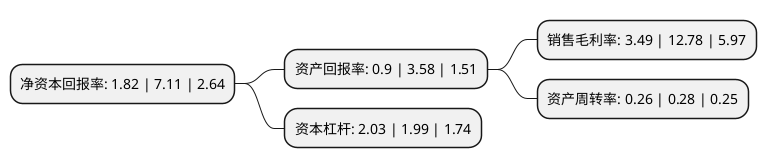

> 本页面由自动化程序生成于 2022年5月20日 01:12
> 内容可能存在错误，如有bug请提交issue至：https://github.com/Eroleice/doc-pi/issues
{.is-warning}

# 上市公司基本情况

## 基本资料

天水众兴菌业科技股份有限公司（以下简称“众兴菌业”）成立于2005年11月18日，天水市。于2015年06月26日在深交所中小板上市。

众兴菌业注册资本40,742.18万元，公司专业从事食用菌的研发，生产与销售，为国内领先的食用菌工厂化高科技生产企业，致力于为消费者提供绿色，安全的高品质食用菌产品。公司食用菌产品包括金针菇，杏鲍菇与蟹味菇，其中以金针菇为主，杏鲍菇与蟹味菇现处于小批量试产阶段。以下是详细信息：

- 公司名称: 天水众兴菌业科技股份有限公司
- 股票代码: 002772.SZ
- 所在地: 甘肃 - 天水市
- 成立日期: 2005年11月18日
- 注册资本: 40,742.18万元
- 法定代表人: 刘亮
- 主营业务: 公司专业从事食用菌的研发，生产与销售，为国内领先的食用菌工厂化高科技生产企业，致力于为消费者提供绿色，安全的高品质食用菌产品公司食用菌产品包括金针菇，杏鲍菇与蟹味菇，其中以金针菇为主，杏鲍菇与蟹味菇现处于小批量试产阶段
- 公司官网: www.tszxjy.cn
- 公司介绍: 公司是全国工厂化生产食用菌，尤其是金针菇的领先企业。公司走在了国内食用菌研究和生产领域的前沿，获得了较为先进的技术储备，取得了明显的技术优势，形成了较强的竞争力公司的食用菌种植真正做到了变废为宝，实现了资源的再生循环利用。公司从事的食用菌工厂化生产符合《中华人民共和国循环经济促进法》有关发展循环经济提出的“减量化、再利用、资源化”要求，有利于节约资源、保护环境，属于国家大力扶持和发展的产业。公司已通过GB/T19001-2008/ISO9001质量管理体系认证。公司采用标准化方式生产高品质食用菌产品，形成较好的品牌效应。公司“羲皇”商标已被评为“甘肃省著名商标”、被中国国际名牌发展协会、中国品牌企业联合发展促进会评为“中国著名品牌(重点推广首选单位)”。

## 股东及高管情况

上市公司第一大股东为陶军，持股110,136,094股，占比27.03%，**疑似为**上市公司实际控制人。

截至2022年03月31日，上市公司的前十大股东中，共有5名自然人股东，2名机构股东，2个产品账户，1个海外主体，其中5%以上大股东共有2名。上市公司前十大股东明细如下：

> 未能通过持股比例判定出上市公司实际控制人（持股30%以上）
> 可能存在通过间接持股、联合持股、协议控制等方式拥有实际控制权的主体，具体请参考上市公司定期公告！
{.is-warning}

> 截至2022年03月31日，上市公司前十大股东信息如下：

| 股东名称 | 持股数量（股） | 持股比例 |
| --- | --- | --- |
| 陶军 | 110,136,094 | 27.03% |
| 田德 | 31,132,277 | 7.64% |
| 天水众兴菌业科技股份有限公司-第一期员工持股计划 | 9,000,000 | 2.21% |
| 长城国融投资管理有限公司 | 7,190,476 | 1.76% |
| 甘肃资产管理有限公司 | 5,523,809 | 1.36% |
| 刘亮 | 2,645,715 | 0.65% |
| 雷小刚 | 2,524,712 | 0.62% |
| 安徽中安资本投资基金有限公司 | 2,120,476 | 0.52% |
| 袁斌 | 1,974,679 | 0.48% |
| UBS AG | 1,627,192 | 0.4% |

## 利润表分析

上市公司2021年总收入为15.56亿元，净利润为0.54亿元，实现盈利。

## 杜邦分析

> 数据列示周期：2021年 | 2020年 | 2019年
{.is-info}

上市公司的净资产收益率在近一年有所下降，下降幅度为-74.4%，其变化情况分解如下：
- 上市公司的销售毛利率在近一年下降了-72.69%，可能是生产效率的下降、商品原材料价格上涨或商品价格的下跌所致。
- 上市公司的资产周转率在近一年下降了-7.14%，可能是源自于更慢的销售回款或库存管理效果下降。
- 上市公司的财务杠杆比率在近一年上升了2.01%，可能是增加负债扩大生产规模。

